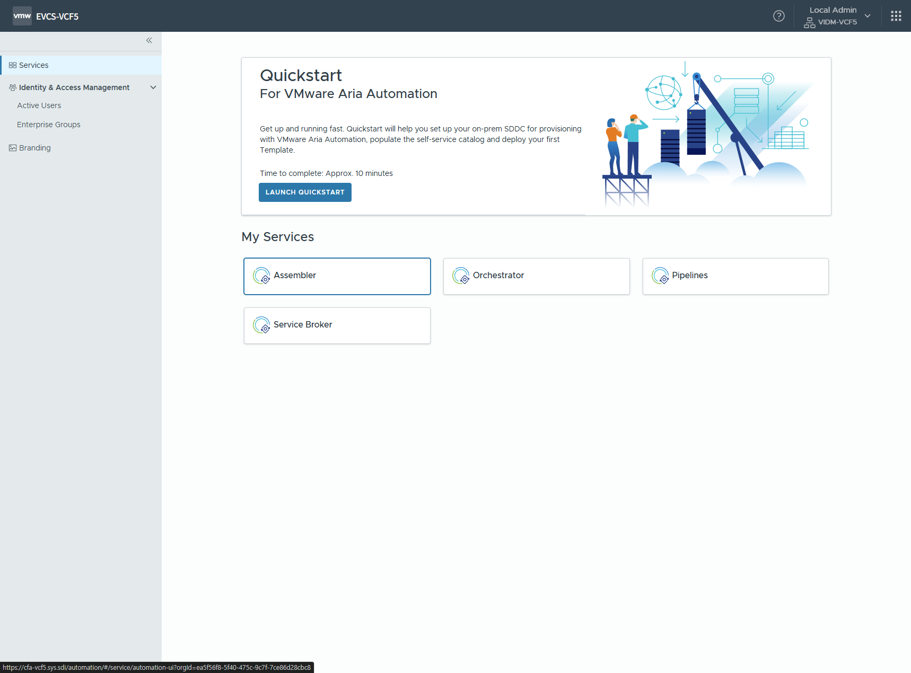
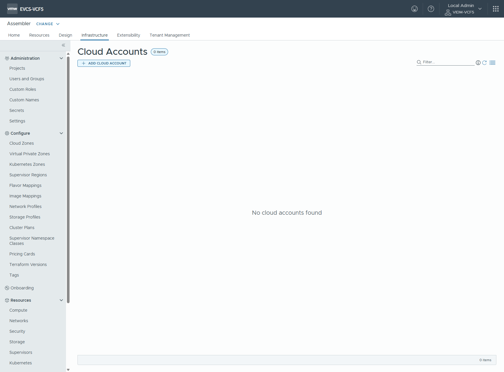
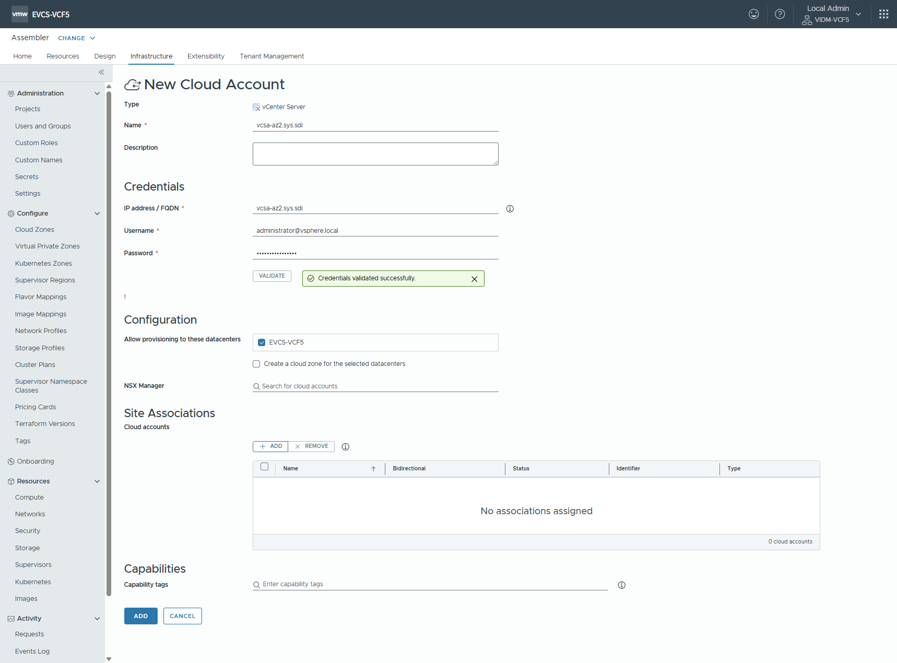
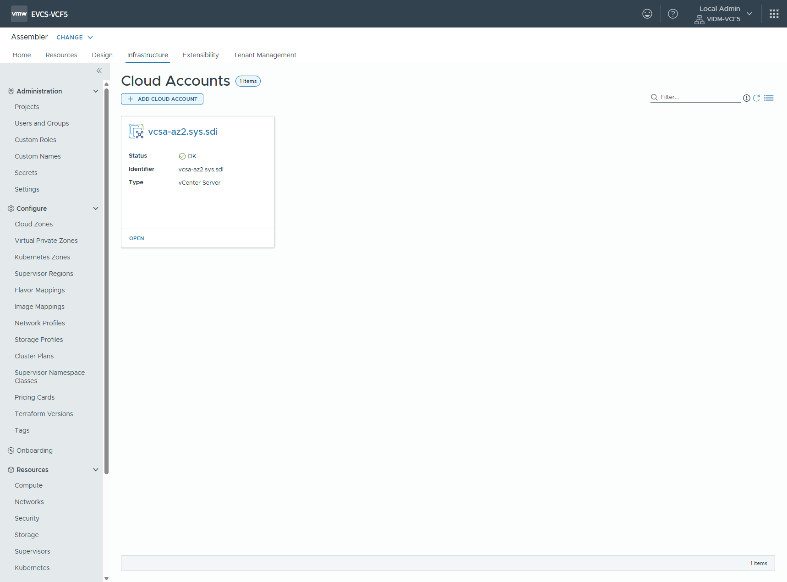
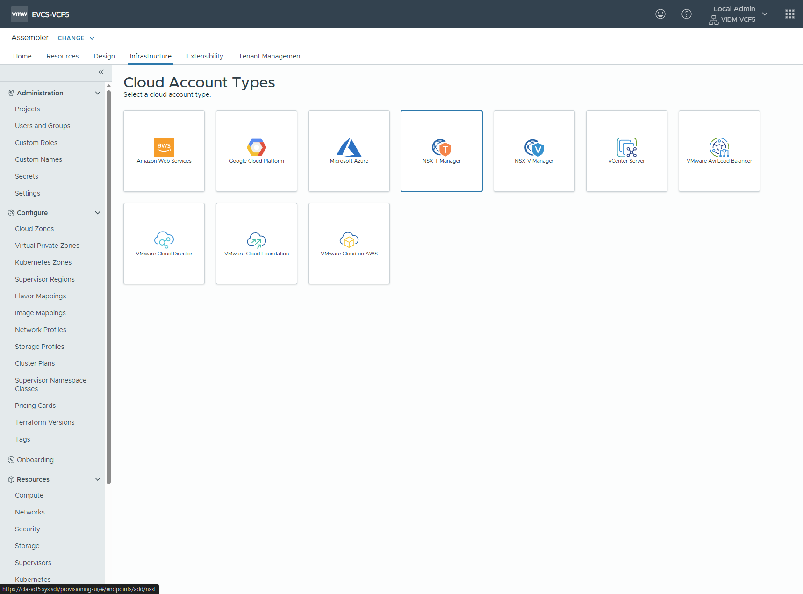
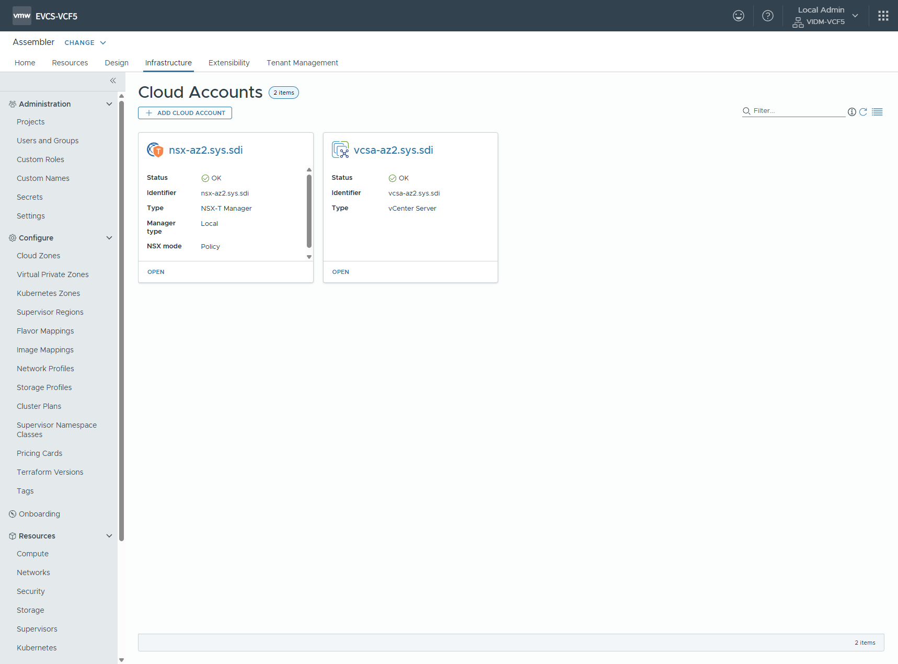
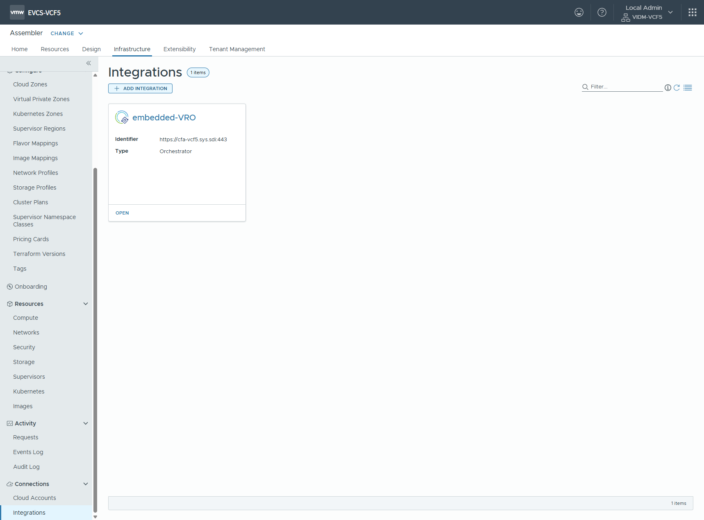
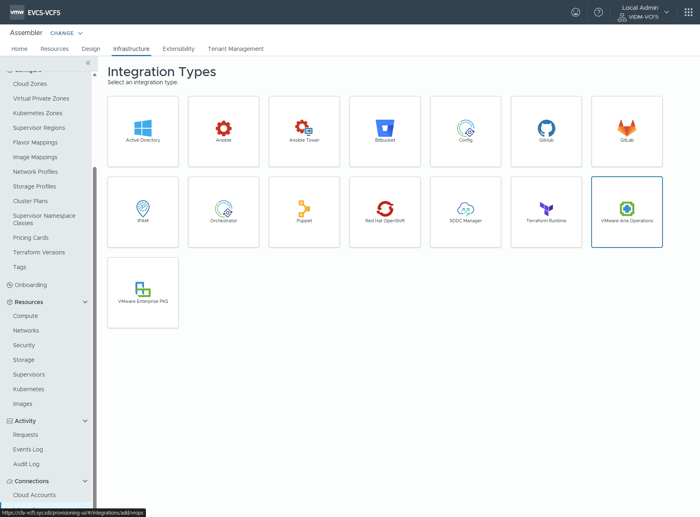
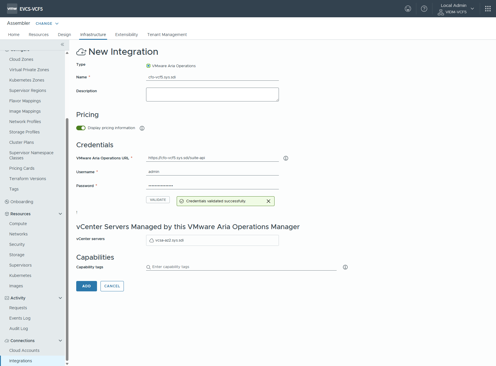
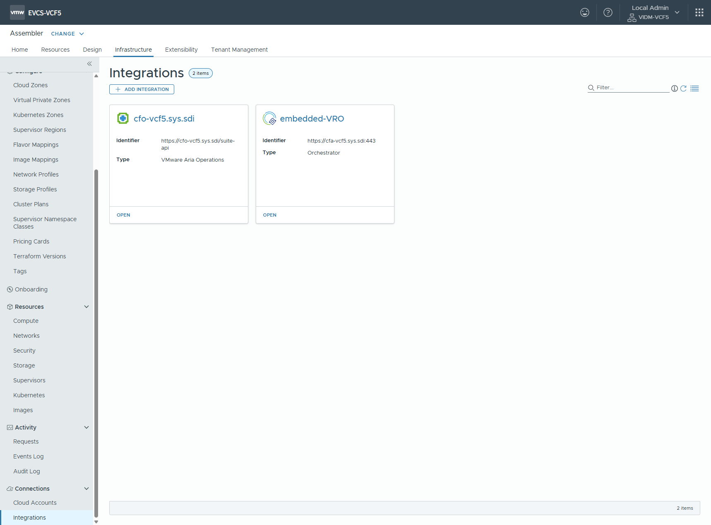

# Cloud Assembly 설정

 Assembler 선택

 Infrastructure > Cloud Accounts 메뉴 선택

 vCenter 등록 선택

 vCenter 엔드포인트 등록

> [!INFO]
> `Name` 필드에 반드시 vCenter FQDN 이름을 등록

> [!CAUTION]
> `Allow provisioning to these datacenters` 에서 데이터센터 선택 후 `Create a cloud zone for the selected datacenters` 체크박스를 반드시 해제 하고 저장

 vCenter 등록 완료

 vCenter 등록 완료

 NSX-T 관리자 등록 선택

 NSX-T 엔드포인트 등록

> [!INFO]
> `Name` 필드에 반드시 NSX-T 관리자의 LoadBalancer FQDN 또는 Master 노드 FQDN 이름을 등록

> [!INFO]
> `Associations` 에 등록한 vCenter 엔드포인트를 추가

 NSX-T 관리자 등록 완료

 Infrastructure > Integration 메뉴 선택

 VMware Aria Operations 등록 선택

 VMware Aria Operations 엔드포인트 등록

 VMware Aria Operations 등록 완료

