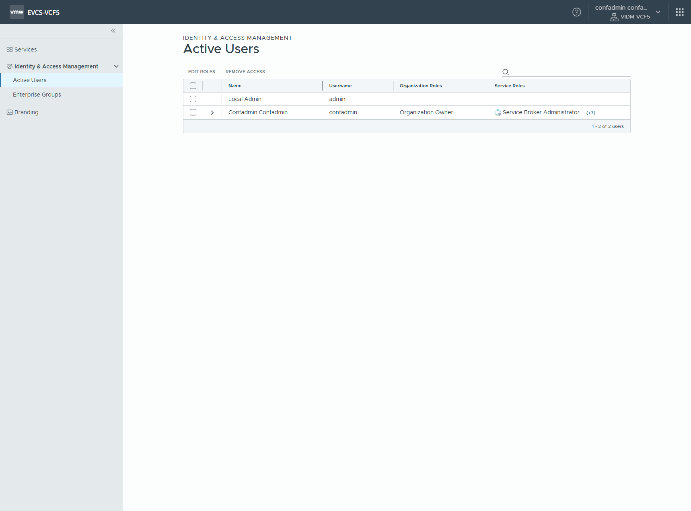
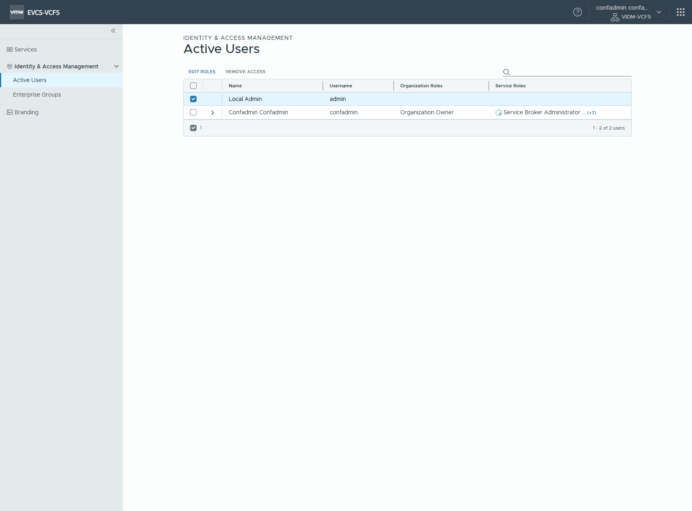
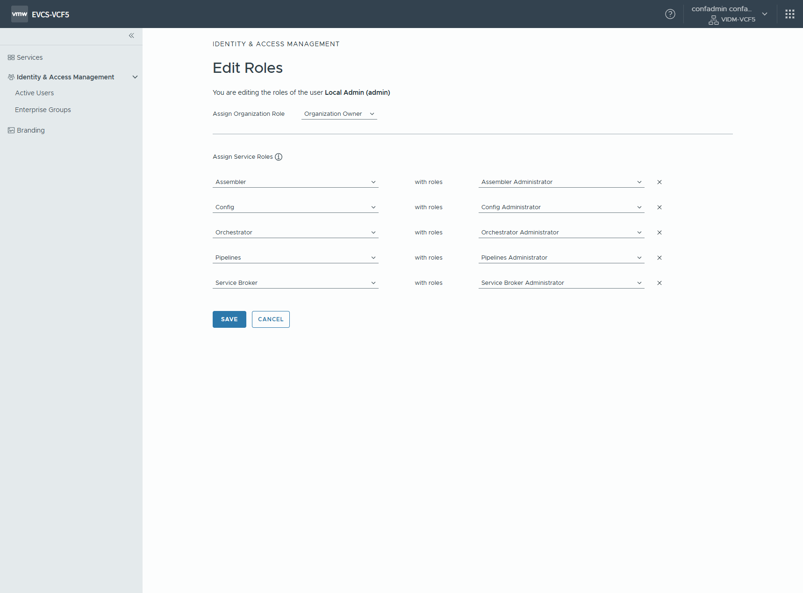
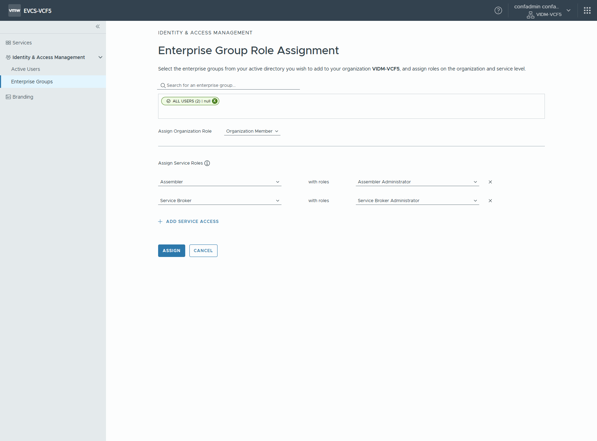
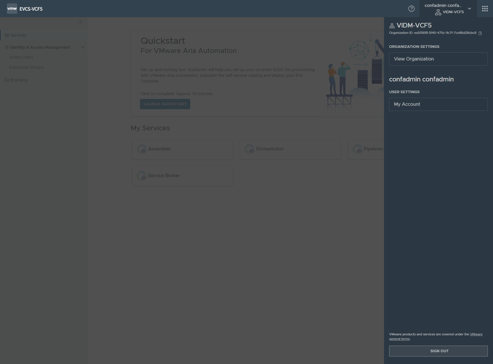
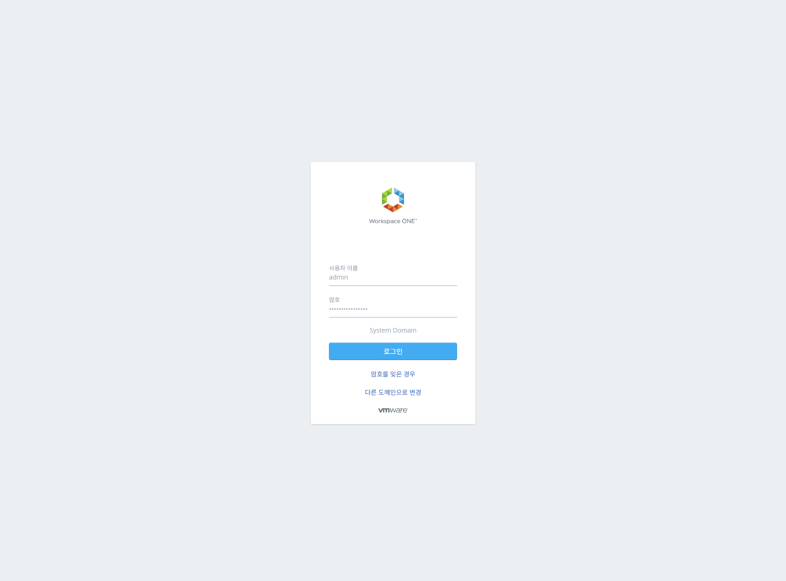

# Aria Automation 권한 설정

**최초 로그인**

 설정 관리자로 최초 로그인

confadmin 으로 로그인 하는것 설명, Configuration Admin 은 자동화용 내부 계정이므로 사용 하지 말자

**인증 및 접근 관리**

 활성 유저 설정

 Local Admin 선택

 역할 수정

- `Organization Owner` 로 선택
- 각 서비스 모듈에 대한 `Administrator` 권한 선택

왜 이작업 해야 하는지 설명, 앞으로 admin으로 admin을 쓰게끔 한다

 그룹 추가

- `ALL USERS` 검색 후 선택
- `Organization Member` 로 선택
- `Assembler` 및 `Service Broker` 에 대한 `Administrator` 권한 선택

**설정 관리자 계정 로그아웃 및 관리자 계정으로 재 로그인**

 로그아웃 (사인아웃)

 관리자로 로그인

