# 클라우드 계정 설정
> [!NOTE]
> `Aria Automation` 에서 `admin/System Domain` 계정으로 수행

Aria Automation 에서 사용할 vCenter, NSX 등록 및 Aria Operation 연동을 위한 작업을 수행합니다.

 < Assembler 선택 >

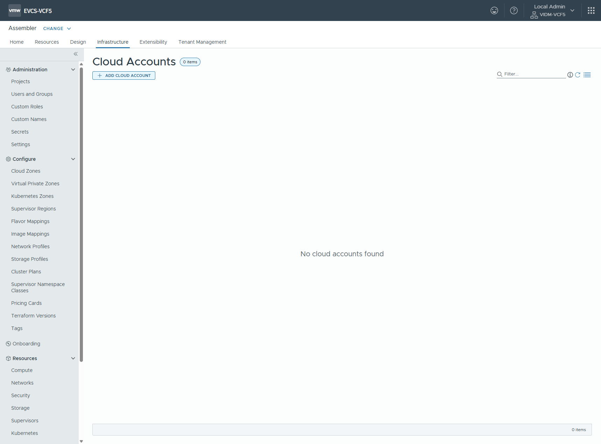 < Infrastructure > Cloud Accounts 메뉴 선택 >

  
## 1. vCenter 연동
VMware Aria Automation 클라우드 템플릿을 배포하려는 계정 지역에 대한 기본 vCenter 클라우드 계정을 추가합니다.
> [!CAUTION]
> 필요한 서비스 계정 자격 증명이 있고 포트 443에서 HTTPS 액세스를 사용하도록 설정했는지 확인합니다. 
> 클라우드 관리자 사용자 역할이 있는지 확인합니다. 
> 원격 vSphere 에이전트에서 사용할 클라우드 계정을 생성하는 경우(프록시를 통해 모든 트래픽 전달 옵션을 사용하여 가능) 대상 원격 vCenter 서버에 VMware Aria Automation 확장성(vREx) 프록시를 배포하고 구성했는지 확인합니다.
> 클라우드 계정 지원을 위해 포트와 프로토콜을 올바르게 구성했는지 확인합니다.

`ADD CLOUD ACCOUNT` 를 선택하고 `Cloud Account Types` 중 `vCenter Server` 를 선택합니다.

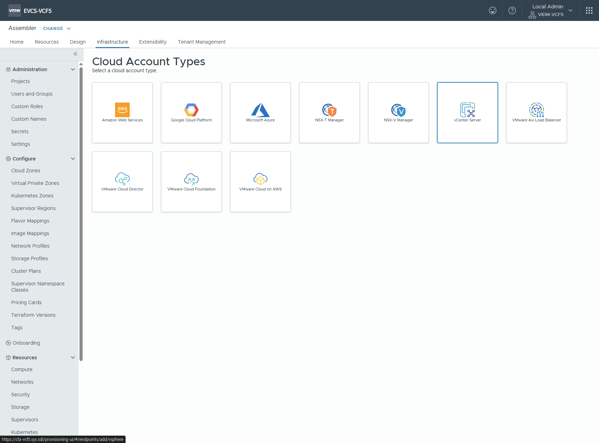 < vCenter 등록 선택 >

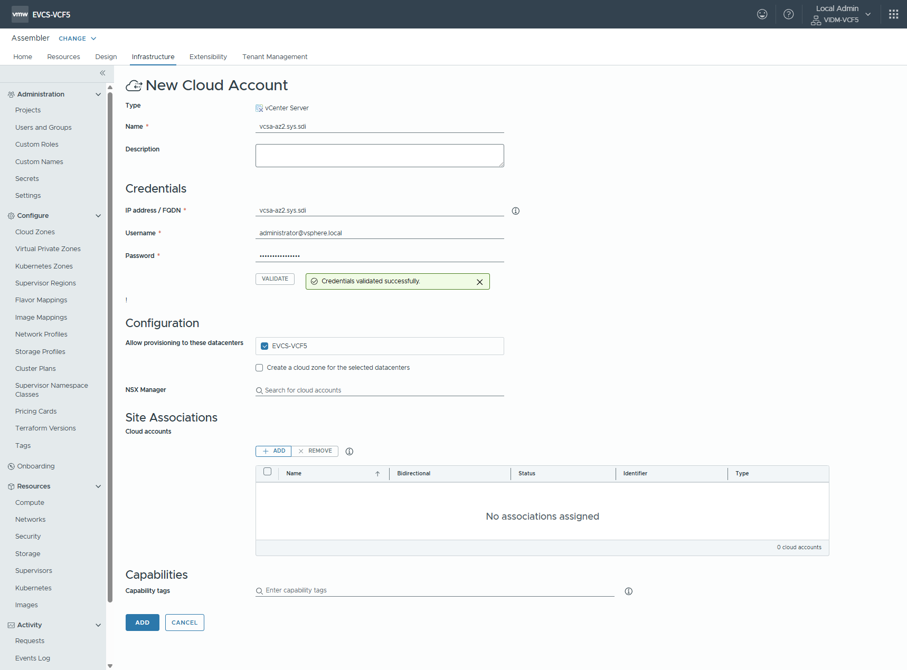 < vCenter 엔드포인트 등록 >

> [!NOTE]
> `Name` 필드에 반드시 vCenter FQDN 이름을 등록

> [!CAUTION]
> `Allow provisioning to these datacenters` 에서 데이터센터 선택 후 `Create a cloud zone for the selected datacenters` 체크박스를 반드시 해제 하고 저장

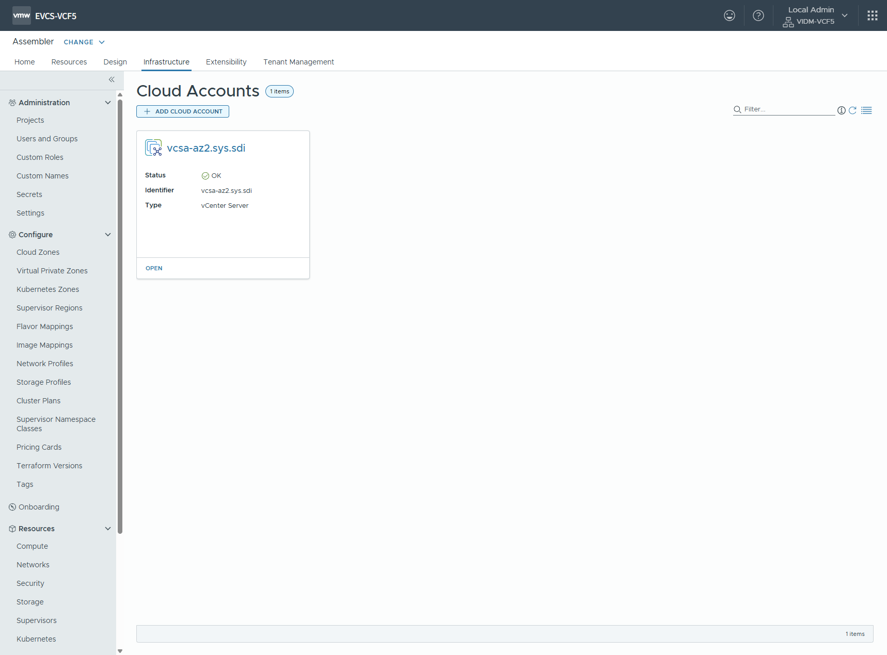 < vCenter 등록 완료 >

  
## 2. NSX 연동
네트워크 및 보안을 위해 NSX-T 클라우드 계정을 생성하고 하나 이상의 vCenter 클라우드 계정에 연결할 수 있습니다.
> [!CAUTION]
> 필요한 서비스 계정 자격 증명이 있고 포트 443에서 HTTPS 액세스를 사용하도록 설정했는지 확인합니다. 
> 클라우드 관리자 사용자 역할이 있는지 확인합니다.
> 이 NSX 클라우드 계정에서 사용할 vCenter 클라우드 계정이 있는지 확인합니다.

`ADD CLOUD ACCOUNT` 를 선택하고 `Cloud Account Types` 중 `NSX-T Manager` 를 선택합니다.

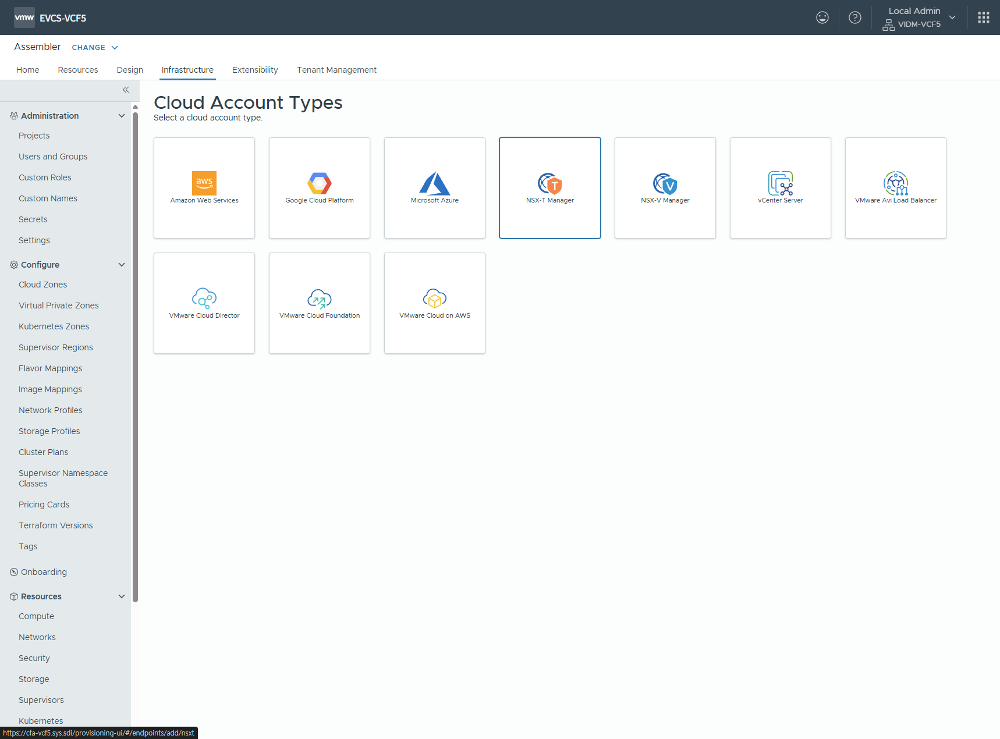 < NSX-T 관리자 등록 선택 >

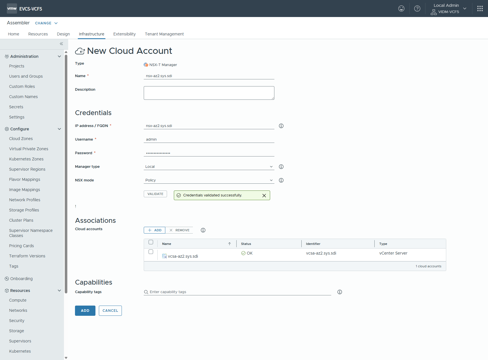 < NSX-T 엔드포인트 등록 >

> [!NOTE]
> `Name` 필드에 반드시 NSX-T 관리자의 LoadBalancer FQDN 또는 Master 노드 FQDN 이름을 등록

> [!NOTE]
> `Associations` 에 등록한 vCenter 엔드포인트를 추가

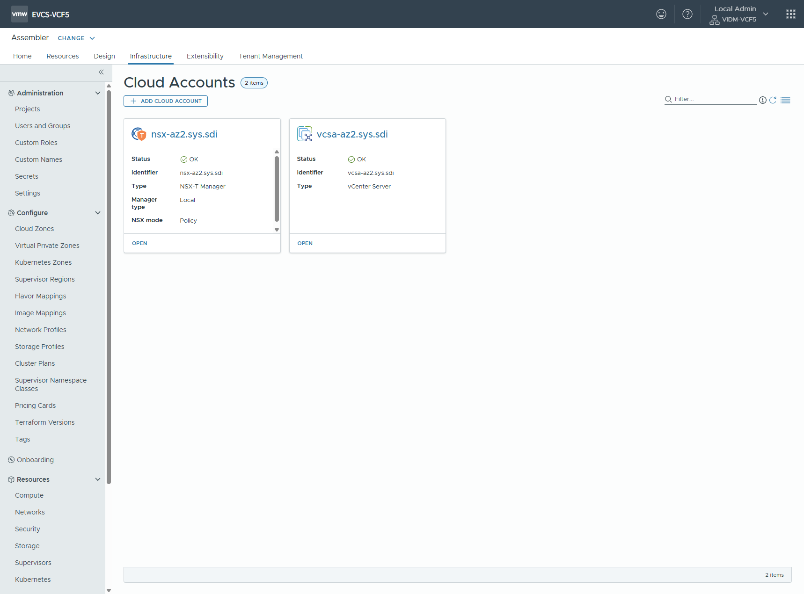 < NSX-T 관리자 등록 완료 >

  
## 3. Aria Operations 연동
VMware Aria Automation은 VMware Aria Operations를 사용하여 고급 워크로드 배치를 수행하고, 배포 상태 및 가상 시스템 메트릭을 제공하고, 가격 책정을 표시할 수 있습니다.

`Infrastructure` > `Connections` > `Integrations` > `ADD INTEGRATIONS` 를 선택하고 `Integrations Types` 중 `VMware Aria Operations` 를 선택합니다.

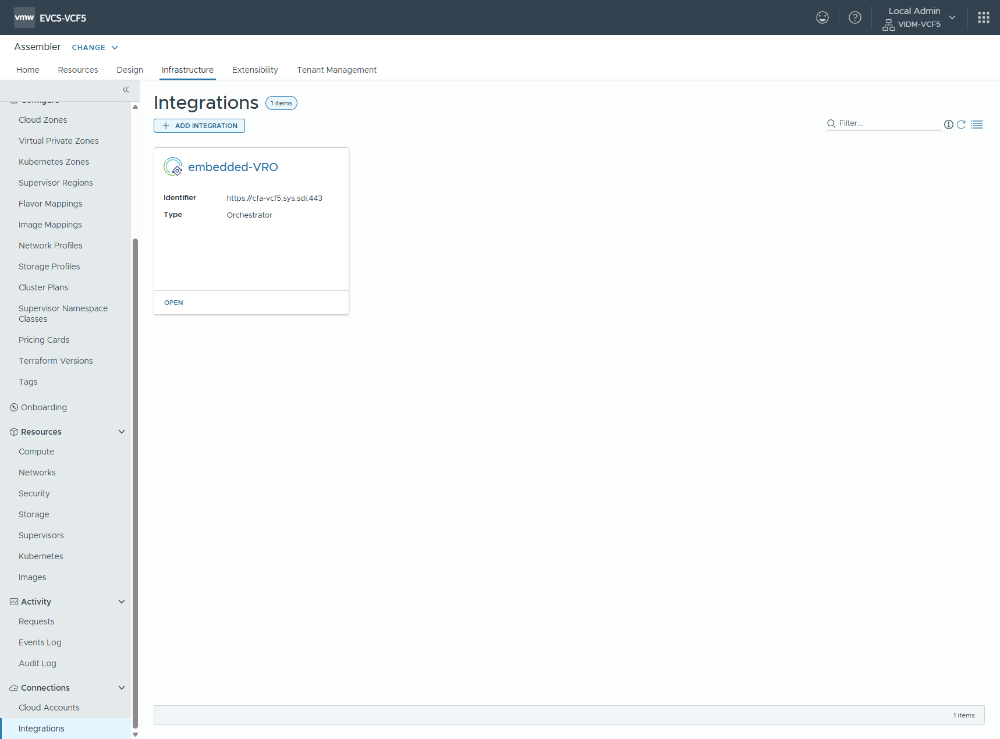 < Infrastructure > Integration 메뉴 선택 >

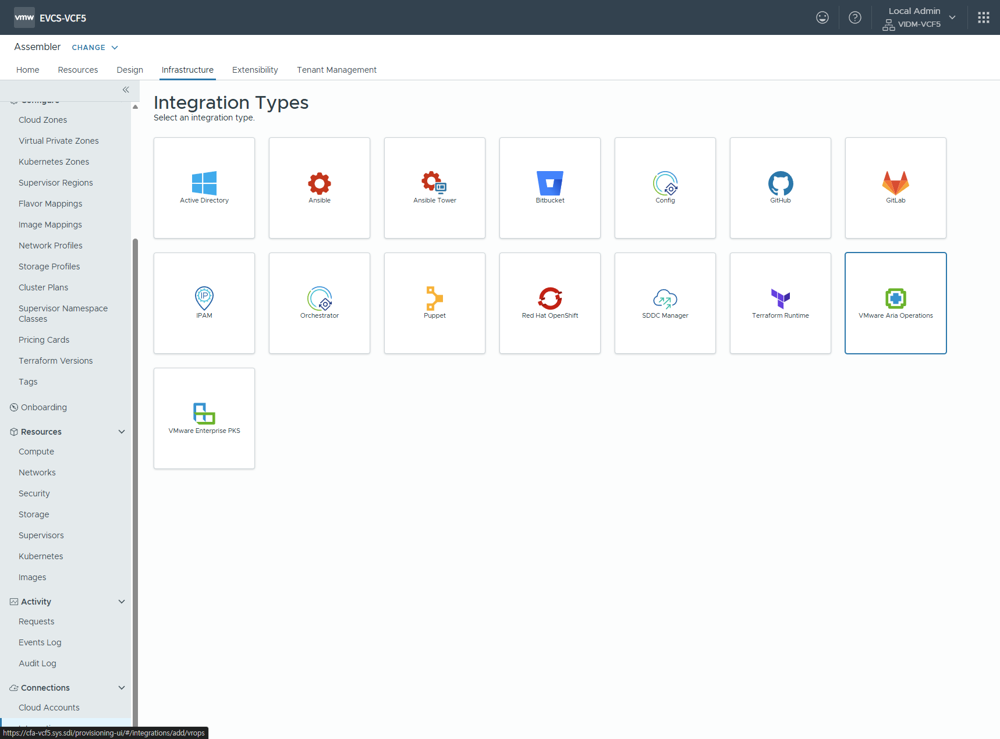 < VMware Aria Operations 등록 선택 >

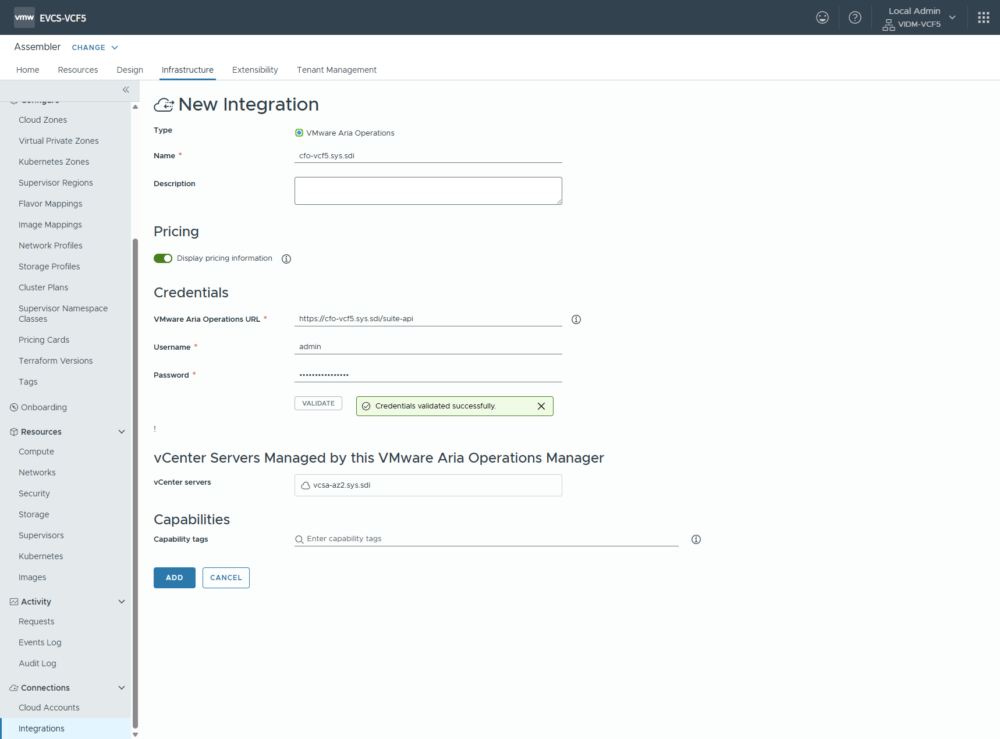 < VMware Aria Operations 엔드포인트 등록 >

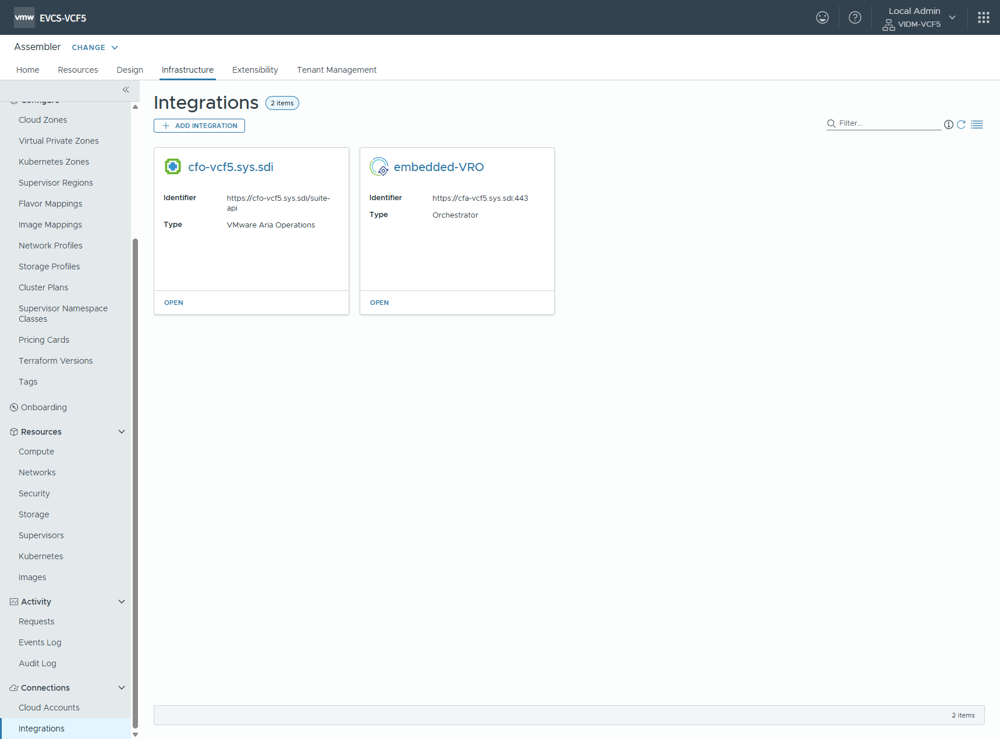 < VMware Aria Operations 등록 완료 >

