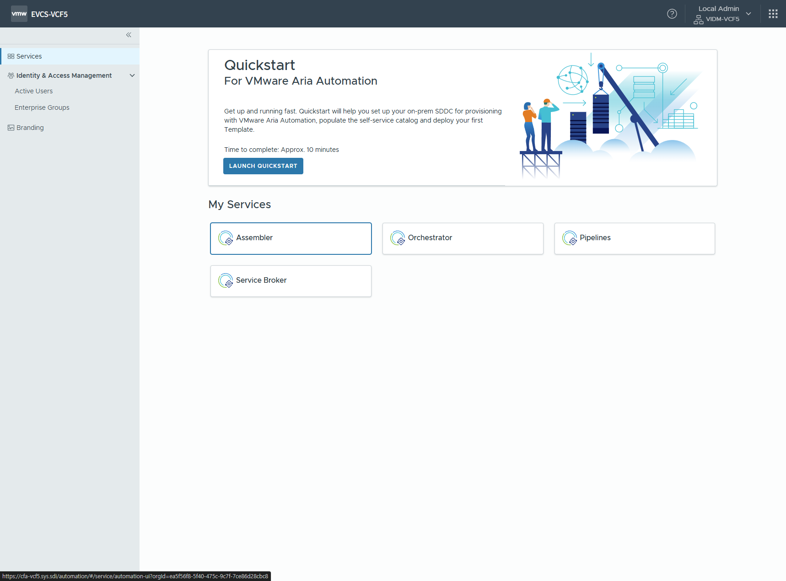
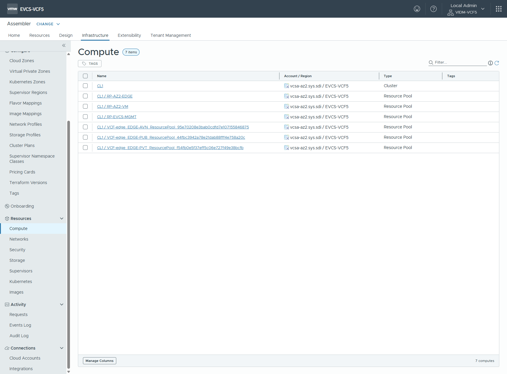
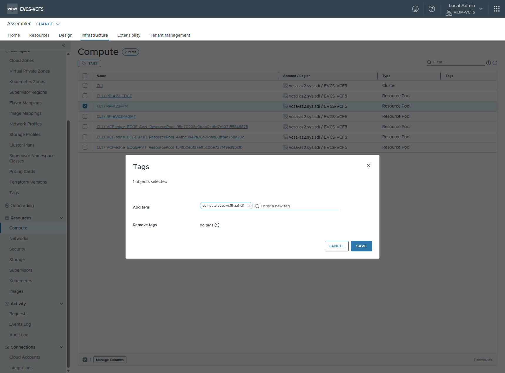
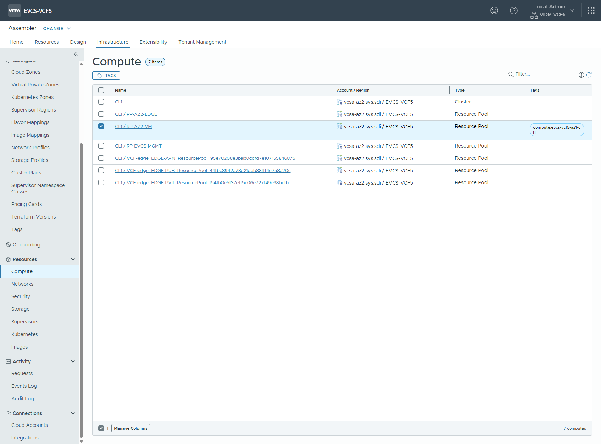
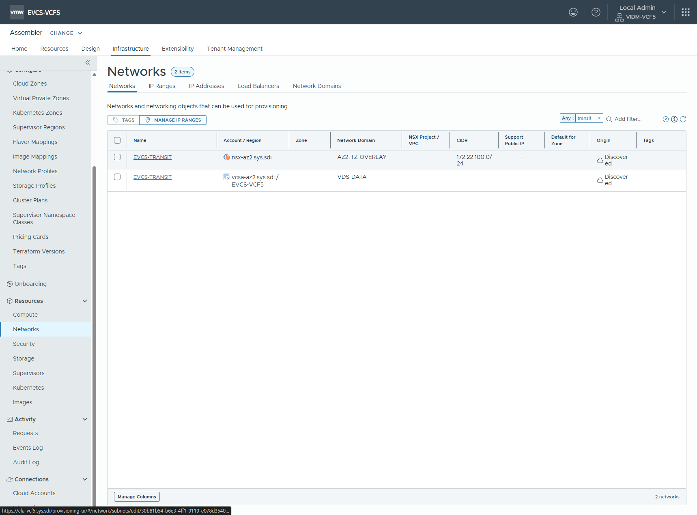
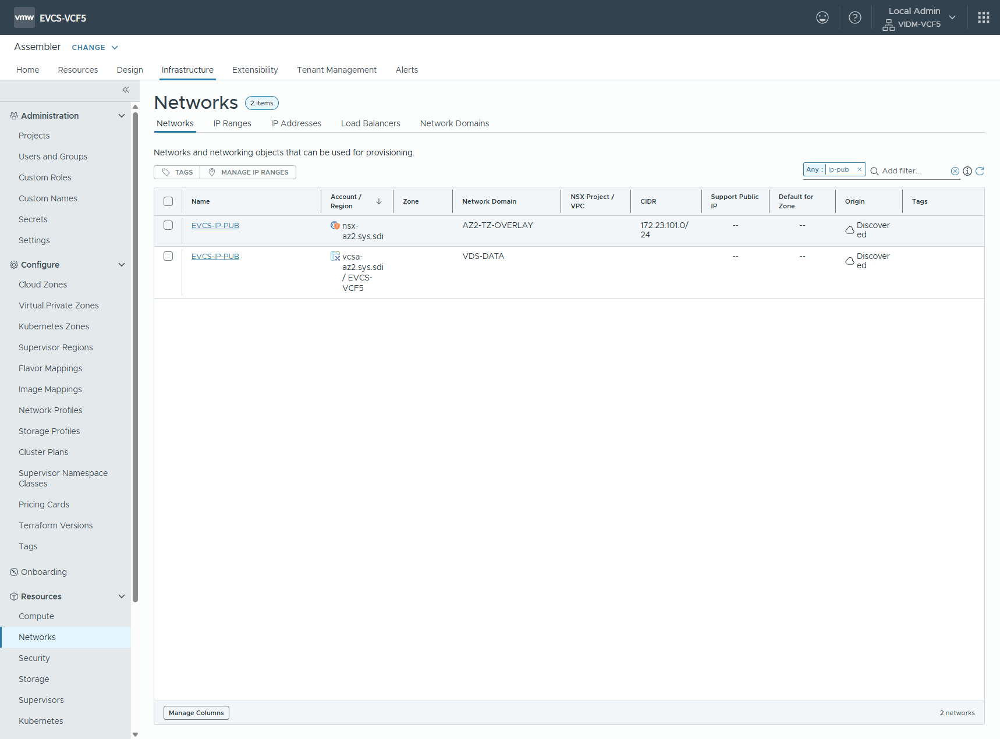
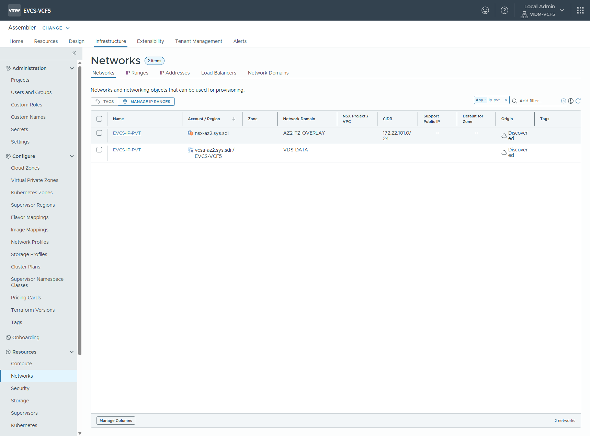
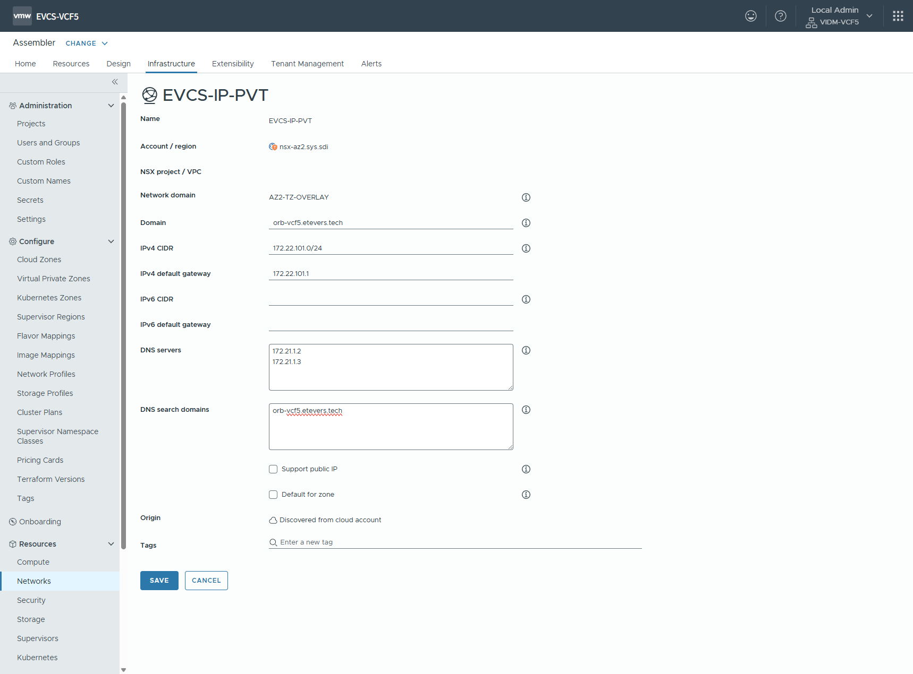
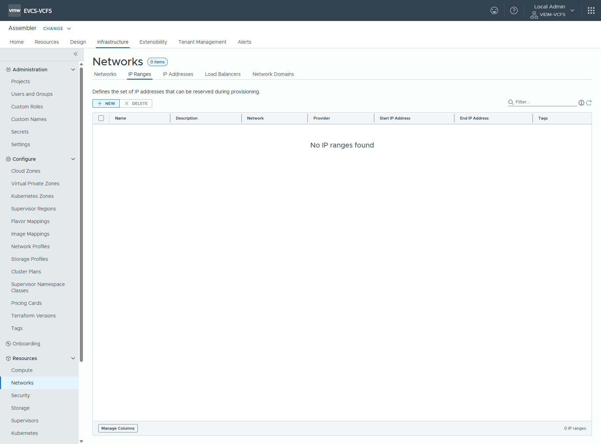
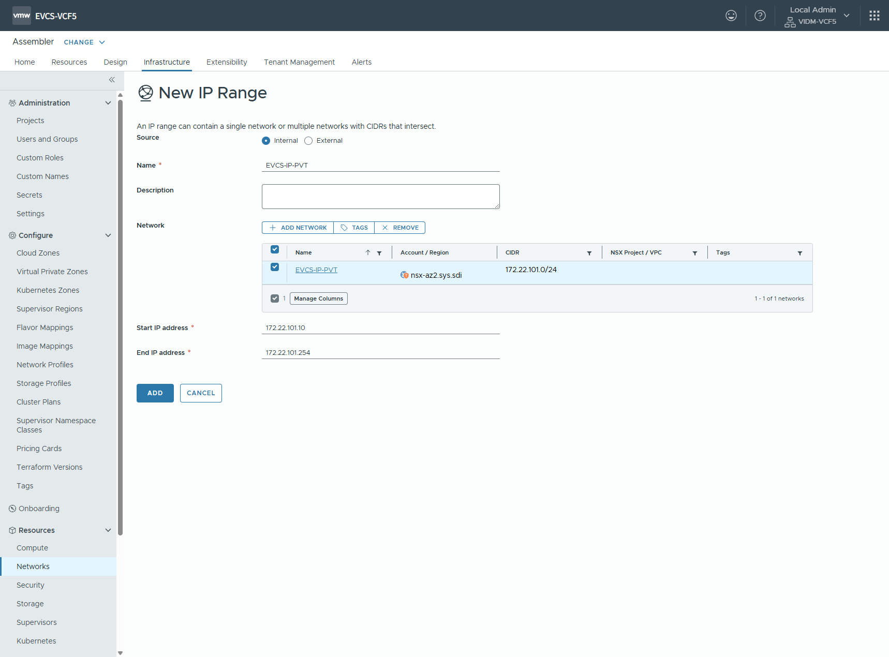

# 클라우드 기반 자원 설정

 < Assembler 선택 >

## 컴퓨팅 설정

 < Infrastructure > Resources > Compute 메뉴 선택 >

 < VM 배포 공간(클러스터 또는 리소스풀) 선택 후 태그 추가 >

> [!NOTE]
> `compute:` 로 시작하는 고유 값을 입력

 < 컴퓨팅 설정 확인 >

## 네트워크 설정

### 트랜짓 네트워크 설정

 < Infrastructure > Resources > Networks 에서 트랜짓 네트워크 검색 >

> [!CAUTION]
> 반드시 모든 작업은 NSX-T 계정으로 등록된 자원을 대상으로 수행 하여야 함\
> 일반적으로 CIDR 설정과 자원 상세페이지에서 게이트웨이 정보가 보이는 것이 NSX-T 계정의 자원정보임

 < 네트워크 정보 입력 >

> [!CAUTION]
> `Domain` 필드 설정은 반드시 하여야 함. VM 배포시 Customization Spec의 주요 설정 내용으로 동작하고 IP 설정 등에 관여함\
> EVCS 아키텍처의 회사 도메인 설계에 따라 클라우드 도메인을 등록, 트랜짓에 등록된 내용을 바탕으로 VPC의 도메인 영역이 결정됨

### 엣지 클러스터 구성에 따른 네트워크 설정

**외부망 네트워크 설정 (샘플)**

 외부망 네트워크 네트워크 검색

> [!CAUTION]
> 반드시 모든 작업은 NSX-T 계정으로 등록된 자원을 대상으로 수행 하여야 함\
> 일반적으로 CIDR 설정과 자원 상세페이지에서 게이트웨이 정보가 보이는 것이 NSX-T 계정의 자원정보임

 네트워크 정보 입력

> [!CAUTION]
> `Domain` 필드 설정은 반드시 하여야 함. VM 배포시 Customization Spec의 주요 설정 내용으로 동작하고 IP 설정 등에 관여함

**내부망 네트워크 설정 (샘플)**

 내부망 네트워크 네트워크 검색

> [!CAUTION]
> 반드시 모든 작업은 NSX-T 계정으로 등록된 자원을 대상으로 수행 하여야 함\
> 일반적으로 CIDR 설정과 자원 상세페이지에서 게이트웨이 정보가 보이는 것이 NSX-T 계정의 자원정보임

 네트워크 정보 입력

> [!CAUTION]
> `Domain` 필드 설정은 반드시 하여야 함. VM 배포시 Customization Spec의 주요 설정 내용으로 동작하고 IP 설정 등에 관여함

### 트랜짓 네트워크 IP 영역 설정

 Infrastructure > Resources > Networks > IP Ranges 탭 선택 후 생성

 트랜짓 네트워크 IP Range 정보 입력

> [!NOTE]
> 트랜짓 네트워크 선택 후, 트랜짓 네트워크의 게이트웨이 IP와 기 사용중인 IP를 제외하고 Start~End IP를 구성

### 엣지 클러스터 구성에 따른 네트워크 IP 영역 설정

> [!NOTE]
> 설정되는 IP 영역은 VPC의 SNAT용 IP 또는 Access IP의 DNAT용 IP 할당을 위해 설정함

**외부망 네트워크 IP 영역 설정 (샘플)**

 외부망 네트워크 IP Range 정보 입력

**내부망 네트워크 IP 영역 설정 (샘플)**

 내부망 네트워크 IP Range 정보 입력

