# 클라우드 논리 자원 설정

 < Assembler 선택 >

## 클라우드 영역 설정
Automation Assembler 클라우드 영역은 클라우드 계정 유형(예: AWS 또는 vSphere)에만 해당하는 계산 리소스 섹션입니다.\
클라우드 영역은 지역에 따라 달라지며 프로젝트에 할당해야 합니다. 클라우드 영역과 프로젝트 간에는 다대다 관계가 있습니다. \
Automation Assembler는 vSphere 뿐만 아니라 Azure, AWS 및 GCP를 비롯하여 가장 널리 사용되는 공용 클라우드에 대한 배포를 지원합니다. \
추가적인 배치 컨트롤로는 배치 정책 옵션, 기능 태그 및 계산 태그가 포함됩니다.\
프로젝트에 최대 3000개의 클라우드 영역을 추가할 수 있습니다. 그러나 클라우드 템플릿 배포에 포함될 수 있는 최대 클라우드 영역 수는 100개를 초과할 수 없습니다. \
배포 단계에서 클라우드 영역은 할당된 제약 조건 태그 또는 클라우드 계정을 기준으로 필터링됩니다. \
적용 가능한 클라우드 영역이 100개 넘게 남아 있으면 배포가 실패합니다.

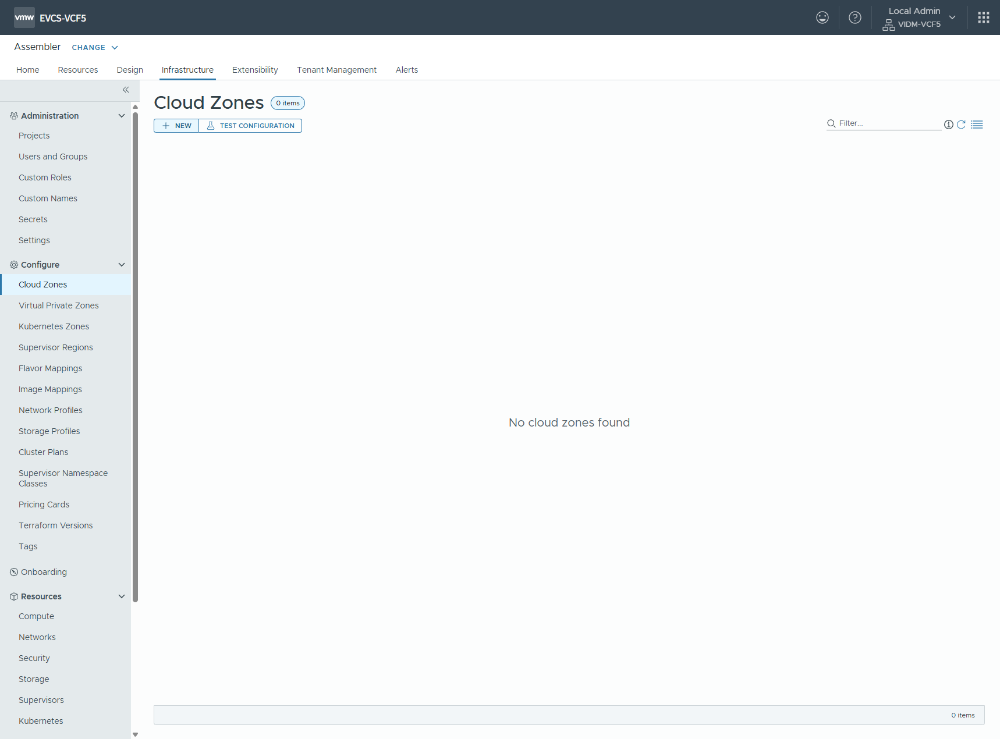 < Infrastructure > Configure >< Cloud Zones 메뉴 선택 >

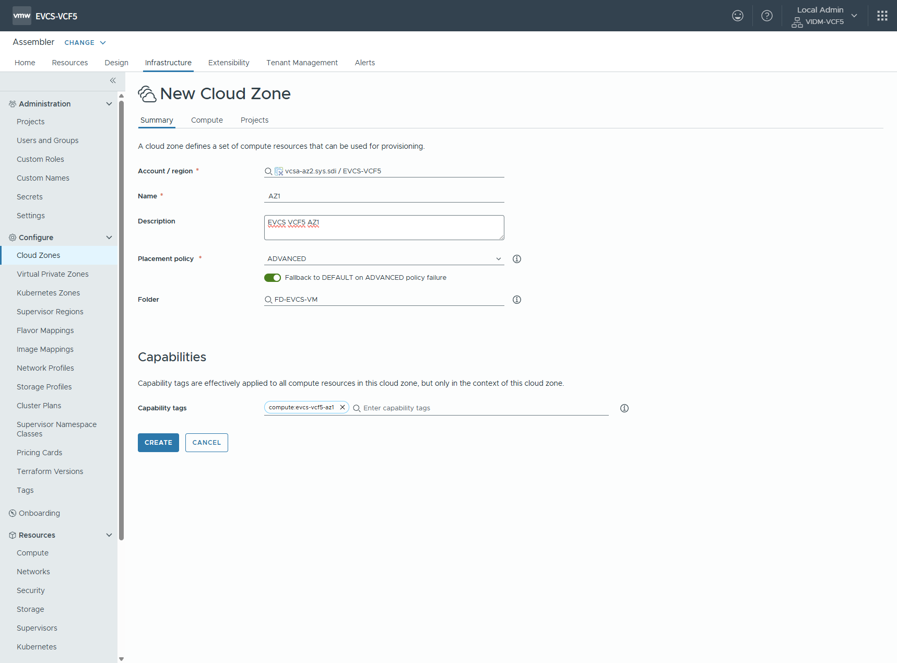 < 클라우드 영역 설정 >

> [!NOTE]
> `Description`에 BVP에서 표시할 사용자 친화적인 이름을 입력

> [!NOTE]
> Aria Operations와 연동하고 있다면 `Placement Policy`를 `ADVANCED`로 선택

> [!NOTE]
> `Capability tags`에 `compute:` 로 시작하는 고유 태그 입력

이 클라우드 영역에 워크로드를 프로비저닝하는 데 사용할 수 있는 계산 리소스(예: AWS 가용성 영역 및 vCenter 클러스터)를 보고 관리할 수 있습니다.

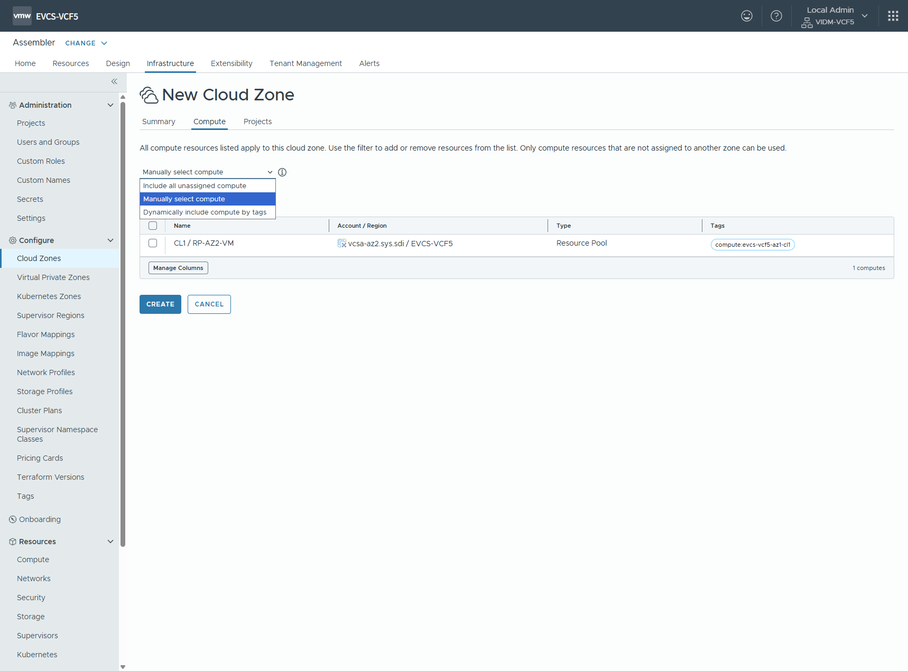 < 할당 클라우드 자원 설정 >

> [!NOTE]
> `Manually select compute` 선택 자원 메뉴에서 설정한 클라우드 기반 컴퓨팅 자원 선택  

> [!NOTE]
> VMware Aria Automation 8.3 릴리스부터는 클라우드 영역이 계산 리소스를 더 이상 공유할 수 없습니다.\
> 공유 계산 리소스를 사용하는 레거시 클라우드 영역은 계속 지원되지만 현재 표준을 준수하도록 업데이트하라는 메시지가 사용자에게 표시됩니다.\
> 클라우드 계정 생성 중 자동 생성된 클라우드 영역은 데이터 수집 후 기본 계산 리소스와 연결됩니다.

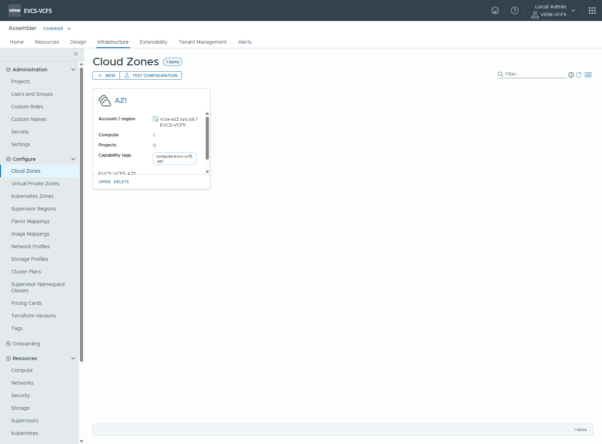 < 클라우드 영역 생성 완료 >

## 네트워크 프로필 설정
네트워크 프로파일은 VMware Aria Automation의 특정 지역 또는 데이터 센터의 클라우드 계정에서 사용할 수 있는 네트워크 설정 및 네트워크 그룹을 정의합니다.\
일반적으로 네트워크 프로파일은 예를 들어 기존 네트워크에 아웃바운드 액세스만 있는 소규모 테스트 환경이나 일련의 보안 정책이 필요한 대규모의 로드 밸런싱된 운영 환경과 같은 대상 배포 환경을 지원하기 위해 정의합니다. \
네트워크 프로파일을 워크로드별 네트워크 특성의 모음으로 생각할 수 있습니다.

### 네트워크 프로파일의 내용
네트워크 프로파일에는 다음 설정을 포함하여 VMware Aria Automation의 명명된 클라우드 계정 유형 및 지역에 대한 특정 정보가 포함되어 있습니다.
- 네트워크 프로파일에 대한 명명된 클라우드 계정/지역 및 선택적 기능 태그.
- 명명된 기존 네트워크 및 해당 설정.
- 네트워크 프로파일의 주문형 네트워크 및 기타 측면을 정의하는 네트워크 정책.
- 기존 로드 밸런서가 선택적으로 포함됩니다.
- 기존 보안 그룹이 선택적으로 포함됩니다.

네트워크 프로파일을 기반으로 네트워크 IP 관리 기능을 결정합니다.

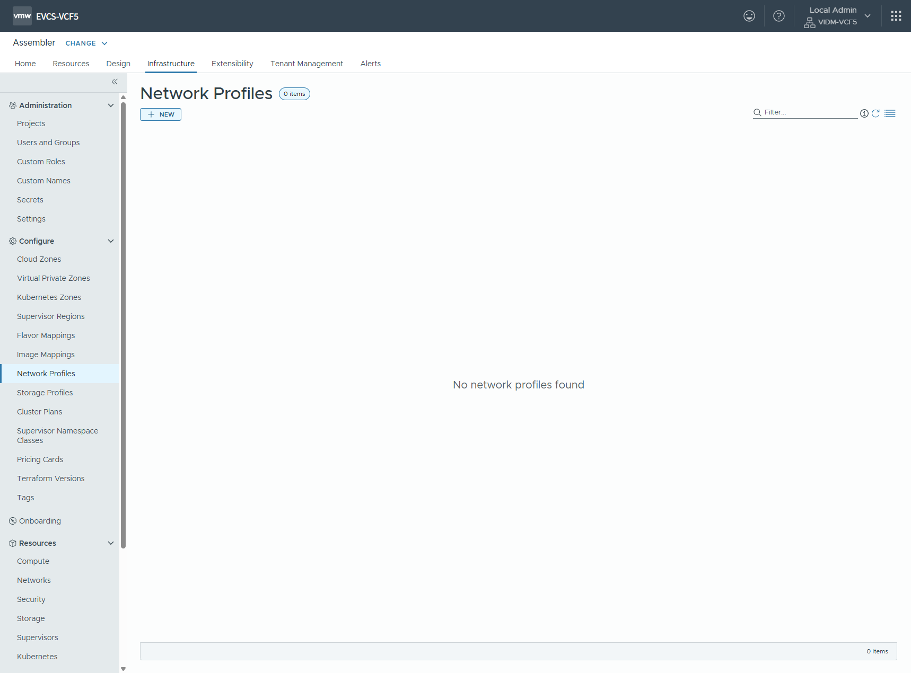 < Infrastructure > Configure > Network Profiles 메뉴 선택 >

> [!NOTE]
> VPC의 업링크 인프라 단위로 프로필 생성\
> 일반적으로 엣지 클러스터 단위로 생성함

### 내부망 VPC 기반 네트워크 설정 (샘플)

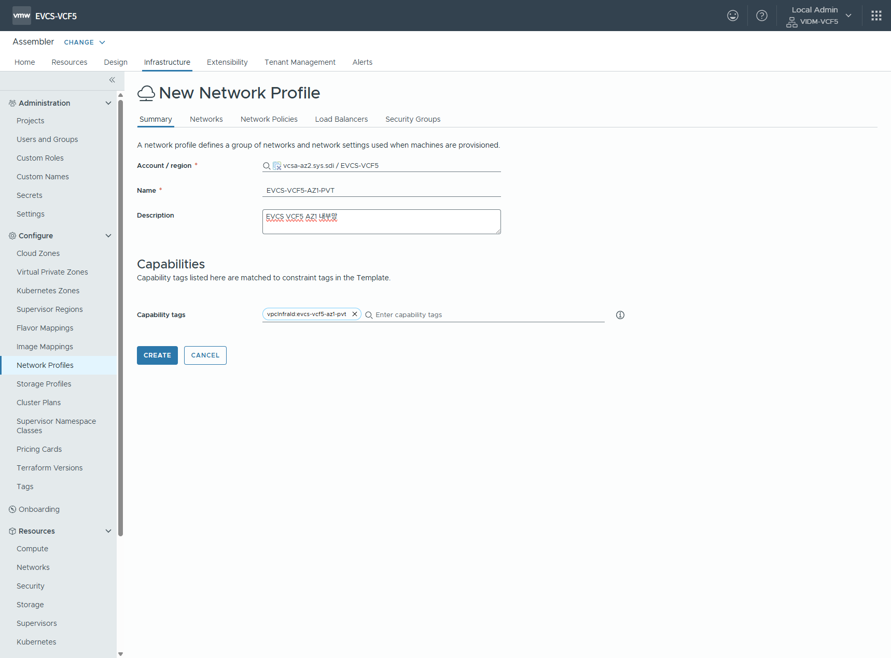 내부망 VPC 기반 네트워크 기본 설정

> [!NOTE]
> `Description`에 BVP에서 표시할 사용자 친화적인 이름을 입력

> [!CAUTION]
> `Capability tags`에 `vpcInfraId:` 로 시작하는 고유 태그 입력\
> 반드시 `vpcInfraId:` 로 시작하는 태그가 있어야 BVP에서 VPC 배포시 기반 인프라 탐색을 수행 할 수 있음

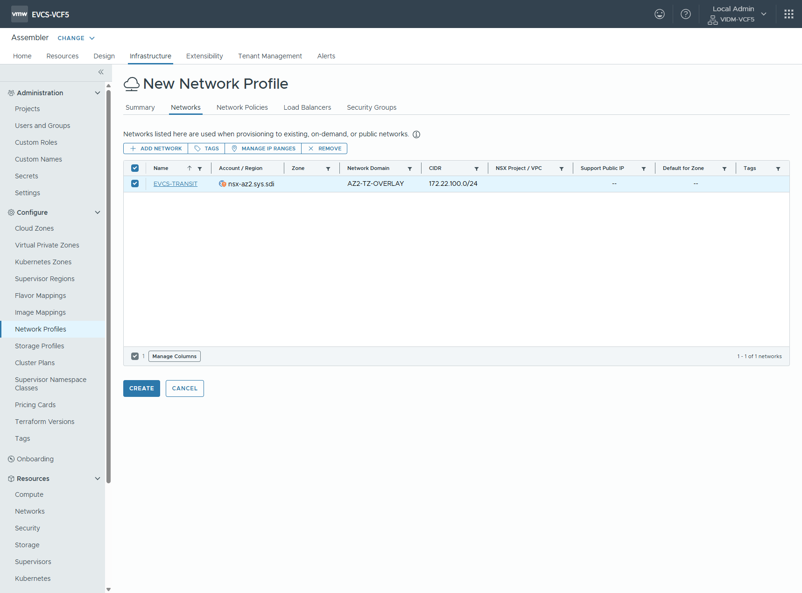 내부망 VPC 사전 네트워크 설정

> [!NOTE]
> `Add Network` 버튼을 통해 반드시 트랜짓 네트워크를 등록해야 함\
> 클라우드 네트워크에 대한 전반적인 설정 정보를 트랜짓 네트워크로 부터 가져옴

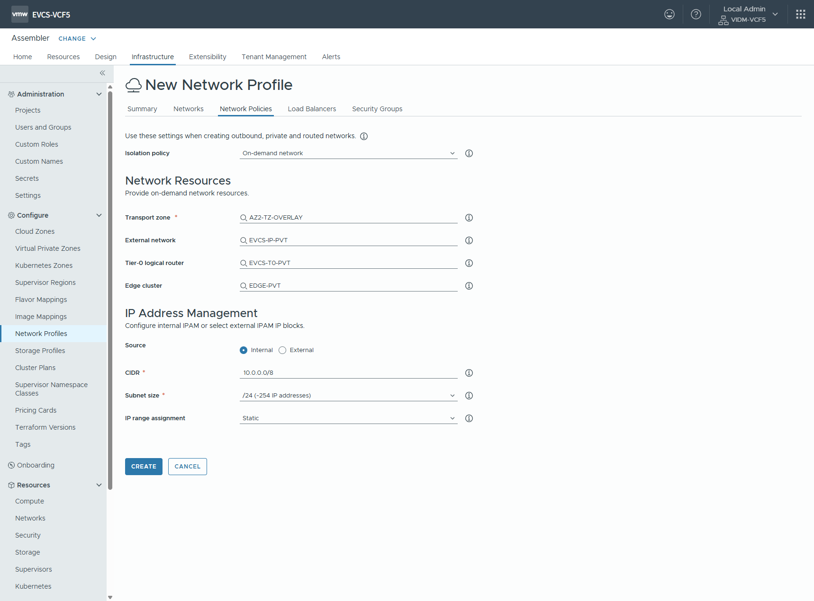 내부망 VPC 할당 네트워크 설정

> [!NOTE]
> `Isolation policy` 를 `On-demand network` 로 설정\
> `Transport zone` 은 클라우드 데이터 전송용 오버레이를 선택\
> `External network` 는 엣지 클러스터 하위에 NSX에서 설정한 IP 할당용 세그먼트를 지정\
> `Tier-0 logical router` 는 엣지 클러스터에 포함된 업링크용 T0 라우터 지정\
> `Edge Cluster` 는 해당 엣지 클러스터를 지정\
> `CIDR` 은 엣지 클러스터 상위에 지정된 라우트 망 CIDR을 지정. 기본 BVP 기능에서는 특별히 사용되지는 않음\
> `Subnet size` 는 `CIDR` 하위 프리픽스 영역을 임의로 지정\
> `IP range assignment` 는 `Static` 으로 설정

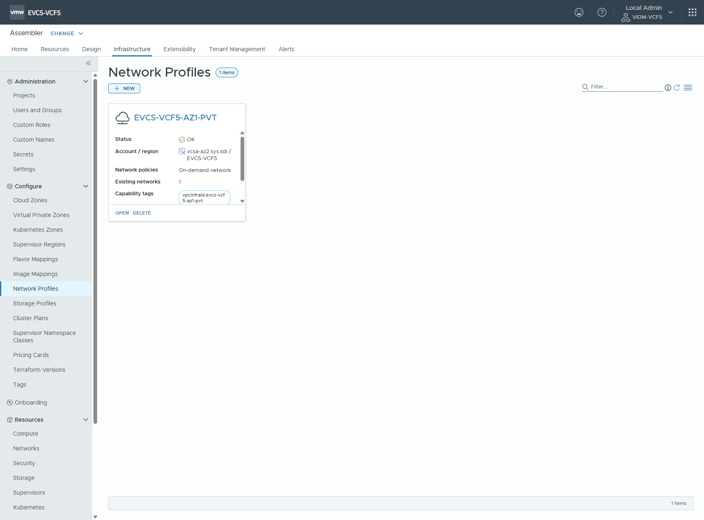 내부망 VPC 사전 네트워크 확인

### 외부망 VPC 기반 네트워크 설정 (샘플)

 외부망 VPC 기반 네트워크 기본 설정

> [!NOTE]
> `Description`에 BVP에서 표시할 사용자 친화적인 이름을 입력

> [!CAUTION]
> `Capability tags`에 `vpcInfraId:` 로 시작하는 고유 태그 입력\
> 반드시 `vpcInfraId:` 로 시작하는 태그가 있어야 BVP에서 VPC 배포시 기반 인프라 탐색을 수행 할 수 있음

 외부망 VPC 사전 네트워크 설정

> [!NOTE]
> `Add Network` 버튼을 통해 반드시 트랜짓 네트워크를 등록해야 함\
> 클라우드 네트워크에 대한 전반적인 설정 정보를 트랜짓 네트워크로 부터 가져옴

 외부망 VPC 할당 네트워크 설정

> [!NOTE]
> `Isolation policy` 를 `On-demand network` 로 설정\
> `Transport zone` 은 클라우드 데이터 전송용 오버레이를 선택\
> `External network` 는 엣지 클러스터 하위에 NSX에서 설정한 IP 할당용 세그먼트를 지정\
> `Tier-0 logical router` 는 엣지 클러스터에 포함된 업링크용 T0 라우터 지정\
> `Edge Cluster` 는 해당 엣지 클러스터를 지정\
> `CIDR` 은 엣지 클러스터 상위에 지정된 라우트 망 CIDR을 지정. 기본 BVP 기능에서는 특별히 사용되지는 않음\
> `Subnet size` 는 `CIDR` 하위 프리픽스 영역을 임의로 지정\
> `IP range assignment` 는 `Static` 으로 설정

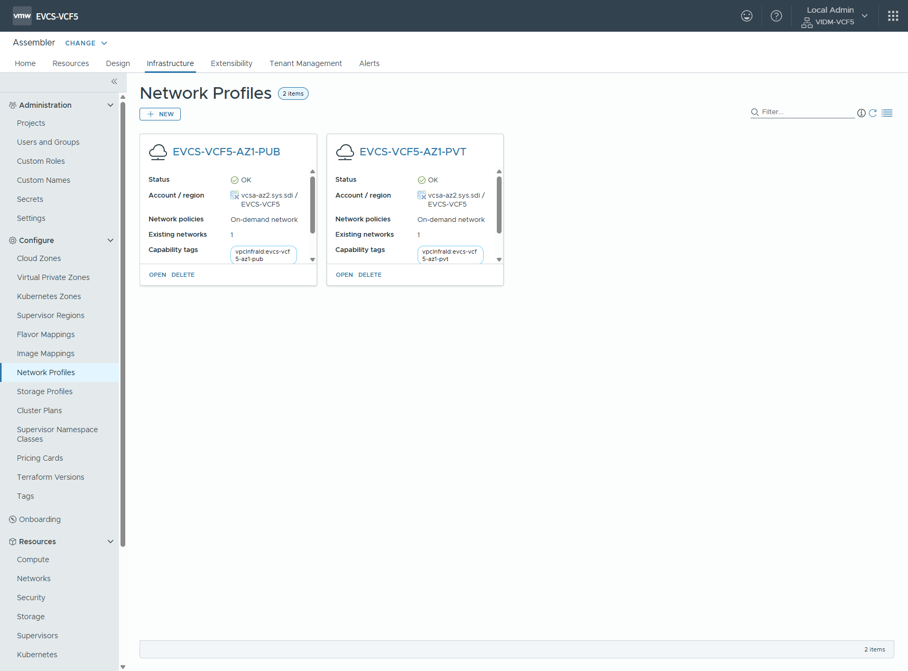 외부망 VPC 사전 네트워크 확인

## 스토리지 프로필 설정

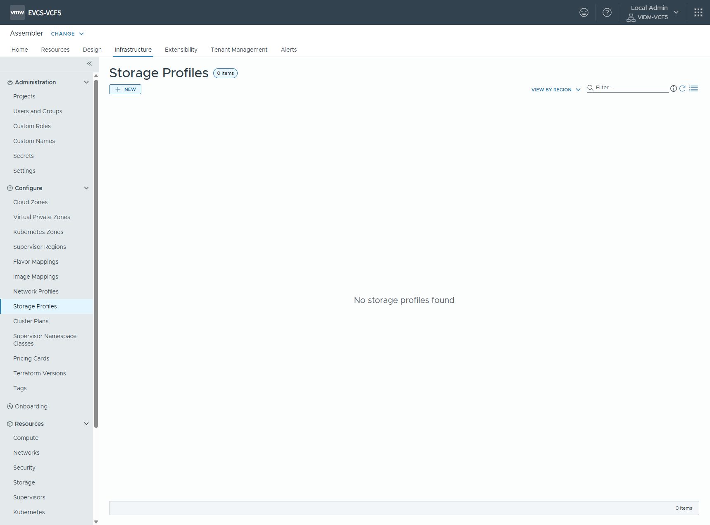 Infrastructure > Configure > Storage Profiles 메뉴 선택

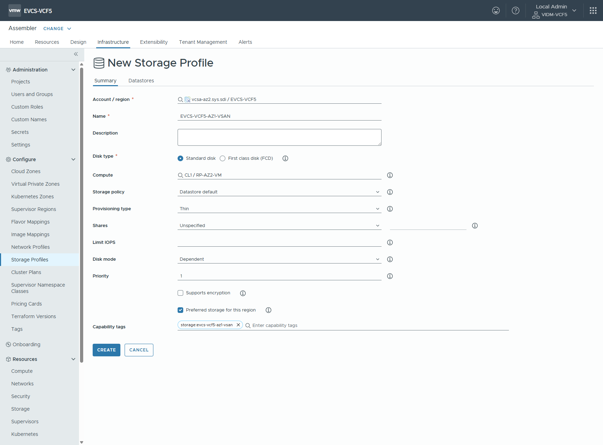 클러스터에 따른 스토리지 설정

> [!NOTE]
> `Compute` 에 배포 영역 기준 설정

> [!NOTE]
> `Capability tags` 에 `storage:` 로 시작하는 고유 태그 입력

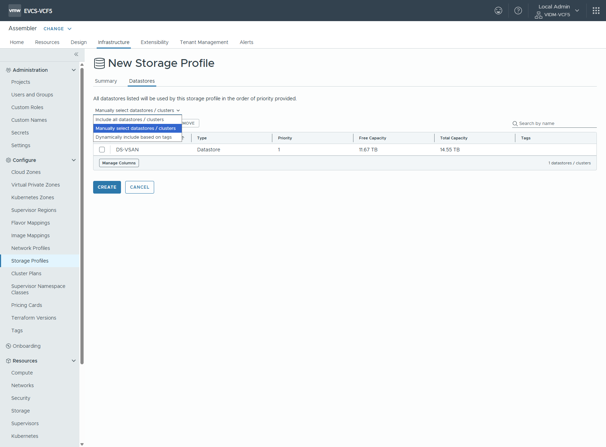 데이터스토어 추가

> [!NOTE]
> `Manually select datastores/clusters` 선택 후 Datastore 추가

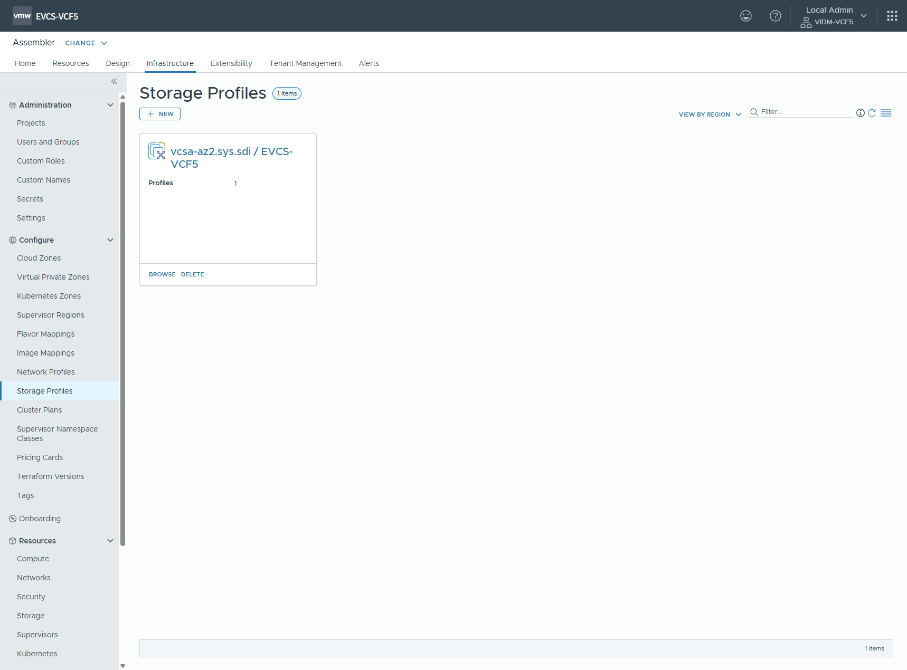 스토리지 프로필 확인

## 플레이버 (기준 배포 스펙) 설정

 Infrastructure > Configure > Flavor Mappings 메뉴 선택

**`small` 크기 생성 (샘플)**

 small 크기 [1Core 2GRam]

**`medium` 크기 생성 (샘플)**

 medium 크기 [2Core 4GRam]

**`large` 크기 생성 (샘플)**

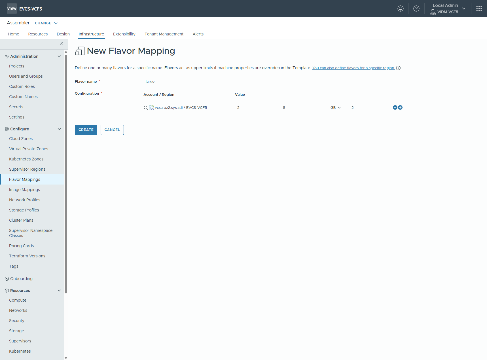 large 크기 [2Core 8GRam]

**`xlarge` 크기 생성 (샘플)**

 xlarge 크기 [4Core 16GRam]

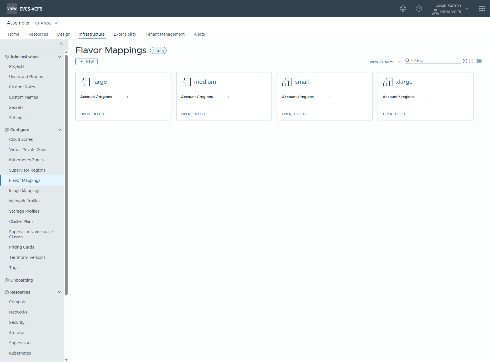 플레이버 확인

## 이미지 설정

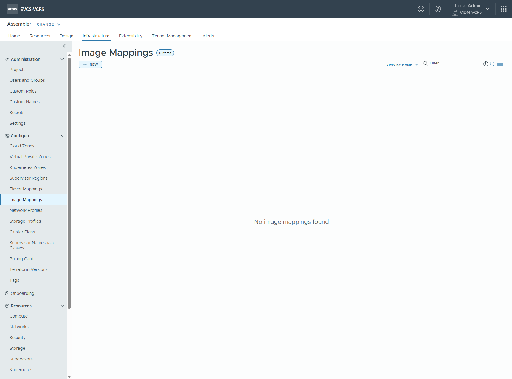 Infrastructure > Configure > Image Mappings 메뉴 선택

**Ubuntu 24.04 (샘플)**

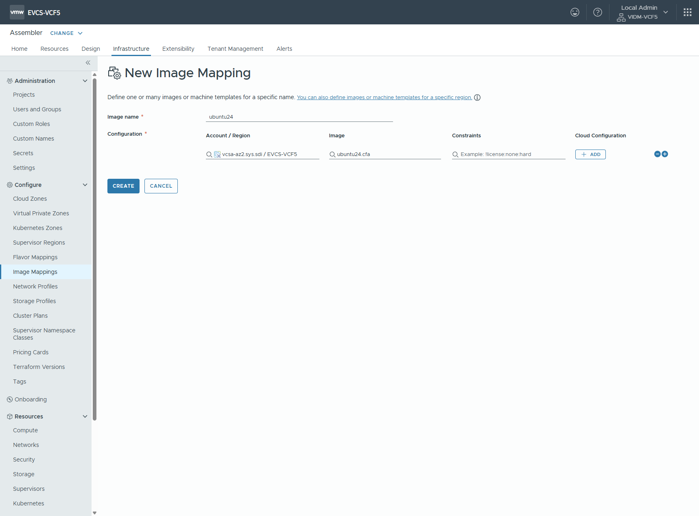 ubuntu24

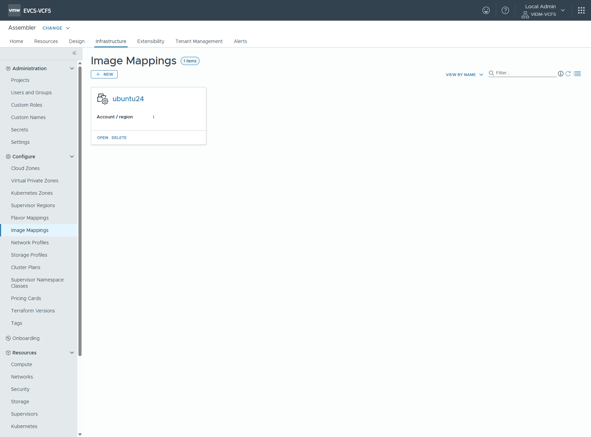 이미지 설정 확인

## 기본 커스텀 이름 규칙

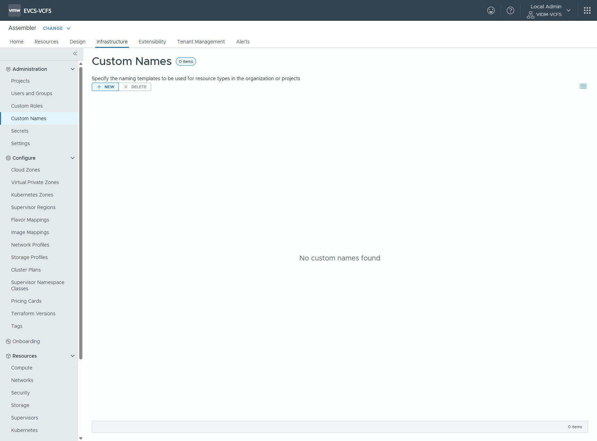 Infrastructure > Configure > Custom Names 메뉴 선택

> [!NOTE]
> 최초 설정시에는 `Enroll` 버튼을 눌러 활성화 함

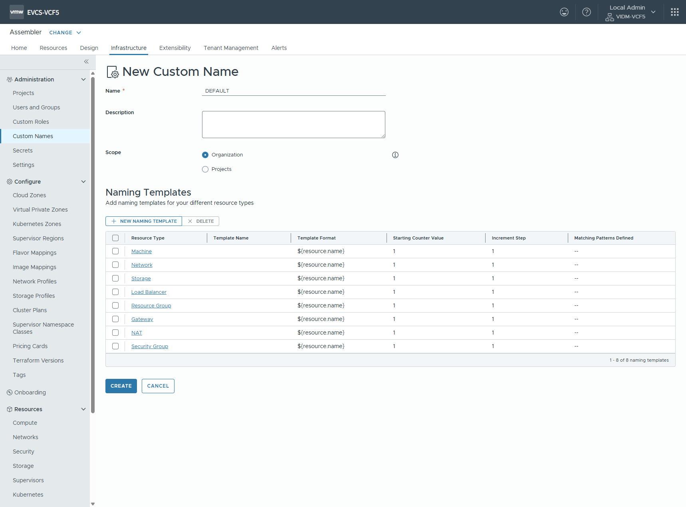 기본 이름 규칙 설정

> [!NOTE]
> 모든 `Template Format`은 `${resource.name}` 으로 지정

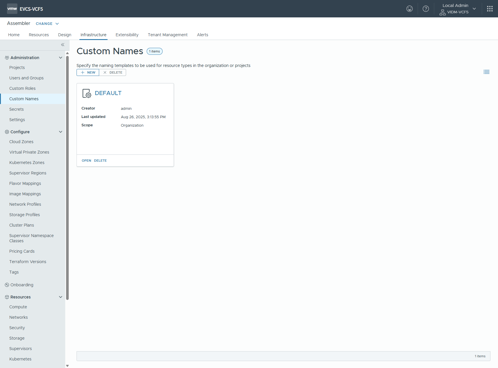 기본 이름 규칙 확인

