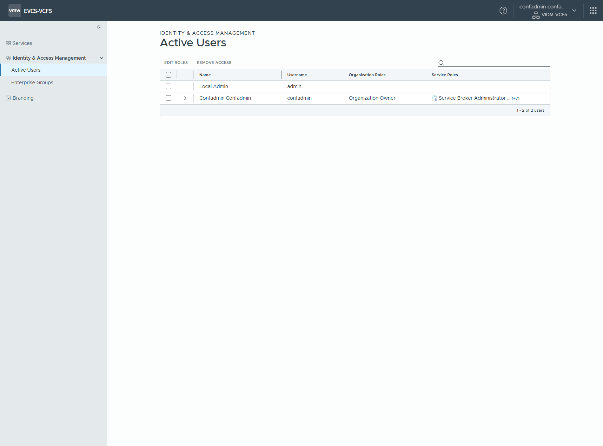
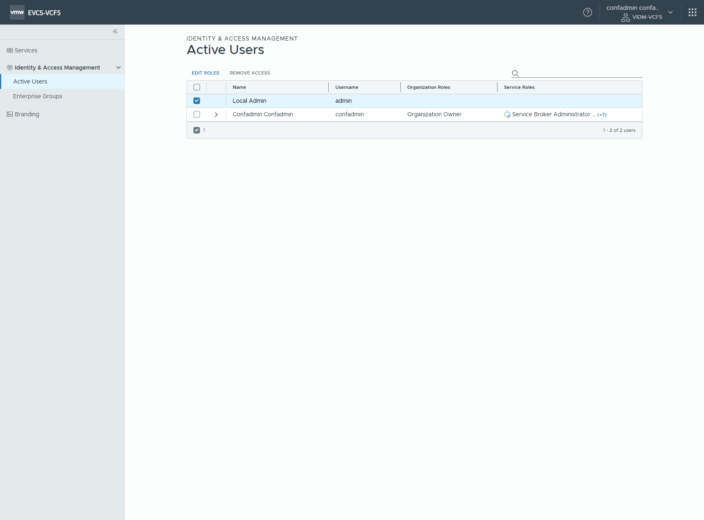
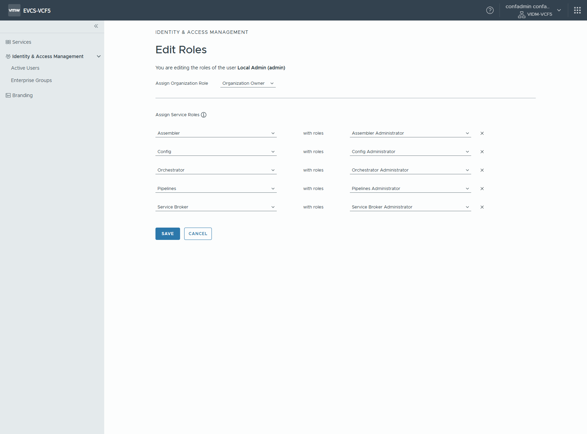
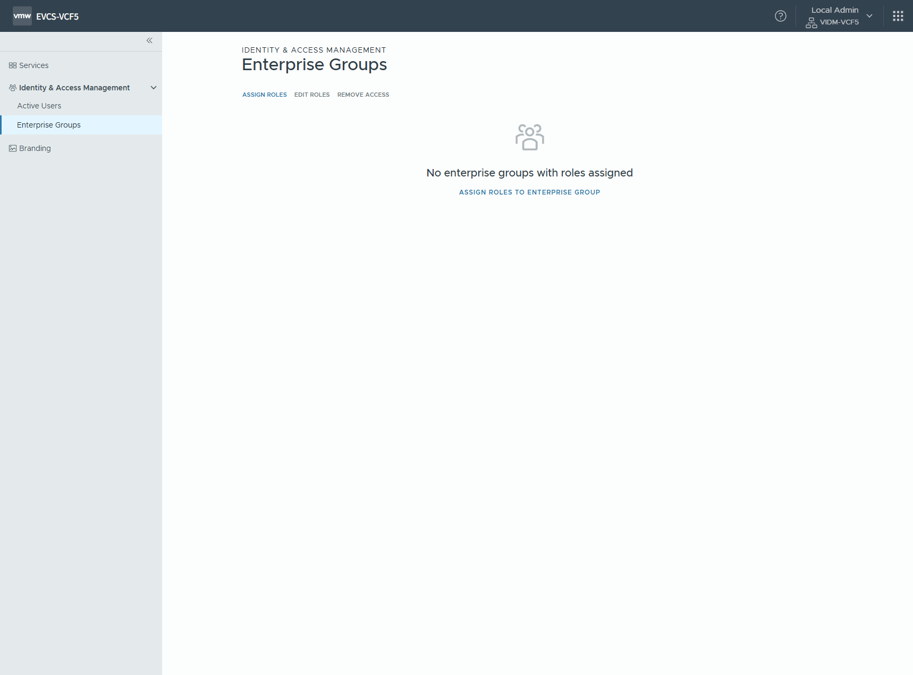
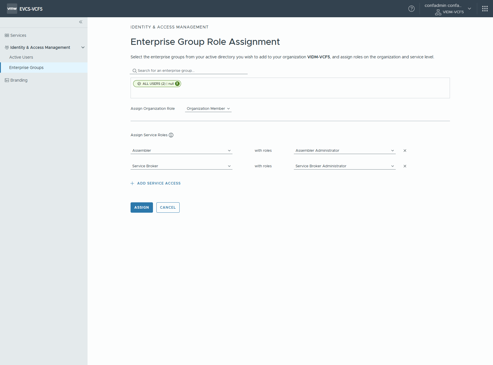
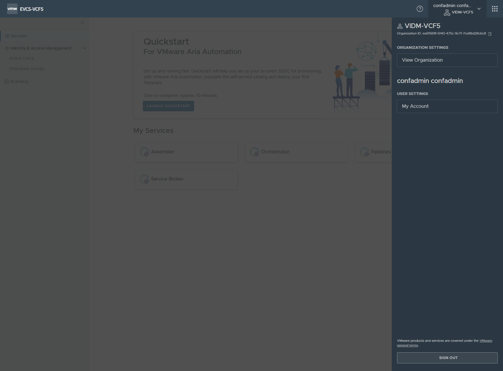
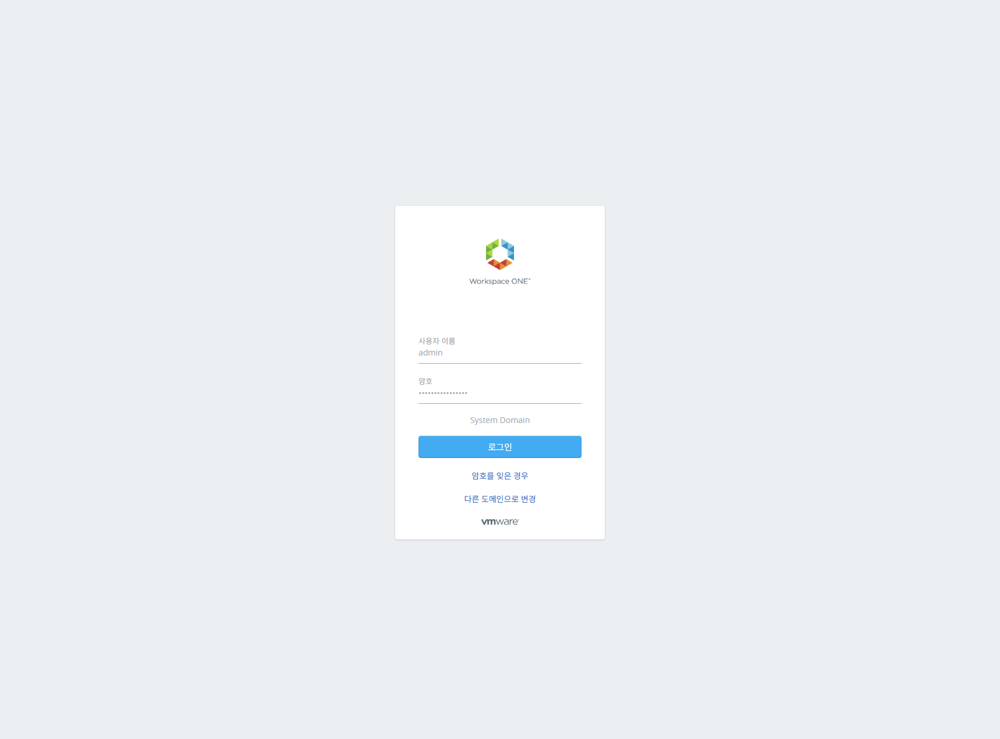

# Aria Automation 권한 설정

## 1. 최초 로그인

 설정 관리자로 최초 로그인

> [!WARNING]
> confadmin 으로 로그인 하는것 설명, Configuration Admin 은 자동화용 내부 계정이므로 아래 세팅 후 사용 하지 말자는 설명 필요

## 2. 인증 및 접근 관리

### 2.1. Admin 계정에 대한 권한 설정

 Identity & Access Management > Active Users 메뉴 선택

 Local Admin 선택

 역할 수정

> [!NOTE]
> `Assign Organization Role` 은 `Organization Owner` 로 선택\
> 각 서비스 모듈에 대한 `Administrator` 권한 선택

> Todo
> 왜 이작업 해야 하는지 설명, 앞으로 admin 계정을 관리자로 쓰게끔 한다\
> 추가의 관리자가 필요하면 IDM에 계정시스템 연동 후 관리자 계정을 추가 설정한다는 설명 필요

### 2.2. All Users 그룹에 대한 권한 설정

 Identity & Access Management > Enterprise Groups 메뉴 선택

 All Users 권한 생성

> [!NOTE]
> `ALL USERS` 검색 후 선택\
> `Organization Member` 로 선택\
> `Assembler` 및 `Service Broker` 에 대한 `Administrator` 권한 선택

## 3. 설정 관리자 로그아웃 후 관리자 계정으로 로그인

 로그아웃 (SIGN OUT)

 admin 계정으로 로그인

