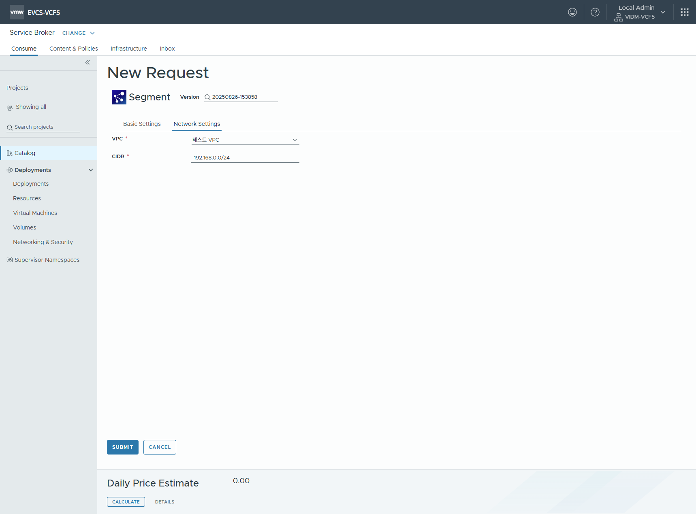

# Service Broker 설정
VMware Aria Automation Service Broker는 카탈로그 항목을 요청하고 관리할 수 있는 단일 지점을 제공합니다.\
클라우드 관리자는 사용자가 클라우드 벤더 지역이나 데이터스토어에 배포할 수 있는 릴리스된 VMware Aria Automation Assembler 클라우드 템플릿을 가져와서 카탈로그 항목을 생성합니다.\
사용자는 프로비저닝 프로세스를 요청하고 모니터링할 수 있습니다. 배포 후에는 배포된 카탈로그 항목을 배포 수명 주기 동안 관리합니다.

 < Service Broker 선택 >

 TEXT

 TEXT

 TEXT

 TEXT

 TEXT

 TEXT

 TEXT

 TEXT

 TEXT

 TEXT

 TEXT

 TEXT

 TEXT

 TEXT

 TEXT

 TEXT

 TEXT

 TEXT

 TEXT

 TEXT

 TEXT

 TEXT

