# Broadcom Value Pack (BVP) 사용자 메뉴얼

> **이 문서 사용 방법**
> 이 문서는 **BVP(Broadcom Value Pack)를 설치한 모든 VCF Automation 환경**에서 사용 가능한 서비스 운영 가이드입니다.
> 아래 항목은 귀사 환경에 맞는 실제 값으로 대체하여 읽으십시오.
>
> | 항목 | 귀사 환경 값 | 설명 |
> |---|---|---|
> | VCF Automation URL | `https://<VCF-Automation-URL>` | 브라우저에서 접속하는 VCF Automation 주소 |
> | 조직(Organization) | `<조직명>` | 로그인 후 우측 상단에서 확인 |
> | VCF Automation 버전 | v9.0.x 이상 | BVP 지원 최소 버전 |

---

## 목차

1. [BVP 개요](#1-bvp-개요)
2. [시작하기 — Catalog 접속 방법](#2-시작하기--catalog-접속-방법)
3. [서비스 요청 기본 흐름](#3-서비스-요청-기본-흐름)
4. [서비스별 사용 가이드 (생성 순서)](#4-서비스별-사용-가이드-생성-순서)
   - 4.1 [Project (프로젝트)](#41-project-프로젝트) 
   - 4.2 [Virtual Private Cloud (VPC)](#42-virtual-private-cloud-vpc)
   - 4.3 [Subnet (서브넷)](#43-subnet-서브넷)
   - 4.4 [Virtual Machine (가상 머신)](#44-virtual-machine-가상-머신)
   - 4.5 [GPU Virtual Machine (GPU 가상 머신)](#45-gpu-virtual-machine-gpu-가상-머신)
   - 4.6 [Block Disk (블록 디스크)](#46-block-disk-블록-디스크)
   - 4.7 [Load Balancer (로드 밸런서)](#47-load-balancer-로드-밸런서)
   - 4.8 [Kubernetes Cluster (쿠버네티스 클러스터)](#48-kubernetes-cluster-쿠버네티스-클러스터)
   - 4.9 [PostgreSQL (DSM - PostgreSQL)](#49-postgresql-dsm---postgresql)
5. [Day-2 Operations 가이드](#5-day-2-operations-가이드)
6. [문제해결 FAQ](#6-문제해결-faq)
7. [용어 정리](#7-용어-정리)
8. [BVP 설치 가이드 (관리자용)](#8-bvp-설치-가이드-관리자용)
   - 8.1 [사전 요구사항](#81-사전-요구사항)
   - 8.2 [vRO 패키지 Import](#82-vro-패키지-import)
   - 8.3 [Install Value Pack 워크플로우 실행](#83-install-value-pack-워크플로우-실행)
   - 8.4 [설치 확인](#84-설치-확인)
   - 8.5 [설치 후 생성되는 리소스](#85-설치-후-생성되는-리소스)

---

## 1. BVP 개요

**Broadcom Value Pack(BVP)** 은 VCF Automation의 Catalog을 기반으로 구성된 셀프서비스 인프라 자동화 패키지입니다. 사용자는 별도의 인프라 전문 지식 없이도 Catalog에서 필요한 서비스를 선택하고, 입력값을 작성하는 것만으로 가상 머신, 네트워크, 스토리지, 쿠버네티스 클러스터 등 다양한 인프라 자원을 자동으로 프로비저닝할 수 있습니다.

### BVP가 제공하는 서비스

| 서비스 (Catalog 이름) | 리소스 유형 | 설명 |
|---|---|---|
| Virtual Machine | `Custom.VirtualMachine` | 일반 가상 머신 생성 및 관리 |
| GPU Virtual Machine | `Custom.GPUVirtualMachine` | GPU가 연결된 가상 머신 생성 |
| Virtual Private Cloud | `Custom.VPC` | 격리된 가상 사설 네트워크 환경 |
| Subnet | `Custom.Subnet` | VPC 내 서브넷 구성 |
| Load Balancer | `Custom.LoadBalancer` | 트래픽 분산 로드 밸런서 |
| Block Disk | `Custom.BlockDisk` | VM에 연결 가능한 블록 스토리지 |
| Kubernetes Cluster | `Custom.Cluster` | 관리형 쿠버네티스 클러스터 |
| PostgreSQL | `Custom.DSMDb` | DSM 기반 관리형 PostgreSQL 데이터베이스 |
| Project | `Custom.Project` | 팀/조직 단위 프로젝트 관리 |

### 핵심 동작 흐름

```
사용자가 Catalog에서 서비스 선택
        ↓
Blueprint 입력값 작성 (폼 제출)
        ↓
Custom Resource 생성
        ↓
Subscription이 VRO 워크플로우 실행
        ↓
실제 인프라 프로비저닝 완료
```

> ⚠️ **주의**: BVP에서 생성된 모든 리소스는 VCF Automation의 **Instance** 단위로 관리됩니다. 리소스를 삭제하려면 반드시 Instance의 Day-2 Operations를 통해 삭제하십시오. 직접 인프라에서 삭제하면 상태 불일치가 발생할 수 있습니다.

---

## 2. 시작하기 — Catalog 접속 방법

### 사전 요구사항

- BVP 패키지가 설치된 VCF Automation 환경 (설치 방법은 [8. BVP 설치 가이드](#8-bvp-설치-가이드-관리자용) 참고)
- VCF Automation 계정 및 프로젝트 멤버십 (Administrator, User, Advanced User 중 하나)
- VCF Automation URL 및 조직명 확인 (관리자에게 문의)

> **환경 정보 확인 방법**
> - **URL**: 관리자가 제공한 VCF Automation 접속 주소 (예: `https://vcfa.example.com`)
> - **조직명**: 로그인 후 우측 상단 드롭다운에서 확인 가능

### 접속 절차

**1단계: VCF Automation 포털 로그인**

브라우저에서 관리자가 제공한 **VCF Automation URL**에 접속합니다.

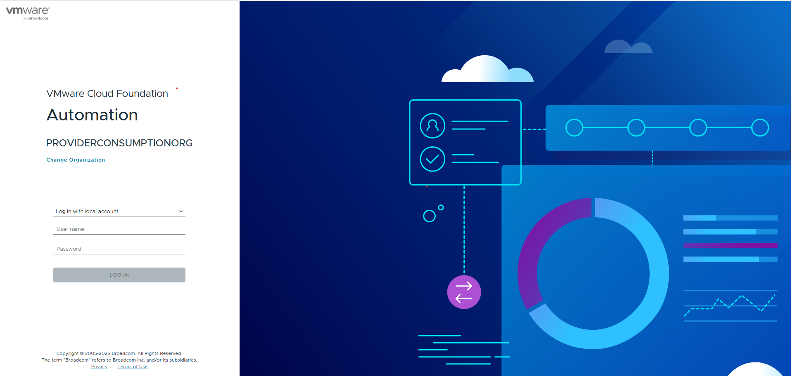
> 📸 *화면 설명: VCF Automation 로그인 페이지. 사용자 이름과 비밀번호 입력란이 표시됩니다.*

**2단계: 조직 확인**

로그인 후 우측 상단의 조직 선택 메뉴에서 **BVP가 설치된 조직**이 선택되어 있는지 확인합니다.

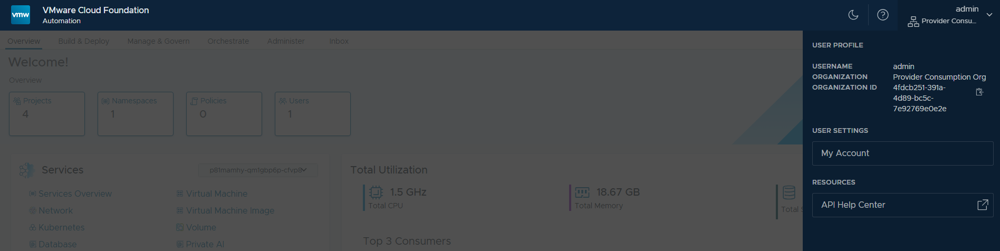
> 📸 *화면 설명: 우측 상단 조직 선택 드롭다운. BVP가 설치된 조직이 활성화된 상태.*

**3단계: Catalog 메뉴 이동**

상단 탭에서 **Build & Deploy**를 클릭한 후, 좌측 사이드바에서 **Catalog**를 클릭합니다.

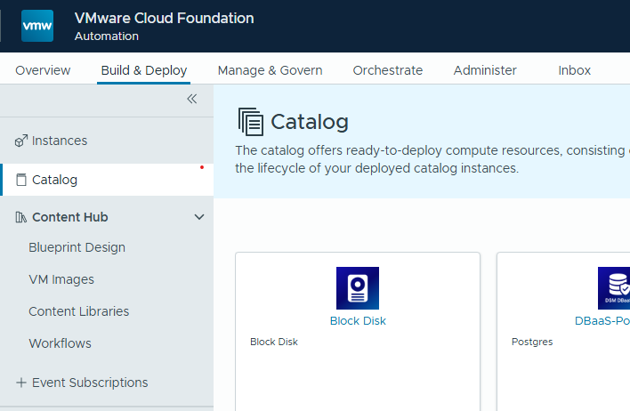
> 📸 *화면 설명: 상단 "Build & Deploy" 탭 선택 후 좌측 사이드바에서 "Catalog" 항목을 클릭합니다.*

**4단계: 서비스 목록 확인**

Catalog 페이지에서 사용 가능한 9개 서비스 카드를 확인합니다. 우측 상단 검색창으로 원하는 서비스를 빠르게 찾을 수 있습니다.


> 📸 *화면 설명: BVP Catalog 서비스 목록. Block Disk, GPU Virtual Machine, Kubernetes Cluster, Load Balancer, PostgreSQL, Project, Subnet, Virtual Machine, Virtual Private Cloud 9개 카드가 표시됩니다.*

---

## 3. 서비스 요청 기본 흐름

모든 BVP 서비스는 아래 공통 절차를 따릅니다.

```
1. Catalog에서 서비스 카드 클릭
2. [Request] 버튼 클릭
3. 입력 폼 작성 (필수 항목 * 표시)
4. [Submit] 클릭
5. Instances 페이지에서 진행 상태 확인
6. 완료 후 리소스 상세 정보 확인
```

### 배포 상태 확인

서비스 요청 후 **Build & Deploy > Instances** 메뉴에서 프로비저닝 상태를 실시간으로 확인할 수 있습니다.

| 상태 | 설명 |
|---|---|
| `IN_PROGRESS` | 프로비저닝 진행 중 |
| `CREATE_SUCCESSFUL` | 생성 완료 |
| `CREATE_FAILED` | 생성 실패 — 상세 로그 확인 필요 |
| `UPDATE_SUCCESSFUL` | Day-2 작업 완료 |
| `DELETE_SUCCESSFUL` | 삭제 완료 |

> 💡 **팁**: 프로비저닝에 걸리는 시간은 서비스 종류에 따라 다릅니다. 가상 머신은 보통 5~10분, 쿠버네티스 클러스터는 15~30분 정도 소요됩니다.

---

## 4. 서비스별 사용 가이드 (생성 순서)

BVP 서비스는 **의존관계**가 있기 때문에, 반드시 아래 순서대로 생성해야 합니다. 예를 들어 VM을 만들려면 그 VM이 속할 VPC와 Subnet이 미리 존재해야 합니다.

### 서비스 생성 순서 및 의존관계

```
① Project (프로젝트)
      │  모든 자원의 소유 단위
      ▼
② Virtual Private Cloud (VPC)
      │  네트워크 기반 환경
      ▼
③ Subnet (서브넷)          ──── VPC에 종속
      │
      ├──▶ ④ Virtual Machine ──────────── VPC + Subnet 필요
      │         │
      │         └──▶ ⑥ Block Disk ──── VM에 Attach 가능 (VPC 필요)
      │         │
      │         └──▶ ⑦ Load Balancer ─ VPC + VM 필요
      │
      ├──▶ ⑤ GPU Virtual Machine ──────── VPC + Subnet 필요 (vGPU 모드는 GPU Enable VPC 필요)
      │
      ├──▶ ⑧ Kubernetes Cluster ───────── VPC 필요
      │
      └──▶ ⑨ PostgreSQL ──────────────── VPC + Namespace 필요
```

| 순서 | 서비스 | 필수 선행 자원 |
|:---:|---|---|
| ① | Project | 없음 (관리자 권한 필요) |
| ② | Virtual Private Cloud | Project |
| ③ | Subnet | VPC |
| ④ | Virtual Machine | VPC + Subnet |
| ⑤ | GPU Virtual Machine | VPC + Subnet (vGPU 모드는 GPU Enable VPC 필요) |
| ⑥ | Block Disk | VPC (Namespace) |
| ⑦ | Load Balancer | VPC + VM |
| ⑧ | Kubernetes Cluster | VPC |
| ⑨ | PostgreSQL | VPC |

---

### 4.1 Project (프로젝트)

**리소스 유형**: `Custom.Project`

> **생성 순서: ① 가장 먼저**
> 프로젝트는 모든 인프라 자원(VPC, VM, DB 등)의 소유 단위입니다. BVP에서 어떤 서비스든 요청하려면 먼저 프로젝트가 있어야 하고, 해당 프로젝트의 멤버로 등록되어 있어야 합니다.

팀 또는 조직 단위로 인프라 자원과 접근 권한을 관리하는 프로젝트를 생성합니다.

> ⚠️ **주의**: Project 생성은 일반적으로 관리자(Administrator) 권한이 필요합니다. 권한이 없는 경우 담당 관리자에게 요청하십시오.

#### 생성 절차

**1단계**: Catalog에서 **Project** 카드를 클릭한 후 **[Request]** 버튼을 클릭합니다.

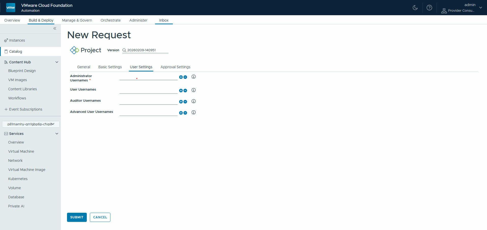
> 📸 *화면 설명: Project 요청 폼. General / Basic Settings / User Settings / Approval Settings 탭으로 구성됩니다. User Settings 탭에서 역할별 사용자를 입력합니다.*

**2단계**: 아래 입력 필드를 참고하여 입력합니다.

#### 입력 필드 설명

> **폼 탭 구조**: General | Basic Settings | **User Settings** | Approval Settings

**Basic Settings 탭**

| UI 표시명 | 필드 ID | 필수 | 설명 | 예시 |
|---|---|:---:|---|---|
| Request Message | requestMessage | - | 서비스 요청 사유를 입력합니다. | `Backend 팀 프로젝트 생성 요청` |
| Display Name | displayName | ✅ | 프로젝트의 표시 이름을 입력합니다. | `Backend Team Project` |
| Code Name | codeName | ✅ | 시스템 내부 식별자입니다. 영문 소문자와 하이픈만 사용 가능합니다. | `backend-team` |

**User Settings 탭**

| UI 표시명 | 필드 ID | 필수 | 설명 | 예시 |
|---|---|:---:|---|---|
| Administrator Usernames | administrators | ✅ | 프로젝트 관리자 역할의 사용자 목록입니다. 1명 이상 지정해야 합니다. | `[user1@example.com]` |
| User Usernames | users | - | 일반 사용자 역할의 사용자 목록입니다. Catalog에서 서비스를 요청할 수 있습니다. | `[user2@example.com]` |
| Auditor Usernames | auditors | - | 감사자 역할의 사용자 목록입니다. 읽기 전용으로 리소스를 조회할 수 있습니다. | `[auditor@example.com]` |
| Advanced User Usernames | advancedUsers | - | 고급 사용자 역할의 사용자 목록입니다. 일반 사용자보다 확장된 권한을 가집니다. | `[user3@example.com]` |

**Approval Settings 탭**

| UI 표시명 | 필드 ID | 필수 | 설명 | 예시 |
|---|---|:---:|---|---|
| Approver Usernames | approvers | - | 서비스 요청 승인자 목록입니다. 승인 정책이 활성화된 경우 이 목록의 사용자가 승인합니다. | `[approver@example.com]` |

#### 프로젝트 역할별 권한

| 역할 | 서비스 요청 | Day-2 Operations | 멤버 관리 | 리소스 조회 |
|---|:---:|:---:|:---:|:---:|
| Administrator | ✅ | ✅ | ✅ | ✅ |
| Advanced User | ✅ | ✅ | ❌ | ✅ |
| User | ✅ | ✅ (본인 리소스) | ❌ | ✅ (본인 리소스) |
| Auditor | ❌ | ❌ | ❌ | ✅ |

**3단계**: 모든 항목 입력 후 **[Submit]** 버튼을 클릭합니다.

**4단계**: **Instances** 페이지에서 Project 생성 상태가 `CREATE_SUCCESSFUL`로 변경되면 완료입니다.

> 💡 **다음 단계**: 프로젝트가 생성되었으면 [4.2 Virtual Private Cloud](#42-virtual-private-cloud-vpc)를 생성하여 네트워크 환경을 구성하십시오.

---

### 4.2 Virtual Private Cloud (VPC)

**리소스 유형**: `Custom.VPC`

> **생성 순서: ② Project 생성 후**
> VPC는 VM, Subnet, Load Balancer, K8s Cluster, DBaaS 등 **모든 인프라 자원의 네트워크 기반**입니다. 프로젝트 생성 후 가장 먼저 VPC를 설계하고 생성하십시오.

격리된 가상 사설 네트워크 환경을 생성합니다.

#### 생성 절차

**1단계**: Catalog에서 **Virtual Private Cloud** 카드를 클릭한 후 **[Request]** 버튼을 클릭합니다.


> 📸 *화면 설명: VPC 요청 폼. Display Name, Region, Zone 설정 영역이 표시됩니다.*

**2단계**: 아래 입력 필드를 참고하여 입력합니다.

#### 입력 필드 설명

> **폼 탭 구조**: General | Basic Settings | **Policy Settings**

| UI 표시명 | 필드 ID | 탭 | 필수 | 설명 | 예시 |
|---|---|---|:---:|---|---|
| Display Name | displayName | Basic Settings | ✅ | VPC의 표시 이름을 입력합니다. | `dev-team-vpc` |
| Request Message | requestMessage | Basic Settings | - | 서비스 요청 사유를 입력합니다. | `개발 팀 VPC 생성 요청` |
| VPC Unique ID | codeName | Basic Settings | ✅ | 시스템 내부 고유 식별자입니다. 자동으로 랜덤 생성됩니다. 수정하지 마십시오. | (자동 생성) |
| Region Name | regionName | Policy Settings | ✅ | VPC를 생성할 리전을 선택합니다. | `vc-az1` |
| Zones | zones | Policy Settings | ✅ | VPC가 포함할 가용 영역을 1개 이상 선택합니다. | `[az1-cl01]` |
| External IP Block | vpcConnectivityProfileName | Policy Settings | ✅ | 외부 IP 할당에 사용할 IP 블록을 선택합니다. | `172.22.225.0/24` |
| Private IPs | privateIps | Policy Settings | ✅ | VPC에서 사용할 사설 IP 대역을 CIDR 형식으로 입력합니다. | `10.0.0.0/16` |
| GPU Enable | gpuEnabled | Policy Settings | - | vGPU 모드 사용 여부를 설정합니다. **vGPU 모드로 GPU VM을 생성할 계획이라면 반드시 활성화하십시오.** PCI 패스스루 모드에는 필요하지 않습니다. VPC 생성 후 변경 불가합니다. | (체크박스) |
| GPU VM Classes | gpuVmClasses | Policy Settings | - | GPU Enable이 활성화된 경우, 사용할 vGPU 클래스를 선택합니다. | `[vgpu-class-a]` |

> ⚠️ **주의**: Private IPs(CIDR) 설정 시 다른 VPC와 IP 대역이 겹치지 않도록 주의하십시오. IP 대역 중복은 네트워크 통신 장애를 유발할 수 있습니다.

> ⚠️ **주의**: `GPU Enable` 설정은 VPC 생성 후 변경할 수 없습니다. **vGPU 모드**로 GPU VM을 생성할 계획이라면 VPC 생성 시 반드시 활성화하십시오. PCI 패스스루 모드만 사용할 경우에는 활성화하지 않아도 됩니다.

> 💡 **팁**: 향후 확장을 고려하여 충분히 넓은 CIDR 대역(`/16` 또는 `/20`)을 할당하는 것을 권장합니다.

**3단계**: **[Submit]** 버튼을 클릭합니다.

**4단계**: **Instances** 페이지에서 VPC 생성 상태가 `CREATE_SUCCESSFUL`로 변경되면 완료입니다.

> 💡 **다음 단계**: VPC가 생성되었으면 [4.3 Subnet](#43-subnet-서브넷)을 생성하여 네트워크를 분할하십시오.

---

### 4.3 Subnet (서브넷)

**리소스 유형**: `Custom.Subnet`

> **생성 순서: ③ VPC 생성 후**
> **사전 요건**: VPC가 먼저 생성되어 있어야 합니다.
> VM, GPU VM을 구성하려면 Subnet이 필요합니다.

VPC 내에 서브넷을 생성합니다. VM 및 기타 리소스를 서브넷에 배치하여 네트워크를 논리적으로 분리할 수 있습니다.

#### 생성 절차

**1단계**: Catalog에서 **Subnet** 카드를 클릭한 후 **[Request]** 버튼을 클릭합니다.

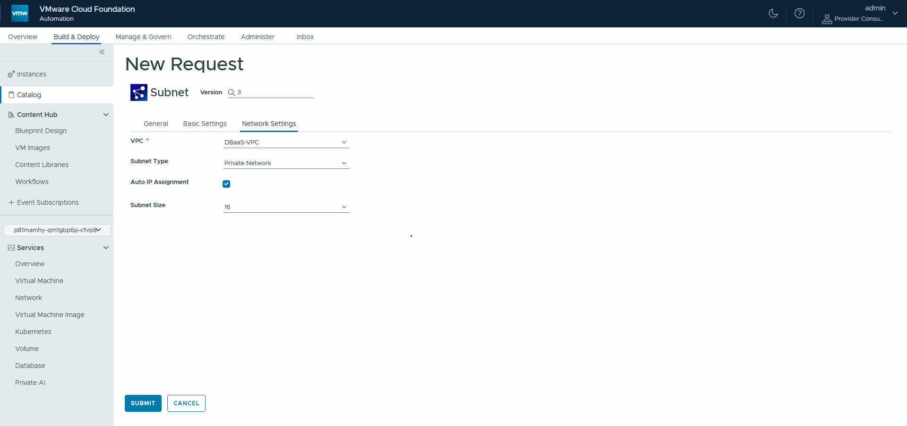
> 📸 *화면 설명: Subnet 요청 폼. VPC 드롭다운과 서브넷 타입 선택 옵션이 표시됩니다.*

**2단계**: 아래 입력 필드를 참고하여 입력합니다.

#### 입력 필드 설명

> **폼 탭 구조**: General | Basic Settings | **Network Settings**

| UI 표시명 | 필드 ID | 탭 | 필수 | 설명 | 예시 |
|---|---|---|:---:|---|---|
| Request Message | requestMessage | Basic Settings | - | 서비스 요청 사유를 입력합니다. | `프론트엔드 서브넷 생성 요청` |
| Display Name | displayName | Basic Settings | ✅ | 서브넷의 표시 이름을 입력합니다. | `frontend-subnet` |
| VPC | vpc | Network Settings | ✅ | 서브넷을 생성할 VPC를 선택합니다. | `dev-team-vpc` |
| Code Name | codeName | Basic Settings | ✅ | 시스템 내부 식별자입니다. 자동으로 랜덤 생성됩니다. | (자동 생성) |
| Subnet Type | subnetType | Network Settings | - | 서브넷 유형을 선택합니다. `Private Network` = 일반 사설 서브넷, `PrivateTGW` = Transit Gateway 연결용 서브넷. 기본값: `Private Network` | `Private Network` |
| Auto IP Assignment | autoIpAssginment | Network Settings | - | VM 배치 시 IP를 자동으로 할당할지 여부를 설정합니다. 기본값: 활성화(체크됨) | `true` |
| Subnet Size | subnetSize | Network Settings | ✅ | 서브넷 크기(IP 주소 수)를 선택합니다. 16 / 32 / 64 / 128 / 256 / 512 중 선택합니다. 기본값: `16` | `64` |
| CIDR | cidr | Basic Settings | ✅ | 서브넷에 할당할 CIDR 범위를 입력합니다. VPC의 IP 대역 내에서 지정하십시오. | `10.0.1.0/26` |


| Subnet Size | CIDR 마스크 | 사용 가능한 IP 수 |
|---|---|---|
| 16 | `/28` | 14개 |
| 32 | `/27` | 30개 |
| 64 | `/26` | 62개 |
| 128 | `/25` | 126개 |
| 256 | `/24` | 254개 |
| 512 | `/23` | 510개 |

**3단계**: **[Submit]** 버튼을 클릭합니다.

**4단계**: **Instances** 페이지에서 Subnet 생성 상태가 `CREATE_SUCCESSFUL`로 변경되면 완료입니다.

> 💡 **다음 단계**: Project, VPC, Subnet이 모두 준비되었습니다. 이제 [4.4 Virtual Machine](#44-virtual-machine-가상-머신)을 생성할 수 있습니다.

---

### 4.4 Virtual Machine (가상 머신)

**리소스 유형**: `Custom.VirtualMachine`

> **생성 순서: ④ Project + VPC + Subnet 생성 후**
> **사전 요건**: Project, VPC, Subnet이 모두 생성되어 있어야 합니다. 요청 폼에서 VPC와 Subnet을 드롭다운으로 선택하므로, 폼 작성 전 미리 생성되어 있어야 합니다.

일반적인 목적의 가상 머신을 생성합니다. 네트워크, 스토리지, OS, 초기화 스크립트까지 하나의 폼에서 설정할 수 있습니다.

#### 생성 절차

**1단계**: Catalog에서 **Virtual Machine** 카드를 클릭한 후 **[Request]** 버튼을 클릭합니다.

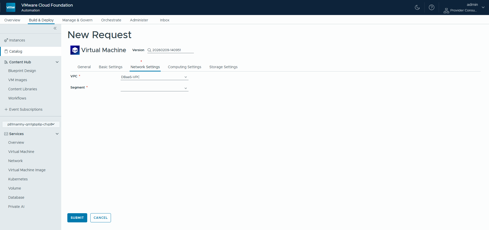
> 📸 *화면 설명: Virtual Machine 요청 폼 상단. VPC 및 Zone 선택 드롭다운이 표시됩니다.*

**2단계**: 아래 입력 필드 설명을 참고하여 각 항목을 입력합니다.

#### 입력 필드 설명

> **폼 탭 구조**: General | Basic Settings | **Network Settings** | Computing Settings | Storage Settings

| UI 표시명 | 필드 ID | 탭 | 필수 | 설명 | 예시 |
|---|---|---|:---:|---|---|
| Request Message | requestMessage | Basic Settings | - | 서비스 요청 사유를 입력합니다. | `웹 서버 VM 생성 요청` |
| Display Name | displayName | Basic Settings | ✅ | VM의 표시 이름을 입력합니다. | `web-server-01` |
| Host Name | hostName | Basic Settings | - | VM의 호스트명(hostname)을 지정합니다. 미입력 시 자동 생성됩니다. | `web-server-01` |
| VPC | vpc | Network Settings | ✅ | VM을 배치할 VPC를 선택합니다. | `my-vpc-01` |
| Segment ¹ | subnet | Network Settings | ✅ | VM이 속할 네트워크 세그먼트(서브넷)를 선택합니다. VPC 선택 시 목록이 자동 표시됩니다. | `frontend-subnet` |
| Zone | placementZone | Computing Settings | ✅ | VM을 배치할 가용 영역을 선택합니다. | `az1-cl01` |
| Flavor | flavor | Computing Settings | ✅ | VM의 CPU/메모리 사양을 선택합니다. | `medium` |
| OS Image | image | Computing Settings | ✅ | 설치할 운영체제 이미지를 선택합니다. | `Ubuntu 22.04 LTS` |
| Software Packages | packages | Computing Settings | - | VM 생성 시 자동 설치할 패키지 목록입니다. (쉼표로 구분) | `nginx, curl` |
| Bootstrap Scripts | bootScripts | Computing Settings | - | VM 최초 부팅 시 실행할 셸 스크립트입니다. | `#!/bin/bash\napt update` |
| Username | username | Computing Settings | ✅ | VM 접속에 사용할 기본 사용자 이름입니다. | `vmadmin` |
| Password | password | Computing Settings | ✅ | 해당 사용자의 비밀번호입니다. 복잡도 정책을 준수해야 합니다. | (비밀번호 입력) |
| Additional Disk (GB) ² | diskSize | Storage Settings | - | 추가 데이터 디스크의 크기를 GB 단위로 입력합니다. 루트 디스크와 별도로 추가됩니다. | `100` |
| Mount | diskMount | Storage Settings | - | 추가 데이터 디스크의 마운트 경로입니다. 기본값: `/data` | `/data` |
| Storage Class ³ | storageClass | Storage Settings | - | VM 디스크의 스토리지 클래스를 선택합니다. | `standard` |

> ¹ **Segment**: UI에서 "Segment"로 표시됩니다. VPC 내 생성한 Subnet(NSX 네트워크 세그먼트)을 선택하는 필드입니다.
> ² **Additional Disk**: 루트 디스크가 아닌 추가 데이터 디스크입니다. 루트 디스크 크기는 선택한 OS Image에 의해 결정됩니다.

> ⚠️ **주의**: Password는 8자 이상, 대문자·소문자·숫자·특수문자를 각각 1개 이상 포함해야 합니다. 비밀번호는 추후 변경이 어려우므로 안전한 곳에 별도로 저장해 두십시오.

> 💡 **팁**: Bootstrap Scripts를 활용하면 VM 생성 직후 애플리케이션 설치나 설정 파일 배포를 자동화할 수 있습니다. 스크립트 첫 줄에 반드시 `#!/bin/bash`를 명시하십시오.

**3단계**: 모든 항목 입력 후 **[Submit]** 버튼을 클릭합니다.

**4단계**: **Instances** 페이지에서 VM 생성 상태가 `CREATE_SUCCESSFUL`로 변경되면 완료입니다.

---

### 4.5 GPU Virtual Machine (GPU 가상 머신)

**리소스 유형**: `Custom.GPUVirtualMachine`

> **생성 순서: ⑤ Project + VPC + Subnet 생성 후**
> **사전 요건**: Project, VPC, Subnet이 생성되어 있어야 합니다. **vGPU 모드**로 생성할 경우에는 VPC 생성 시 **GPU Enable** 옵션이 활성화되어 있어야 합니다. PCI 패스스루 모드는 GPU Enable 없이도 사용 가능합니다.

GPU 워크로드(AI/ML, 그래픽 렌더링 등)를 위한 GPU가 연결된 가상 머신을 생성합니다.

#### 생성 절차

**1단계**: Catalog에서 **GPU Virtual Machine** 카드를 클릭한 후 **[Request]** 버튼을 클릭합니다.

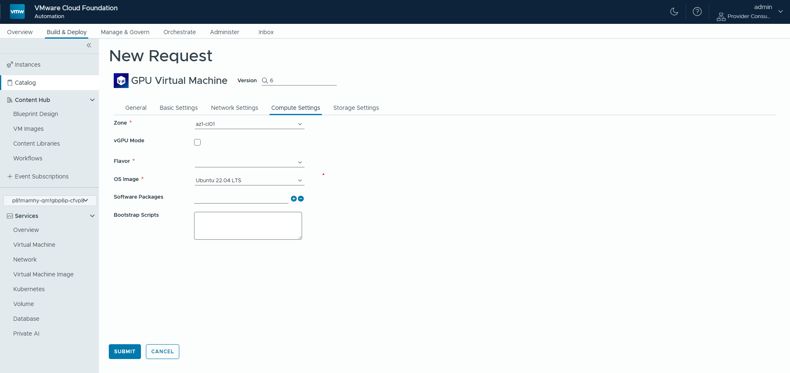
> 📸 *화면 설명: GPU Virtual Machine 요청 폼. vGPU 모드 토글 스위치가 표시됩니다.*

**2단계**: 아래 입력 필드를 참고하여 입력합니다.

#### 입력 필드 설명

> **폼 탭 구조**: General | Basic Settings | Network Settings | **Compute Settings** | Storage Settings

| UI 표시명 | 필드 ID | 탭 | 필수 | 설명 | 예시 |
|---|---|---|:---:|---|---|
| Request Message | requestMessage | Basic Settings | - | 서비스 요청 사유를 입력합니다. | `AI 학습용 GPU VM 생성 요청` |
| Display Name | displayName | Basic Settings | ✅ | GPU VM의 표시 이름을 입력합니다. | `gpu-vm-01` |
| Host Name | hostName | Basic Settings | - | VM의 호스트명을 지정합니다. 미입력 시 자동 생성됩니다. | `gpu-vm-01` |
| VPC | vpc | Network Settings | ✅ | GPU VM을 배치할 VPC를 선택합니다. vGPU 모드 사용 시에는 GPU Enable이 활성화된 VPC를 선택해야 합니다. | `gpu-vpc-01` |
| Segment ¹ | subnet | Network Settings | ✅ | VM이 속할 네트워크 세그먼트(서브넷)를 선택합니다. | `subnet-gpu-01` |
| Zone | placementZone | Compute Settings | ✅ | GPU 노드가 배치된 가용 영역을 선택합니다. | `az1-cl01` |
| vGPU Mode | isVgpu | Compute Settings | - | vGPU 사용 여부를 설정합니다. 체크 = vGPU 모드, 미체크 = PCI 패스스루 모드. 기본값: 미체크 | (체크박스) |
| Flavor | flavor | Compute Settings | ✅ | vGPU/PCI 모드에 맞는 Flavor를 선택합니다. | `vgpu-large` |
| OS Image | image | Compute Settings | ✅ | GPU 드라이버가 포함된 OS 이미지를 선택하십시오. 기본값: `Ubuntu 22.04 LTS` | `Ubuntu 22.04 LTS` |
| Software Packages | packages | Compute Settings | - | VM 생성 시 자동 설치할 패키지 목록입니다. | `cuda-toolkit` |
| Bootstrap Scripts | bootScripts | Compute Settings | - | VM 최초 부팅 시 실행할 셸 스크립트입니다. | `#!/bin/bash` |
| Username | username | Compute Settings | ✅ | VM 접속에 사용할 기본 사용자 이름입니다. | `gpuadmin` |
| Password | password | Compute Settings | ✅ | 해당 사용자의 비밀번호입니다. | (비밀번호 입력) |
| Additional Disk (GB) ² | diskSize | Storage Settings | - | 추가 데이터 디스크의 크기를 GB 단위로 입력합니다. | `200` |
| Mount | diskMount | Storage Settings | - | 추가 데이터 디스크의 마운트 경로입니다. 기본값: `/data` | `/data` |
| Storoage Class ³ | storageClass | Storage Settings | - | VM 디스크의 스토리지 클래스를 선택합니다. | `high-performance` |

> ¹ **Segment**: UI에서 "Segment"로 표시됩니다. VPC 내 생성한 Subnet을 선택합니다.
> ² **Additional Disk**: 루트 디스크가 아닌 추가 데이터 디스크입니다.

---

### 4.6 Block Disk (블록 디스크)

**리소스 유형**: `Custom.BlockDisk`

> **생성 순서: ⑥ VPC 생성 후 (VM과 독립적으로 생성 가능)**
> **사전 요건**: VPC가 생성되어 있어야 합니다. Block Disk를 VM에 연결하려면 대상 VM도 실행 중이어야 합니다.

VM에 연결 가능한 독립적인 블록 스토리지 볼륨을 생성합니다. 생성 후 VM에 연결(Attach)하여 추가 저장 공간으로 사용할 수 있습니다.

#### 생성 절차

**1단계**: Catalog에서 **Block Disk** 카드를 클릭한 후 **[Request]** 버튼을 클릭합니다.

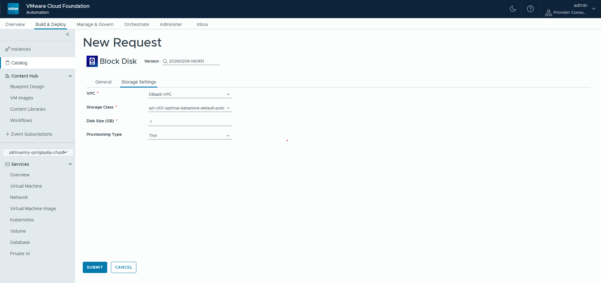
> 📸 *화면 설명: Block Disk 요청 폼. VPC(Namespace) 선택, 크기 및 프로비저닝 타입 옵션이 표시됩니다.*

**2단계**: 아래 입력 필드를 참고하여 입력합니다.

#### 입력 필드 설명

> **폼 탭 구조**: General | **Storage Settings**

| UI 표시명 | 필드 ID | 탭 | 필수 | 설명 | 예시 |
|---|---|---|:---:|---|---|
| Request Message | requestMessage | General | - | 서비스 요청 사유를 입력합니다. | `데이터 스토리지 디스크 추가` |
| Display Name | displayName | General | ✅ | 디스크의 표시 이름을 입력합니다. | `data-disk-01` |
| Code Name | codeName | General | ✅ | 시스템 내부 식별자입니다. 자동으로 랜덤 생성됩니다. | (자동 생성) |
| VPC | vpc | Storage Settings | ✅ | 블록 디스크를 생성할 VPC(네임스페이스)를 선택합니다. | `dev-team-vpc` |
| Storage Class | storageClass | Storage Settings | ✅ | 스토리지 성능 클래스를 선택합니다. | `az1-cl01-optimal-datastore-default` |
| Disk Size (GB) | size | Storage Settings | ✅ | 디스크 크기를 GB 단위로 입력합니다. 기본값: `1` | `200` |

> 💡 **팁**: Block Disk를 생성한 후, VM의 Day-2 Operations에서 `attachBlockDisk` 작업을 통해 VM에 연결할 수 있습니다. 자세한 내용은 [Day-2 Operations 가이드](#5-day-2-operations-가이드)를 참고하십시오.

---

### 4.7 Load Balancer (로드 밸런서)

**리소스 유형**: `Custom.LoadBalancer`

> **생성 순서: ⑦ VPC + VM 생성 후**

여러 VM에 트래픽을 분산하는 로드 밸런서를 생성합니다. TCP/UDP 프로토콜을 지원하며, 외부 IP를 통해 외부에서 접근할 수 있습니다.

#### 생성 절차

**1단계**: Catalog에서 **Load Balancer** 카드를 클릭한 후 **[Request]** 버튼을 클릭합니다.

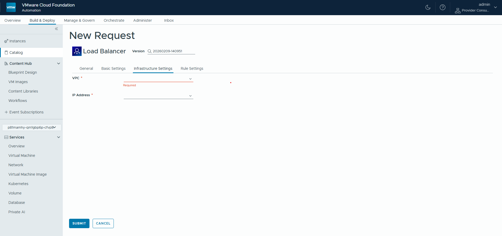
> 📸 *화면 설명: Load Balancer 요청 폼. VPC 선택 후 대상 VM 목록 및 Rules 설정 섹션이 표시됩니다.*

**2단계**: 아래 입력 필드를 참고하여 입력합니다.

#### 입력 필드 설명

> **폼 탭 구조**: General | Basic Settings | **Infrastructure Settings** | Rule Settings

| UI 표시명 | 필드 ID | 탭 | 필수 | 설명 | 예시 |
|---|---|---|:---:|---|---|
| Request Message | requestMessage | Basic Settings | - | 서비스 요청 사유를 입력합니다. | `웹 서버 로드 밸런서 구성 요청` |
| Display Name | displayName | Basic Settings | ✅ | 로드 밸런서의 표시 이름을 입력합니다. | `web-lb-01` |
| VPC | vpc | Infrastructure Settings | ✅ | 로드 밸런서를 생성할 VPC를 선택합니다. | `dev-team-vpc` |
| IP Address | address | Infrastructure Settings | ✅ | 외부에서 접근할 공인 IP 주소를 선택합니다. VPC의 External IP Block에서 할당합니다. | `203.0.113.10` |
| Virtual Machines ¹ | vms | Basic Settings | ✅ | 트래픽을 수신할 대상 VM 목록을 선택합니다. 복수 선택 가능합니다. | `[web-vm-01, web-vm-02]` |
| Rules | rules | Rule Settings | ✅ | 트래픽 전달 규칙을 1개 이상 설정합니다. 아래 Rules 설정 항목을 참고하십시오. | (아래 표 참고) |

> ¹ **Virtual Machines**: UI에 "Virtual Machines"로 표시됩니다. 로드 밸런서의 대상 VM(서버 풀)을 선택하는 필드입니다.

#### Rules 설정 항목

각 Rule은 로드 밸런서로 들어오는 트래픽을 대상 VM으로 전달하는 규칙을 정의합니다.

| 필드명 | 필수 | 설명 | 예시 |
|---|:---:|---|---|
| name | ✅ | 규칙의 이름을 입력합니다. 각 규칙은 고유한 이름을 가져야 합니다. | `http-rule` |
| protocol | ✅ | 사용할 프로토콜을 선택합니다. `TCP` 또는 `UDP` | `TCP` |
| port | ✅ | 외부에서 접근하는 포트(수신 포트)를 입력합니다. | `80` |
| targetPort | ✅ | 대상 VM에서 수신 대기 중인 포트를 입력합니다. | `8080` |

**Rules 설정 예시**:

```yaml
Rules:
  - name: http-rule
    protocol: TCP
    port: 80
    targetPort: 8080
  - name: https-rule
    protocol: TCP
    port: 443
    targetPort: 8443
```

> 💡 **팁**: 동일한 외부 IP에 여러 Rule을 설정하면 HTTP(80)와 HTTPS(443) 트래픽을 동시에 처리할 수 있습니다.

---

### 4.8 Kubernetes Cluster (쿠버네티스 클러스터)

**리소스 유형**: `Custom.Cluster`

> **생성 순서: ⑧ VPC 생성 후**
> **사전 요건**: VPC가 생성되어 있어야 합니다.

관리형 쿠버네티스 클러스터를 생성합니다. 클러스터 생성 후 `kubeconfig` 파일을 다운로드하여 `kubectl`로 접근할 수 있습니다.

#### 생성 절차

**1단계**: Catalog에서 **Kubernetes Cluster** 카드를 클릭한 후 **[Request]** 버튼을 클릭합니다.

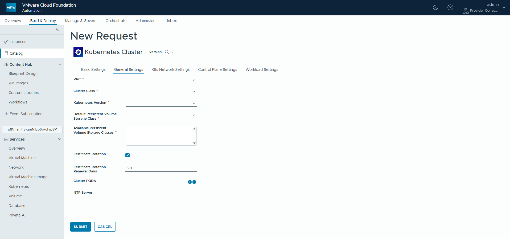
> 📸 *화면 설명: Kubernetes Cluster 요청 폼. K8s 버전 선택 드롭다운과 네트워크 CIDR 입력 필드가 표시됩니다.*

**2단계**: 아래 입력 필드를 참고하여 입력합니다.

#### 입력 필드 설명

> **폼 탭 구조**: Basic Settings | **General Settings** | K8s Network Settings | Control Plane Settings | Workload Settings

**General Settings 탭**

| UI 표시명 | 필드 ID | 필수 | 설명 | 예시 |
|---|---|:---:|---|---|
| VPC | vpc | ✅ | 클러스터를 배치할 VPC를 선택합니다. | `dev-team-vpc` |
| Cluster Class | clusterClass | ✅ | 클러스터의 노드 규모 및 사양 클래스를 선택합니다. | `standard` |
| Kubernetes Version | version | ✅ | 쿠버네티스 버전을 선택합니다. 지원되는 버전 목록에서 선택하십시오. | `1.29` |
| Default Persistent Volume Storage Class | defaultPvStorageClass | ✅ | PVC(PersistentVolumeClaim) 기본값으로 사용할 스토리지 클래스를 선택합니다. | `standard` |
| Available Persistent Volume Storage Classes | availPvStroageClass | ✅ | PVC에서 사용 가능한 스토리지 클래스 목록을 선택합니다. | `[standard, high-perf]` |
| Certificate Rotation | certRotate | - | 인증서 자동 갱신 활성화 여부입니다. 기본값: 활성화(체크됨) | (체크박스) |
| Certificate Rotation Renewal Days | certRotateDays | - | 인증서 자동 갱신 주기(일)를 설정합니다. 기본값: `90` | `90` |
| Cluster FQDN | clusterFqdn | - | 클러스터에 사용할 FQDN(완전한 도메인 이름) 목록을 입력합니다. | `[k8s.example.com]` |
| NTP Server | ntpServer | - | 클러스터 노드에서 사용할 NTP 서버 주소를 입력합니다. | `ntp.example.com` |

**Basic Settings 탭**

| UI 표시명 | 필드 ID | 필수 | 설명 | 예시 |
|---|---|:---:|---|---|
| Request Message | requestMessage | - | 서비스 요청 사유를 입력합니다. | `운영 K8s 클러스터 생성 요청` |
| Display Name | displayName | ✅ | 클러스터의 표시 이름을 입력합니다. | `prod-cluster-01` |

**K8s Network Settings 탭**

| UI 표시명 | 필드 ID | 필수 | 설명 | 예시 |
|---|---|:---:|---|---|
| POD CIDR | podsCidr | ✅ | 파드(Pod)에 할당할 IP 대역을 입력합니다. 기본값: `192.168.156.0/20` | `192.168.156.0/20` |
| Service CIDR | serviceCidr | ✅ | 쿠버네티스 서비스에 할당할 IP 대역을 입력합니다. 기본값: `10.96.0.0/12` | `10.96.0.0/12` |
| Service Domain | serviceDomain | - | 클러스터 내부 DNS 도메인을 설정합니다. 기본값: `cluster.local` | `cluster.local` |
| FIPS Mode | fips | - | FIPS 140-2 보안 표준 준수 모드를 활성화합니다. 보안 규정 준수가 필요한 경우에만 활성화하십시오. | (체크박스) |

**Control Plane Settings 탭**

| UI 표시명 | 필드 ID | 필수 | 설명 | 예시 |
|---|---|:---:|---|---|
| Control Plane Replicas | controlPlaneReplicas | ✅ | Control Plane 노드의 수를 지정합니다. 고가용성을 위해 홀수(1, 3, 5)를 권장합니다. | `3` |
| Control Plane VM Class | controlPlaneVmClass | ✅ | Control Plane 노드의 VM 사양 클래스를 선택합니다. | `best-effort-2xlarge` |
| Control Plane Storage Class | controlPlaneStorageClass | ✅ | Control Plane 노드의 스토리지 클래스를 선택합니다. | `standard` |
| Control Plane VM OS | controlPlaneOsImage | ✅ | Control Plane 노드에서 사용할 OS 이미지를 선택합니다. | `photon-5` |
| Control Plane Volumes | controlPlaneVolumes | - | Control Plane 노드에 마운트할 추가 볼륨 설정 목록입니다. | (배열 입력) |

**Workload Settings 탭**

| UI 표시명 | 필드 ID | 필수 | 설명 | 예시 |
|---|---|:---:|---|---|
| Worker VM Replicas | workerReplicas | ✅ | Worker 노드의 수를 지정합니다. 기본값: `1` | `3` |
| Worker VM Class | workerVmClass | ✅ | Worker 노드의 VM 사양 클래스를 선택합니다. | `best-effort-4xlarge` |
| Storage Class | workerStorageClass | ✅ | Worker 노드의 스토리지 클래스를 선택합니다. | `standard` |
| Worker VM OS | workerOsImage | ✅ | Worker 노드에서 사용할 OS 이미지를 선택합니다. | `photon-5` |
| Worker Volumes | workerVolumes | - | Worker 노드에 마운트할 추가 볼륨 설정 목록입니다. | (배열 입력) |

> ⚠️ **주의**: Pod CIDR과 Service CIDR은 VPC의 사설 IP 대역 및 다른 서브넷 CIDR과 겹치지 않아야 합니다. 겹치는 경우 네트워크 통신 장애가 발생할 수 있습니다.

> 💡 **팁**: 클러스터 생성 완료 후 Day-2 Operations의 `generateKubeconfig` 작업을 실행하여 접속에 필요한 kubeconfig 파일을 다운로드할 수 있습니다.

---

### 4.9 PostgreSQL (DSM - PostgreSQL)

**리소스 유형**: `Custom.DSMDb`

> **생성 순서: ⑨ VPC 생성 후**
> **사전 요건**: VPC가 생성되어 있어야 하며, DSM(vSphere Data Services Manager)이 환경에 구성되어 있어야 합니다. 관리자에게 DSM 활성화 여부를 확인하십시오.

vSphere Data Services Manager(DSM)와 연동하여 관리형 PostgreSQL 데이터베이스를 생성합니다. 데이터베이스 엔진 설치, 설정, 유지보수 등은 DSM이 자동으로 관리합니다.

#### 생성 절차

**1단계**: Catalog에서 **PostgreSQL** 카드를 클릭한 후 **[Request]** 버튼을 클릭합니다.

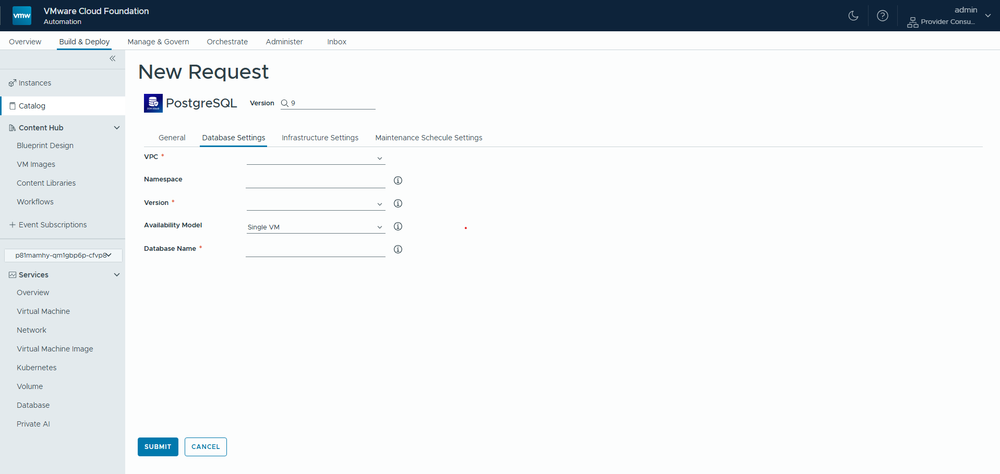
> 📸 *화면 설명: PostgreSQL 요청 폼. 탭 구조(Database Settings / Infrastructure Settings / Maintenance Schecule Settings)로 구성됩니다.*

**2단계**: 아래 입력 필드를 참고하여 입력합니다.

#### 입력 필드 설명

> **폼 탭 구조**: General | **Database Settings** | Infrastructure Settings | Maintenance Schecule Settings ¹

**Database Settings 탭**

| UI 표시명 | 필드 ID | 필수 | 설명 | 예시 |
|---|---|:---:|---|---|
| VPC | vpc | ✅ | 데이터베이스를 생성할 VPC를 선택합니다. | `dev-team-vpc` |
| Namespace | namespace | - | DSM 테넌트 네임스페이스를 입력합니다. | `default` |
| Version | dbVersion | ✅ | 프로비저닝할 PostgreSQL 메이저 버전을 선택합니다. VPC 선택 시 지원 버전 목록이 자동 표시됩니다. | `15` |
| Availability Model | dbAvailability | - | 가용성 모드를 선택합니다. `Single VM` = 단일 노드, `ha` = Primary/Replica HA 클러스터. 기본값: `Single VM` | `Single VM` |
| Database Name | dbName | ✅ | 생성할 데이터베이스 이름을 입력합니다. 4자 이상이어야 합니다. 미입력 시 Instance 이름이 사용됩니다. | `myappdb` |

**General 탭**

| UI 표시명 | 필드 ID | 필수 | 설명 | 예시 |
|---|---|:---:|---|---|
| Request Message | requestMessage | - | 서비스 요청 사유를 입력합니다. | `백엔드 PostgreSQL DB 생성 요청` |
| Display Name | displayName | ✅ | 데이터베이스의 표시 이름을 입력합니다. | `backend-postgres-01` |
| Admin Name | adminUsername | - | DB 관리자 계정 이름을 입력합니다. 기본값: `pgadmin` | `pgadmin` |
| Password | adminPassword | - | DB 관리자 비밀번호를 입력합니다. 기본값: `pgadmin` (변경 권장) | (비밀번호 입력) |

**Infrastructure Settings 탭**

| UI 표시명 | 필드 ID | 필수 | 설명 | 예시 |
|---|---|:---:|---|---|
| Infrastructure Policy | dbInfraPolicy | ✅ | DSM 인프라 정책을 선택합니다. VPC 선택 시 사용 가능한 목록이 자동 표시됩니다. | `standard-policy` |
| Storage Policy | storagePolicy | ✅ | vSphere 스토리지 정책을 선택합니다. VPC 선택 시 목록이 자동 표시됩니다. | `db-storage-policy` |
| Disk Size (GB) | diskSize | ✅ | 데이터베이스 스토리지 크기를 입력합니다. 기본값: `20` | `50` |
| Backup Location | backupLocation | - | DSM 백업용 S3 스토리지 버킷을 선택합니다. 기본값: `none` (백업 비활성화) | `s3-backup-bucket` |
| VM Class | vmClass | ✅ | 데이터베이스 VM의 사양 클래스를 선택합니다. VPC 선택 시 목록이 자동 표시됩니다. | `db-standard` |

**Maintenance Schecule Settings 탭 ¹**

| UI 표시명 | 필드 ID | 필수 | 설명 | 예시 |
|---|---|:---:|---|---|
| Enable Maintenance Window | checkbox | - | 유지보수 창 활성화 여부를 설정합니다. 활성화 시 아래 설정이 적용됩니다. | (체크박스) |
| Duration | maintenanceDuration | - | 유지보수 창의 지속 시간을 설정합니다. 형식: `6h0m0s`. 기본값: `6h` | `6h` |
| Day of the week | maintenanceStartDay | - | 유지보수 요일을 선택합니다. 기본값: `SATURDAY` | `SATURDAY` |
| Start Time (Local Time Zone) | maintenanceStartTime | - | 유지보수 시작 시간을 설정합니다. 기본값: `23:59` | `23:59` |

> ¹ **Maintenance Schecule Settings**: 현재 시스템 UI의 탭 이름에 "Schecule" 오타가 있습니다. 실제 의미는 "Maintenance Schedule Settings"입니다.

> ⚠️ **주의**: Admin Password의 기본값(`pgadmin`)은 반드시 변경하십시오. 기본 비밀번호를 그대로 사용하면 보안 위험이 발생할 수 있습니다.

> 💡 **팁**: 데이터베이스 연결 정보(엔드포인트, 포트)는 Instances 페이지에서 생성 완료 후 리소스 상세 화면에서 확인할 수 있습니다.

---

## 5. Day-2 Operations 가이드

Day-2 Operations는 이미 생성된 리소스에 대한 추가 작업(전원 관리, 디스크 추가, 설정 변경, 삭제 등)을 수행하는 기능입니다.

### Day-2 Operations 접근 방법

**1단계**: 상단 탭에서 **Build & Deploy**를 클릭한 후, 좌측 사이드바에서 **Instances**를 클릭합니다.

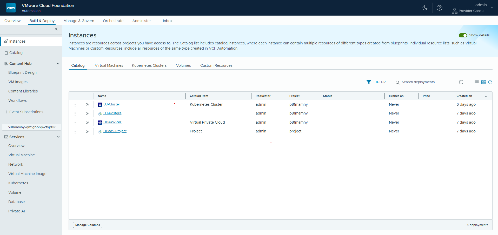
> 📸 *화면 설명: Instances 목록 페이지. 생성된 리소스가 목록 형태로 표시되며 Catalog / Virtual Machines / Kubernetes Clusters / Volumes / Custom Resources 탭으로 구분됩니다.*

**2단계**: **Catalog** 탭에서 작업할 Instance를 클릭하여 상세 페이지로 이동합니다.

**3단계**: 상세 페이지 우측 상단의 **[ACTIONS]** 버튼을 클릭하면 해당 리소스에서 수행 가능한 Day-2 Operations 목록이 표시됩니다.

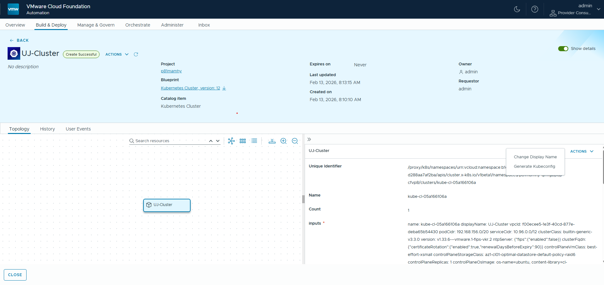
> 📸 *화면 설명: 리소스 상세 페이지의 ACTIONS 드롭다운 메뉴. 수행 가능한 작업 목록이 표시됩니다.*

**4단계**: 원하는 작업을 선택하고 필요한 입력값을 입력한 후 **[Submit]** 버튼을 클릭합니다.

---

### Virtual Machine Day-2 Operations

| 작업명 | 설명 | 주요 입력값 |
|---|---|---|
| `powerOn` | VM의 전원을 켭니다. | 없음 |
| `powerOff` | VM의 전원을 끕니다. 강제 종료됩니다. | 없음 |
| `addDisk` | VM에 새 디스크를 추가합니다. | 디스크 크기(GB), Storage Class |
| `removeDisk` | VM에서 디스크를 제거합니다. | 제거할 디스크 식별자 |
| `attachBlockDisk` | 별도로 생성한 Block Disk를 VM에 연결합니다. | Block Disk 식별자 |
| `detachBlockDisk` | VM에서 Block Disk 연결을 해제합니다. | Block Disk 식별자 |
| `allocateExternalIP` | VM에 외부 접속 IP를 할당합니다. | External IP Block |
| `reclaimExternalIP` | VM에서 외부 접속 IP 할당을 해제합니다. | 없음 |
| `openWebConsole` | 브라우저 기반 VM 웹 콘솔을 엽니다. | 없음 |
| `changeDisplayName` | VM의 표시 이름을 변경합니다. | 새 이름 |

> ⚠️ **주의**: `powerOff`는 운영 중인 애플리케이션을 즉시 종료하므로, OS 내에서 정상 종료(`shutdown -h now`)를 먼저 실행한 후 사용하는 것을 권장합니다.

> ⚠️ **주의**: `removeDisk`는 되돌릴 수 없는 작업입니다. 실행 전 반드시 데이터 백업을 완료하십시오.

---

### GPU Virtual Machine Day-2 Operations

> 📝 **참고**: GPU VM의 Day-2 Operations는 Virtual Machine과 동일한 항목으로 구성됩니다. 일부 작업은 환경에 따라 순차적으로 반영될 수 있습니다.

| 작업명 | 설명 | 주요 입력값 |
|---|---|---|
| `powerOn` | GPU VM의 전원을 켭니다. | 없음 |
| `powerOff` | GPU VM의 전원을 끕니다. 강제 종료됩니다. | 없음 |
| `addDisk` | GPU VM에 새 디스크를 추가합니다. | 디스크 크기(GB), Storage Class |
| `removeDisk` | GPU VM에서 디스크를 제거합니다. | 제거할 디스크 식별자 |
| `attachBlockDisk` | 별도로 생성한 Block Disk를 GPU VM에 연결합니다. | Block Disk 식별자 |
| `detachBlockDisk` | GPU VM에서 Block Disk 연결을 해제합니다. | Block Disk 식별자 |
| `allocateExternalIP` | GPU VM에 외부 접속 IP를 할당합니다. | External IP Block |
| `reclaimExternalIP` | GPU VM에서 외부 접속 IP 할당을 해제합니다. | 없음 |
| `openWebConsole` | 브라우저 기반 GPU VM 웹 콘솔을 엽니다. | 없음 |
| `changeDisplayName` | GPU VM의 표시 이름을 변경합니다. | 새 이름 |

> ⚠️ **주의**: `powerOff`는 운영 중인 워크로드를 즉시 종료하므로, OS 내에서 정상 종료 후 사용하는 것을 권장합니다.

> ⚠️ **주의**: `removeDisk`는 되돌릴 수 없는 작업입니다. 실행 전 반드시 데이터 백업을 완료하십시오.

---

### Virtual Private Cloud Day-2 Operations

| 작업명 | 설명 |
|---|---|
| `changeDisplayName` | VPC의 표시 이름을 변경합니다. |
| `delete` | VPC를 삭제합니다. VPC 내 모든 리소스를 먼저 삭제해야 합니다. |

> ⚠️ **주의**: VPC를 삭제하기 전에 해당 VPC에 속한 모든 VM, Subnet, Load Balancer를 먼저 삭제해야 합니다. 리소스가 남아 있는 상태에서 VPC 삭제를 시도하면 오류가 발생합니다.

---

### Subnet Day-2 Operations

| 작업명 | 설명 |
|---|---|
| `changeDisplayName` | 서브넷의 표시 이름을 변경합니다. |
| `delete` | 서브넷을 삭제합니다. 서브넷에 VM이 없어야 합니다. |

---

### Load Balancer Day-2 Operations

| 작업명 | 설명 | 주요 입력값 |
|---|---|---|
| `changeRules` | 로드 밸런서의 트래픽 전달 규칙을 수정합니다. | 수정된 Rules 목록 (name, protocol, port, targetPort) |
| `changeServerPool` | 로드 밸런서의 대상 VM 목록을 변경합니다. | 새로운 Target VMs 목록 |
| `changeDisplayName` | 로드 밸런서의 표시 이름을 변경합니다. | 새 이름 |
| `delete` | 로드 밸런서를 삭제합니다. | 없음 |

---

### Block Disk Day-2 Operations

| 작업명 | 설명 | 주요 입력값 |
|---|---|---|
| `resizeDisk` | 디스크 크기를 늘립니다. 축소는 지원되지 않습니다. | 새 디스크 크기(GB) |
| `changeDisplayName` | 디스크의 표시 이름을 변경합니다. | 새 이름 |
| `delete` | 디스크를 삭제합니다. VM에서 Detach 후 삭제해야 합니다. | 없음 |

> ⚠️ **주의**: `resizeDisk`는 디스크 크기를 늘리는 것만 가능합니다. 현재 크기보다 작은 값을 입력하면 오류가 발생합니다.

---

### Kubernetes Cluster Day-2 Operations

| 작업명 | 설명 | 주요 입력값 |
|---|---|---|
| `generateKubeconfig` | 클러스터 접속을 위한 kubeconfig 파일을 생성합니다. | 없음 |
| `changeDisplayName` | 클러스터의 표시 이름을 변경합니다. | 새 이름 |
| `delete` | 클러스터를 삭제합니다. 삭제 후 복구가 불가능합니다. | 없음 |

#### kubeconfig 파일 사용 방법

1. Day-2 Operations에서 `generateKubeconfig` 를 실행합니다.
2. 작업 완료 후 리소스 상세 페이지에서 kubeconfig 내용을 복사합니다.
3. 로컬 환경의 `~/.kube/config` 파일에 저장합니다.

```bash
# kubeconfig 파일 저장 (예시)
mkdir -p ~/.kube
# 다운로드한 파일을 config로 복사
cp ~/Downloads/kubeconfig ~/.kube/config

# 클러스터 연결 확인
kubectl get nodes
```

---

### PostgreSQL Day-2 Operations

| 작업명 | 설명 |
|---|---|
| `changeDisplayName` | 데이터베이스의 표시 이름을 변경합니다. |
| `delete` | 데이터베이스를 삭제합니다. 삭제된 데이터는 복구할 수 없습니다. |

> ⚠️ **주의**: 데이터베이스를 삭제하기 전에 반드시 데이터 백업을 완료하십시오. BVP는 삭제 시 데이터 백업을 자동으로 수행하지 않습니다.

---

### Project Day-2 Operations

| 작업명 | 설명 | 주요 입력값 |
|---|---|---|
| `changeAdministrators` | 프로젝트 관리자 목록을 변경합니다. | 새 Administrators 목록 |
| `changeUsers` | 일반 사용자 목록을 변경합니다. | 새 Users 목록 |
| `changeAdvancedUsers` | 고급 사용자 목록을 변경합니다. | 새 Advanced Users 목록 |
| `changeAuditors` | 감사자 목록을 변경합니다. | 새 Auditors 목록 |
| `changeDisplayName` | 프로젝트의 표시 이름을 변경합니다. | 새 이름 |
| `delete` | 프로젝트를 삭제합니다. | 없음 |

---

## 6. 문제해결 FAQ

### Q1. Catalog에서 서비스를 요청했는데 프로비저닝이 계속 `IN_PROGRESS` 상태입니다.

**원인**: VRO(vRealize Orchestrator) 워크플로우 처리 지연 또는 오류가 발생한 경우입니다.

**해결 방법**:
1. Instances 페이지에서 해당 Instance를 클릭합니다.
2. **Events** 탭에서 최근 이벤트 로그를 확인합니다.
3. 오류 메시지가 표시된 경우 내용을 복사하여 인프라 담당자에게 전달합니다.
4. 프로비저닝 시간이 서비스별 예상 시간(VM: 10분, K8s 클러스터: 30분)을 크게 초과하면 담당자에게 문의하십시오.

---

### Q2. VM에 접속이 되지 않습니다.

**원인**: 네트워크 설정 오류, 방화벽 정책, VM 상태 이상 등 여러 원인이 있을 수 있습니다.

**해결 방법**:
1. Instances에서 VM 상태가 `CREATE_SUCCESSFUL`인지 확인합니다.
2. Day-2 Operations의 `openWebConsole`을 사용하여 VM 콘솔에 직접 접속합니다.
3. VM이 실행 중인지 확인하고, 꺼져 있다면 `powerOn` 작업을 실행합니다.
4. Subnet 설정에서 **Auto IP Assignment**가 활성화되어 있는지 확인합니다.
5. 위 조치 후에도 접속이 되지 않으면 인프라 담당자에게 문의하십시오.

---

### Q3. Load Balancer 생성 후 외부에서 접속이 되지 않습니다.

**원인**: VPC의 AVI LB 통합 설정 미활성화, 잘못된 Rule 설정 또는 대상 VM의 포트 설정 문제일 수 있습니다.

**해결 방법**:
1. VPC 상세 정보에서 **AVI LB 통합** 옵션이 `true`로 설정되어 있는지 확인합니다.
2. Load Balancer의 Rules 설정에서 `port`(외부 포트)와 `targetPort`(VM 내부 포트)가 올바른지 확인합니다.
3. 대상 VM에서 해당 포트가 실제로 수신 대기(listening) 중인지 확인합니다.
   ```bash
   # VM에서 포트 확인 명령어
   ss -tlnp | grep <포트번호>
   ```
4. 대상 VM의 방화벽(firewall, iptables 등)이 해당 포트를 허용하는지 확인합니다.

---

### Q4. Block Disk를 VM에 연결(Attach)했는데 VM 내에서 인식되지 않습니다.

**원인**: OS에서 새 디스크를 자동으로 마운트하지 않는 경우입니다.

**해결 방법**:
VM에 SSH 접속 후 다음 명령어로 디스크를 확인하고 마운트합니다.

```bash
# 새로 연결된 디스크 확인
lsblk

# 디스크 파티셔닝 및 포맷 (예: /dev/sdb)
sudo fdisk /dev/sdb
sudo mkfs.ext4 /dev/sdb1

# 마운트 디렉토리 생성 및 마운트
sudo mkdir -p /mnt/data
sudo mount /dev/sdb1 /mnt/data

# 재부팅 후에도 자동 마운트 설정
echo '/dev/sdb1 /mnt/data ext4 defaults 0 0' | sudo tee -a /etc/fstab
```

---


### Q5. 서비스 요청 폼을 제출했는데 "Approval 대기 중" 상태가 됩니다.

**원인**: 프로젝트에 Approval(승인) 정책이 활성화되어 있는 경우, 관리자가 승인해야 프로비저닝이 시작됩니다.

**해결 방법**:
1. 프로젝트 관리자(Administrator)에게 승인 요청을 전달합니다.
2. 관리자는 **Administration > Approvals** 메뉴에서 대기 중인 요청을 승인 또는 거절할 수 있습니다.
3. 승인 정책 변경이 필요한 경우 프로젝트 관리자에게 Day-2 Operations의 `changeDisplayName` 설정 변경을 요청하십시오.

---

### Q6. VPC 삭제가 오류로 실패합니다.

**원인**: VPC 내에 아직 삭제되지 않은 리소스가 남아 있는 경우입니다.

**해결 방법**:
VPC 삭제 전에 아래 순서로 내부 리소스를 먼저 삭제하십시오.

```
1. VM (Virtual Machine / GPU Virtual Machine) 삭제
2. Load Balancer 삭제
3. Block Disk 삭제 (VM에서 Detach 후)
4. Kubernetes Cluster 삭제
5. PostgreSQL 삭제
6. Subnet 삭제
7. VPC 삭제
```

---

## 7. 용어 정리

| 용어 | 설명 |
|---|---|
| **BVP (Broadcom Value Pack)** | VCF Automation 기반 셀프서비스 인프라 자동화 패키지 |
| **Catalog** | 사용자가 서비스를 요청할 수 있는 서비스 목록 페이지 |
| **Blueprint** | 서비스 요청 시 사용자가 입력하는 설정 폼 |
| **Deployment** | Catalog에서 요청한 서비스의 실행 단위. 상태와 생성된 리소스를 포함합니다. |
| **Custom Resource** | BVP에서 정의한 가상 리소스 유형 (예: `Custom.VirtualMachine`) |
| **VRO (vRealize Orchestrator)** | 워크플로우를 실행하여 실제 인프라를 프로비저닝하는 자동화 엔진 |
| **Subscription** | 특정 이벤트 발생 시 VRO 워크플로우를 자동으로 실행시키는 규칙 |
| **Day-2 Operations** | 이미 생성된 리소스에 대한 추가 관리 작업 (전원 관리, 스케일링, 삭제 등) |
| **VPC (Virtual Private Cloud)** | 격리된 가상 사설 네트워크 환경 |
| **Subnet** | VPC 내 IP 대역을 논리적으로 분리한 네트워크 단위 |
| **Flavor** | VM의 CPU/메모리 사양 템플릿 |
| **CIDR** | IP 주소 범위를 표현하는 방법 (예: `10.0.0.0/16`) |
| **AVI LB** | NSX Advanced Load Balancer(AVI). BVP의 Load Balancer 서비스가 사용하는 기반 기술 |
| **DSM (Data Services Manager)** | vSphere 기반 관리형 데이터베이스 서비스 플랫폼 |
| **kubeconfig** | kubectl이 쿠버네티스 클러스터에 접근하기 위한 인증 정보 파일 |
| **FIPS** | 미국 연방 정보 처리 표준 (Federal Information Processing Standards). 보안 규정 준수 모드 |
| **PCI 패스스루** | 물리 GPU를 단일 VM에 직접 할당하는 방식 |
| **NTP (Network Time Protocol)** | 네트워크를 통해 시스템 시각을 동기화하는 프로토콜 |
| **PVC (PersistentVolumeClaim)** | 쿠버네티스에서 영구 스토리지를 요청하는 리소스 |

---

## 8. BVP 설치 가이드 (관리자용)

> **대상 독자**: VCF Automation 환경 관리자 및 BVP 최초 설치 담당자

이 섹션은 BVP를 신규 VCF Automation 환경에 처음 설치하는 절차를 설명합니다. 설치는 크게 **vRO 패키지 Import** → **Install Value Pack 워크플로우 실행** 두 단계로 구성됩니다.

---

### 8.1 사전 요구사항

설치를 시작하기 전에 아래 항목을 확인하십시오.

#### 시스템 요구사항

| 항목 | 요구사항 |
|---|---|
| **VCF Automation 버전** | v9.0.x 이상 |
| **vRO (vRealize Orchestrator)** | VCF Automation에 내장된 embedded-vRO |
| **vCenter Server** | vSphere 9.x 이상 |
| **NSX Manager** | NSX 9.x 이상 |

#### 필요한 계정 및 자격증명

| 계정 | 권한 수준 | 설명 |
|---|---|---|
| VCF Automation 관리자 | Organization Administrator | Catalog, Blueprint, Subscription 생성 권한 |
| Provider 관리자 | Provider 수준 관리자 | vCenter, NSX 연동 및 전체 인프라 관리 |
| vCenter Server 관리자 | `administrator@vsphere.local` | vSphere 인프라 접근 |
| NSX Manager 관리자 | NSX admin | 네트워크 자원 관리 |

#### 필요한 파일

| 파일 | 설명 |
|---|---|
| `com.bvp.package` | BVP vRO 패키지 파일 (워크플로우 + 백업 데이터 포함) |

> **참고**: `backupTimeStr` 값은 `com.bvp.package` 파일에 포함된 백업 데이터의 타임스탬프입니다. 패키지 Import 후 VRO 설정에서 확인할 수 있습니다.

---

### 8.2 vRO 패키지 Import

BVP 워크플로우와 설치에 필요한 데이터를 vRO에 가져옵니다.

**1단계: vRO 관리 콘솔 접속**

VCF Automation 웹 UI에 로그인한 후, 상단 메뉴에서 **Orchestrator**를 선택합니다.

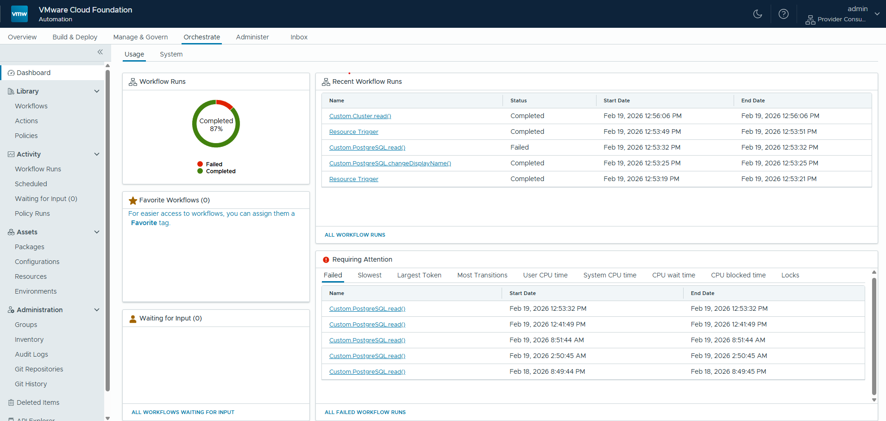

**2단계: 패키지 관리 화면 이동**

좌측 네비게이션에서 **Library → Packages**를 클릭합니다.

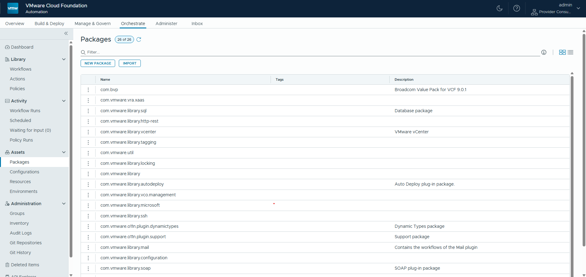

**3단계: 패키지 Import**

우측 상단의 **Import** 버튼을 클릭하고 `com.bvp.package` 파일을 선택합니다.

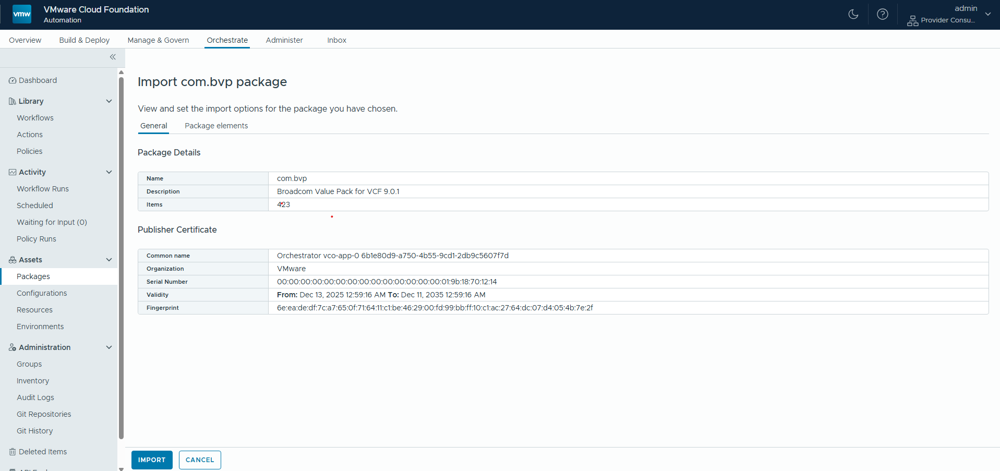

Import 옵션 화면에서 다음과 같이 설정합니다.

| 옵션 | 설정값 |
|---|---|
| Import 방식 | **Import package and all dependencies** |
| 충돌 시 처리 | **Overwrite existing elements** |

**Import** 버튼을 클릭하여 패키지를 가져옵니다.

> 패키지 Import가 완료되면 vRO Library에 `BVP` 카테고리가 생성되고, 아래 워크플로우들이 나타납니다.
>
> | 카테고리 | 워크플로우 |
> |---|---|
> | `BVP/Package` | Install Value Pack |
> | `BVP/Package` | Backup Value Pack |
> | `BVP/Package` | Get Package Keys |
> | `BVP/VM`, `BVP/VPC`, `BVP/Subnet` 등 | 각 서비스별 CRUD 워크플로우 |

**4단계: Import 완료 확인**

Packages 목록에서 `com.bvp` 패키지가 정상적으로 표시되는지 확인합니다.

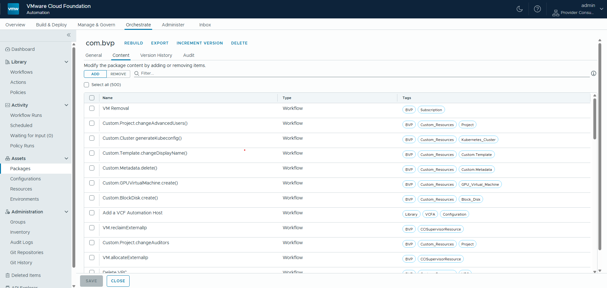

---

### 8.3 Install Value Pack 워크플로우 실행

Import가 완료된 후 `BVP/Package/Install Value Pack` 워크플로우를 실행하여 모든 BVP 컴포넌트를 설치합니다.

**1단계: 워크플로우 찾기**

vRO Library에서 **Workflows** 탭을 선택하고 `BVP > Package > Install Value Pack`을 찾습니다.

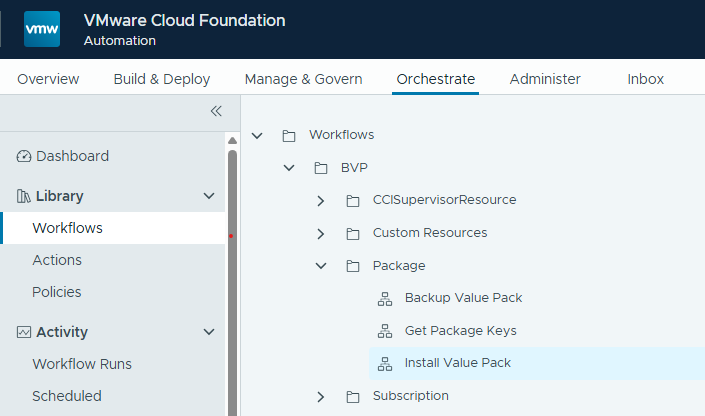

**2단계: 워크플로우 실행**

`Install Value Pack` 워크플로우를 선택하고 **Run** 버튼을 클릭합니다.

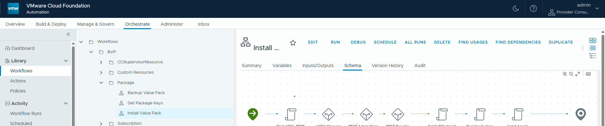

**3단계: 입력 파라미터 설정**

아래 표를 참고하여 각 파라미터 값을 입력합니다.

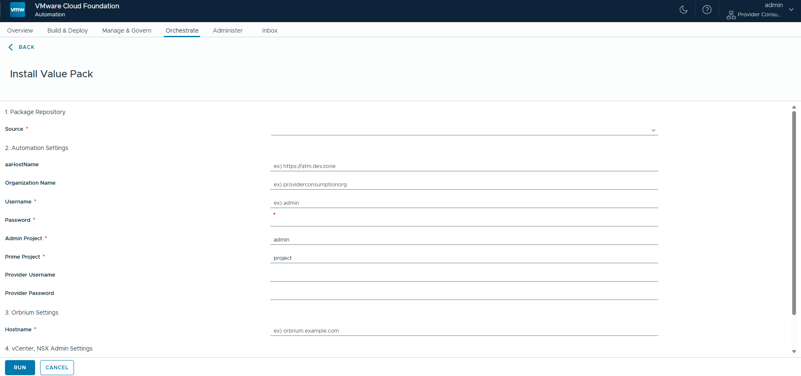

| 파라미터 | 타입 | 설명 | 예시 |
|---|---|---|---|
| `aaUsername` | string | VCF Automation 관리자 사용자 이름 | `admin` |
| `aaPassword` | SecureString | VCF Automation 관리자 비밀번호 | `****` |
| `aaHostName` | string | VCF Automation 호스트 URL | `https://vcfa.example.com` |
| `orbHostname` | string | Orbrium 호스트명 | `orb.example.com` |
| `orgName` | string | 설치 대상 조직(Tenant) 이름 | `your-org-name` |
| `adminProjectName` | string | BVP 관리자 프로젝트 이름 | `admin` |
| `primeProjectName` | string | BVP Prime 프로젝트 이름 | `project` |
| `backupTimeStr` | string | 패키지에 포함된 백업 타임스탬프 | `20250101120000` |
| `providerUsername` | string | Provider 관리자 계정 이름 | `admin` |
| `providerPassword` | SecureString | Provider 관리자 비밀번호 | `****` |
| `vcsaAdminPassword` | SecureString | vCenter Server(`administrator@vsphere.local`) 비밀번호 | `****` |
| `nsxAdminPassword` | SecureString | NSX Manager admin 비밀번호 | `****` |

> **backupTimeStr 확인 방법**: 패키지 배포 담당자에게 문의하거나, VRO Configuration Elements에서 `BVP/Backup/` 경로 하위의 타임스탬프 디렉토리 이름을 확인합니다.

**4단계: 실행 및 진행 상황 모니터링**

파라미터 입력 후 **Submit** 버튼을 클릭하여 워크플로우를 실행합니다.


워크플로우는 다음 순서로 실행됩니다.

```
[1] Find VCFA, REST        — 기존 연결 확인
[2] Add a VCF Automation Host  — VCFA 연결 설정 (없는 경우에만)
[3] Add a REST host (Admin)    — Admin REST 연결 설정 (없는 경우에만)
[4] Add a REST host (Provider) — Provider REST 연결 설정 (없는 경우에만)
[5] Get Self Endpoint          — vRO 자체 엔드포인트 자동 감지
[6] Register System Settings   — 시스템 설정 등록
     ├─ embedded-vRO 동기화
     ├─ BVP 엔드포인트 설정 (Admin, Provider, Orbrium, vCenter, NSX)
     ├─ Admin 프로젝트 생성
     └─ Prime 프로젝트 생성
[7] Install Assets             — BVP 에셋 일괄 설치
     ├─ Property Groups
     ├─ Custom Resources (9종)
     ├─ Blueprints (9종)
     ├─ Custom Forms (9종)
     ├─ Resource Actions (Day-2 Operations)
     └─ Subscriptions (이벤트 자동화)
```

정상 완료 시 워크플로우 상태가 **Completed**로 변경됩니다.

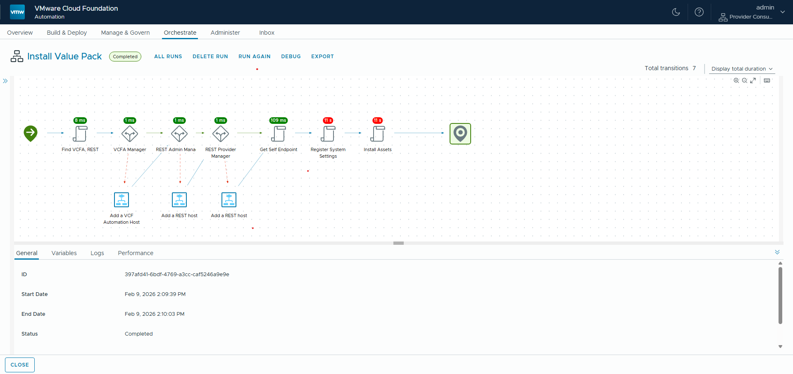

---

### 8.4 설치 확인

워크플로우 실행 후 아래 항목을 순서대로 확인하여 설치가 정상적으로 완료되었는지 검증합니다.

#### Catalog 확인

1. VCF Automation 웹 UI에 접속합니다.
2. 상단 탭에서 **Build & Deploy**를 클릭한 후, 좌측 사이드바에서 **Catalog**를 클릭합니다.
3. 아래 9개 서비스 항목이 모두 표시되는지 확인합니다.

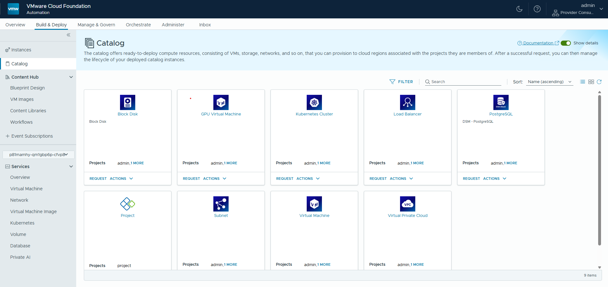

| 확인 항목 | Catalog 이름 |
|---|---|
| ☐ | Block Disk |
| ☐ | GPU Virtual Machine |
| ☐ | Kubernetes Cluster |
| ☐ | Load Balancer |
| ☐ | PostgreSQL |
| ☐ | Project |
| ☐ | Subnet |
| ☐ | Virtual Machine |
| ☐ | Virtual Private Cloud |

#### Custom Resources 확인

1. **Infrastructure → Custom Resources**를 클릭합니다.
2. 아래 9개 Custom Resource 타입이 등록되어 있는지 확인합니다.

| 확인 항목 | Custom Resource 타입 |
|---|---|
| ☐ | `Custom.VirtualMachine` |
| ☐ | `Custom.VPC` |
| ☐ | `Custom.Subnet` |
| ☐ | `Custom.LoadBalancer` |
| ☐ | `Custom.BlockDisk` |
| ☐ | `Custom.Cluster` |
| ☐ | `Custom.DSMDb` |
| ☐ | `Custom.Project` |

#### Subscriptions 확인

1. **Infrastructure → Subscriptions**를 클릭합니다.
2. BVP 관련 Subscription이 **활성화** 상태로 등록되어 있는지 확인합니다.

---

### 8.5 설치 후 생성되는 리소스

`Install Value Pack` 워크플로우가 완료되면 다음 리소스들이 자동으로 생성됩니다.

#### Projects (프로젝트)

| 프로젝트 | 설명 |
|---|---|
| `adminProjectName` (입력값) | BVP 관리자용 프로젝트. Blueprint, Custom Resource 등 BVP 에셋이 이 프로젝트에 귀속됩니다. |
| `primeProjectName` (입력값) | 프로젝트 소유자용 Prime 프로젝트 |

#### Blueprints (9종)

| Blueprint | 대응 서비스 |
|---|---|
| Virtual Machine | VM 생성 |
| GPU Virtual Machine | GPU VM 생성 |
| Virtual Private Cloud | VPC 생성 |
| Subnet | 서브넷 생성 |
| Load Balancer | LB 생성 |
| Block Disk | 블록 디스크 생성 |
| Kubernetes Cluster | K8s 클러스터 생성 |
| PostgreSQL | PostgreSQL DB 생성 |
| Project | 프로젝트 생성 |

#### Custom Resources (9종)

각 Custom Resource는 생성(Create), 조회(Read), 삭제(Delete), 수정(Update) 작업에 대응하는 vRO 워크플로우와 연결됩니다.

#### Subscriptions (이벤트 구독)

| 유형 | 설명 |
|---|---|
| Deployment Trigger | 배포 이벤트 발생 시 워크플로우 실행 |
| Resource Trigger | 리소스 생명주기 이벤트 처리 |
| Event Trigger | 외부 이벤트 기반 자동화 |
| Approval Trigger | 승인 워크플로우 연동 |
| Project Trigger | 프로젝트 생성/삭제 이벤트 처리 |

#### VRO Endpoint 설정

설치 과정에서 아래 VRO 설정 항목이 자동으로 등록됩니다.

| 설정 경로 | 설명 |
|---|---|
| `BVP/Endpoint/Admin` | VCF Automation Admin 사용자 연결 정보 |
| `BVP/Endpoint/Provider` | VCF Automation Provider 사용자 연결 정보 |
| `BVP/Endpoint/Orbrium` | vRO(Orbrium) 자체 엔드포인트 및 액세스 키 |
| `BVP/Endpoint/{vCenter명}` | vCenter Server 연결 정보 |
| `BVP/Endpoint/{NSX Manager명}` | NSX Manager 연결 정보 |

---

> 이 문서에 오류가 있거나 추가 도움이 필요하다면 담당팀에 문의하십시오.
>
> **문서 버전**: v1.3 | **최종 업데이트**: 2026-02-19 | **대상 시스템**: VCF Automation v9.0.x (BVP 설치 환경)
