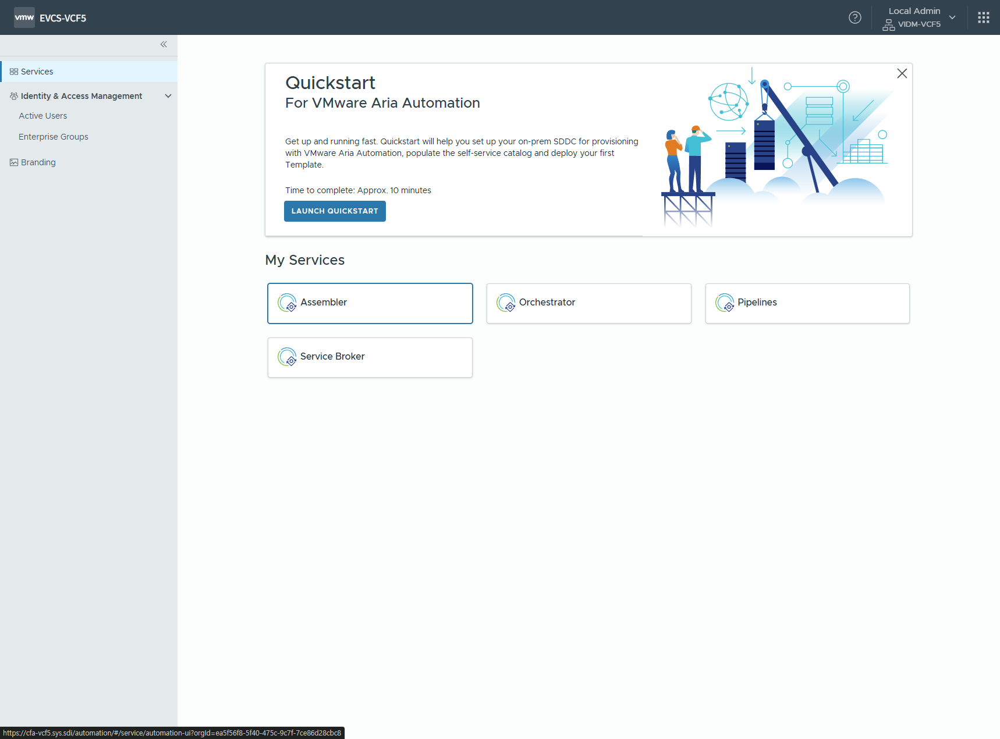
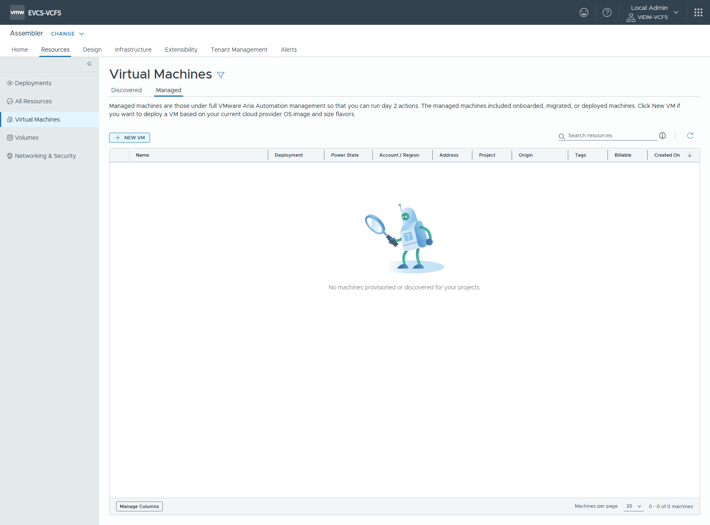
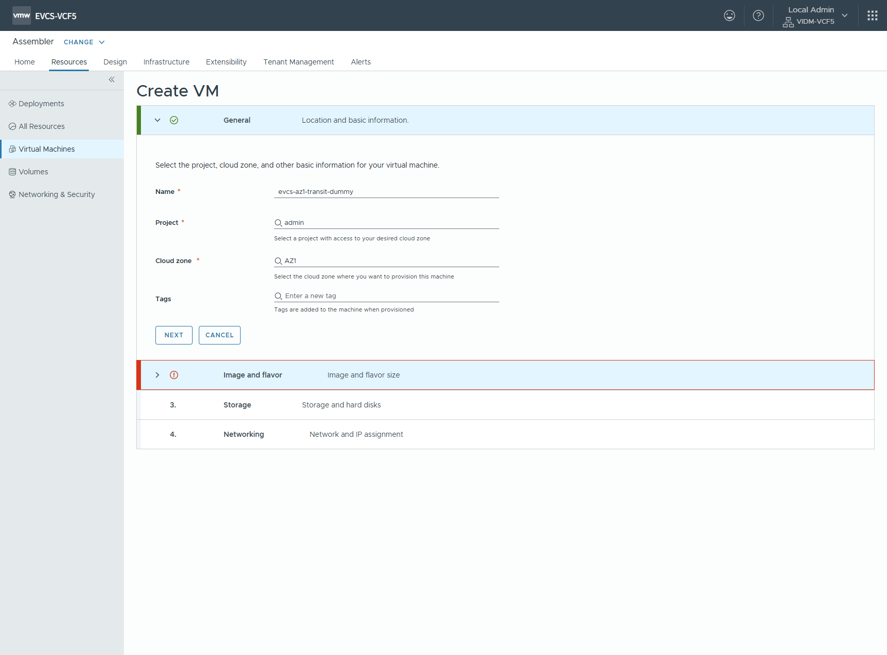
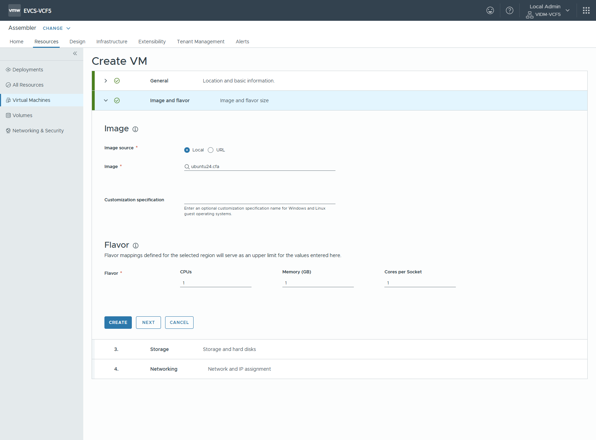
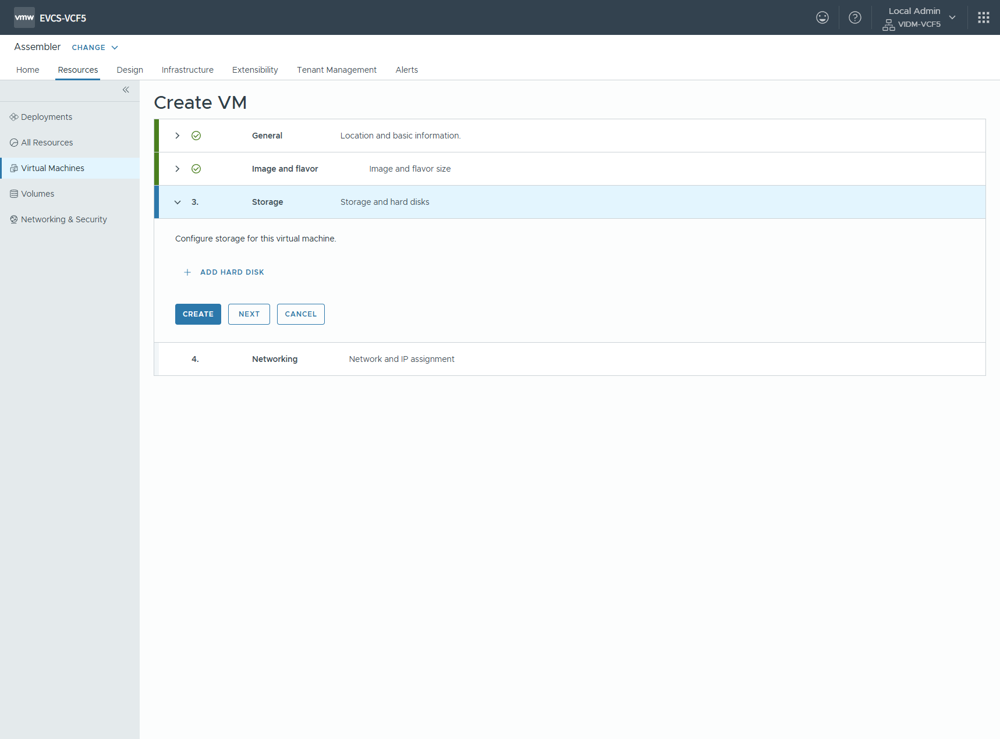
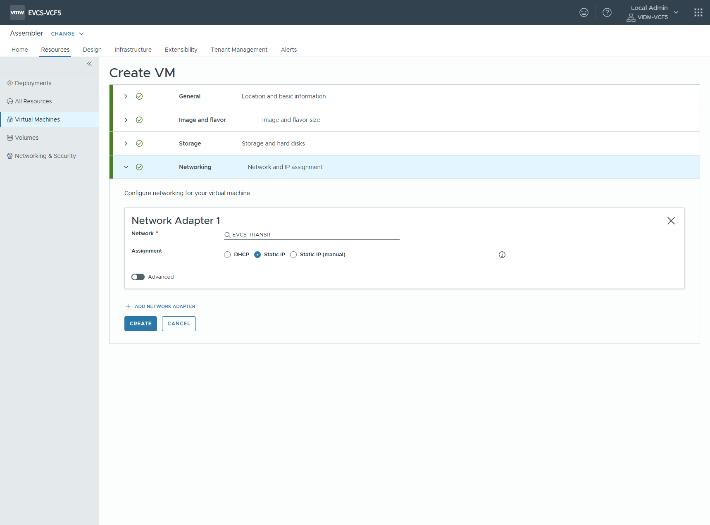
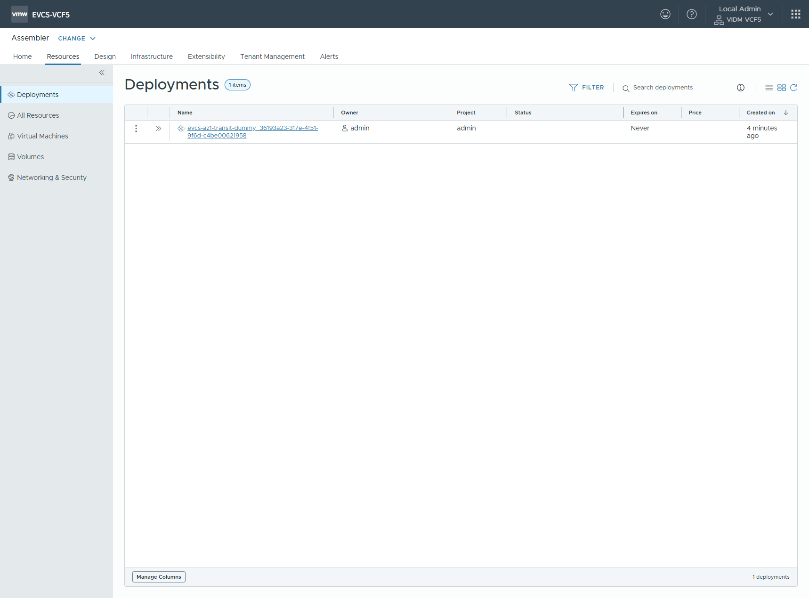
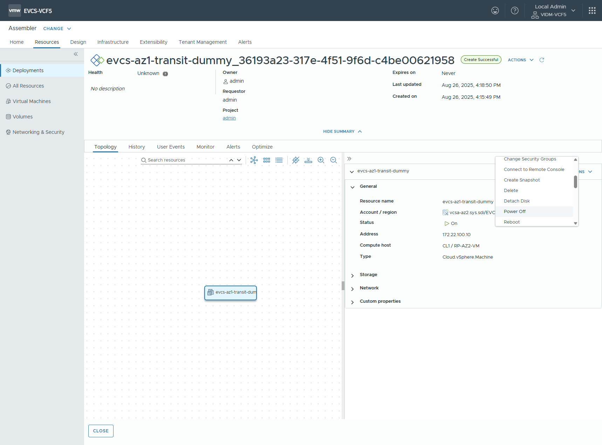
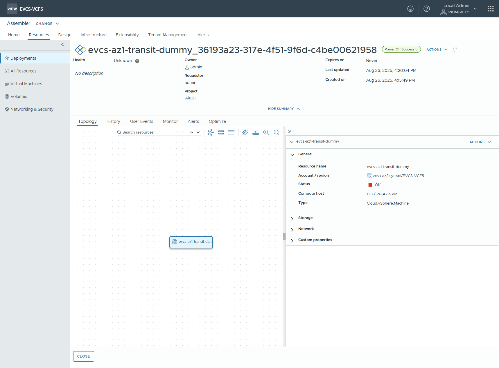

# 트랜짓 더미 VM 생성

> VPC 별 Load Balancer 서비스를 위한 더미 VM 생성\
> Load Balancer 에 지정할 각 룰을 미리 생성하고 VPC 영역안에 생성된 Virtual Machine 에 적용하게 디자인

 < Assembler 선택 >

 < Resources > Virtual Machines Managed 탭 이동 후 New VM 선택 >

> [!IMPORTANT]
> Project 는 admin 선택

 < General 정보 입력 >

 < Image 와 Flavor 정보 입력 >

 < Storage 정보 입력 >

> [!IMPORTANT]
> Network Adaptor 의 Network 은 TRANSIT 영역의 네트워크 선택\
> Assignment 는 Static IP 로 선택

 < Networking 정보 입력 >

 < Virtual Machine 배포 확인 >

자원 절약 차원으로 생성된 Virtual Machine 을 꺼놓습니다. 이 부분은 선택 사항입니다.

 < Virtual Machine 액션 중 Power Off 선택 >

 < Virtual Machine Power Off 확인 >

