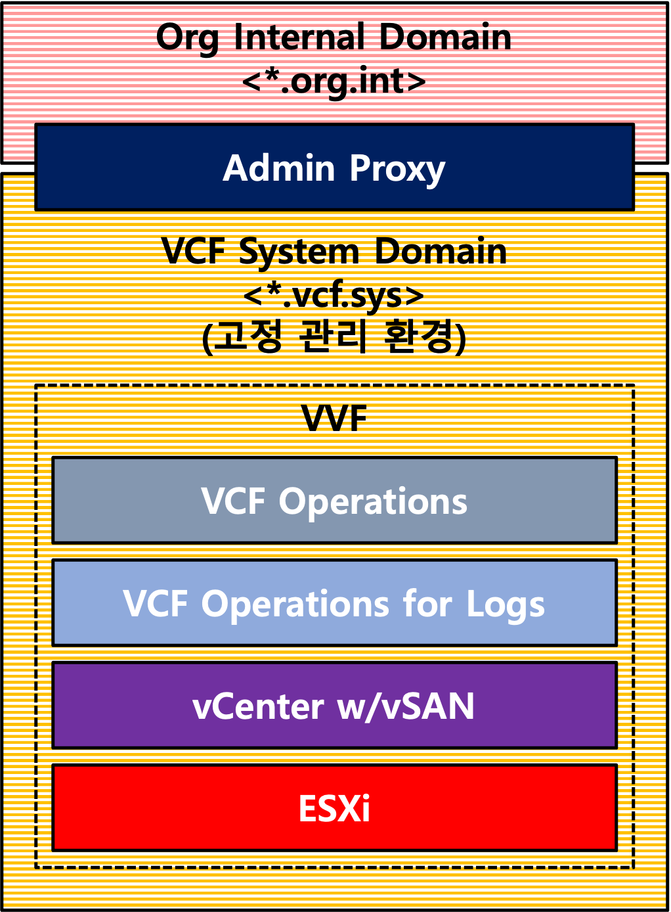
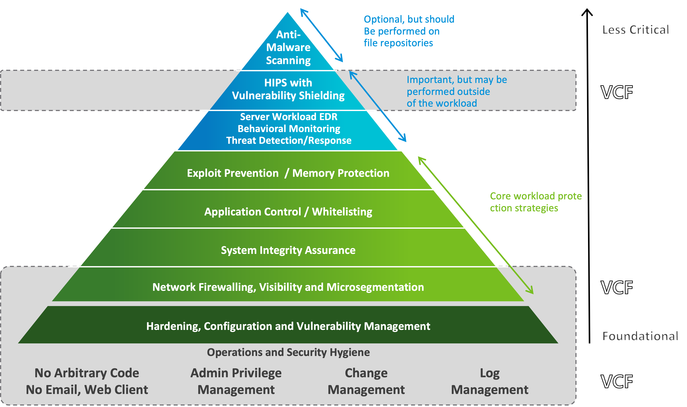
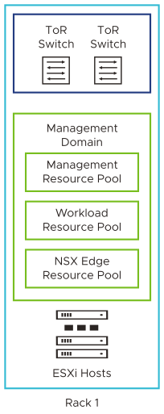
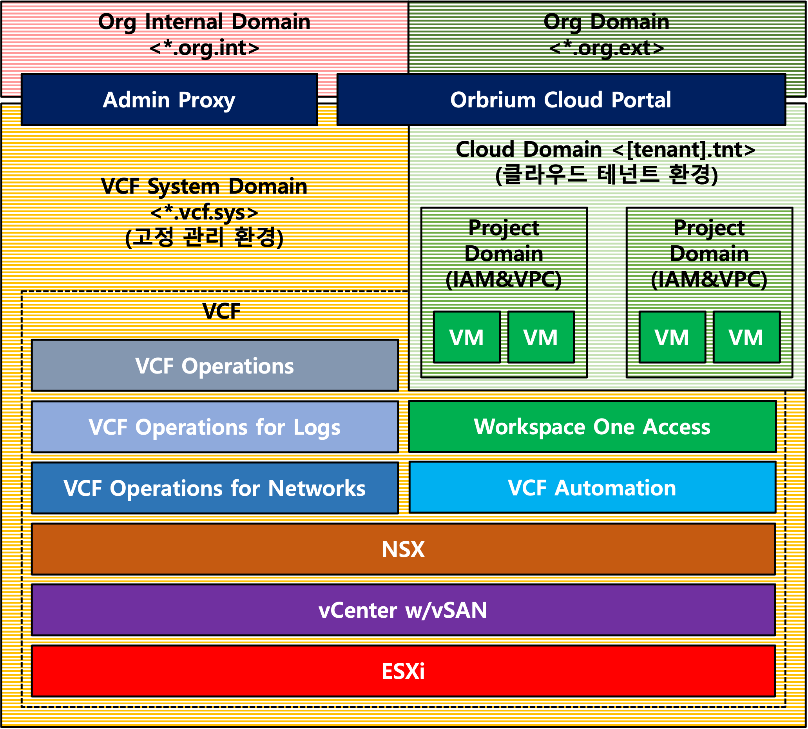

= Etevers VMware Cloud Standards

EVCS는 국내 환경 특성에 맞춘 손쉬운 VCF 표준 설계안을 제공하며, 모든 파트너의 기술 이행 표준화를 돕고자 하였다.

* 지원 인프라스트럭처 (공통)
* 클라우드 관리/서비스 인프라스트럭처 (5.2)
* 클라우드 관리 인프라스트럭처 (9.0)
* 클라우드 서비스 인프라스트럭처 (9.0)

== 지원 인프라스트럭처
Etevers Virtualization Standard 이며, VCF의 지원 인프라스트럭처 환경을 위한 아키텍처이다. SDDC 및 클라우드 구현에 수반되는 전통 인프라스트럭처 시스템의 가상화 데이터 센터 구조이다. 

클라우드 서비스 인프라스트럭처처럼 vSphere 기반 환경을 갖출 수 있으며, 기반을 통합하여 설계 및 유지보수 업무절차를 통합한다.

언더레이 네트워크에 기반하며, 다양한 하드웨어 스택과 밀접한 업무 연관성을 갖추고 있다.

VMware vSphere Foundation (VVF) 솔루션footnote:[VMware by Broadcom. (2024). What Is VSphere Foundation? Broadcom Tech Docs Portal. https://techdocs.broadcom.com/us/en/vmware-cis/vcf/vsphere-foundation/5-2/vvf-getting-started-5-2/what-is-vsphere-foundation.html]을 따르며, vSphere 설계는 VCF와 동일한 구성을 권한다.

.EVS 스택

.워크로드 보호 통제 계층과 VCF의 역할footnote:[Macdonald, N., & Croll, T. (2020). Market Guide for Cloud Workload Protection Platforms. Gartner. https://www.gartner.com/en/documents/4003465]

사이버보안을 위한 워크로드 보호 통제 계층을 고려한다.

[TIP]
9.0 규격부터 VVF 및 VCF 환경을 배포 및 라이프사이클 관리를 통합한다. 각 인프라스트럭처의 vSphere 환경 구성이 서로 동일한 VMware Validated Solutions 지침을 따름이 유리하다.

필요 서비스만 살피면 지원 인프라스트럭처의 구현은 가상화 데이터 센터 여부와는 무관하나, EVS의 추종을 권장한다.

== 클라우드 관리/서비스 인프라스트럭처 (5.2)

Etevers Virtualization Standards이며, 클라우드 관리/서비스 인프라스트럭처를 위한 아키텍처이다. Broadcom CXS의 상용 클라우드 구현 방안을 따라 BVP 및 Orbrium을 배포할 SDDC 구조이다.

솔루션의 자원 사용 단위는 셋으로 구분하나, 병합 아키텍처 모델footnote:[Broadcom. (2025). VMware Cloud Foundation Architecture. Broadcom Tech Docs Portal. https://techdocs.broadcom.com/us/en/vmware-cis/vcf/vcf-5-2-and-earlier/5-2/getting-started-with-vcf-5-2/cloud-foundation-architecture.html]은 이러한 자원 할당을 클러스터 내 자원 풀로 구분하여 통제한다.

최초의 VCF 데이터 센터는 병합 클러스터로 설계하고, 워크로드 클러스터 등을 추가하여 서비스의 안정성을 확장하는 방향으로 운영한다.

.EVCS 스택

[CAUTION]
9.0 규격에서의 병합 아키텍처 가이드의 공식 제공은 없다.