# 설치방법

## 1. VCF 환경 설정

- [VCF5 환경 설정](vcf5.md)
- VCF9 환경 설정: 준비중...

## 2. 오브리움 설치

> [!NOTE]
> `vCenter` 에서 관리자 계정으로 수행

오브리움 OVA를 이용하여 vSphere 환경에 오브리움 VM을 설치하는 과정입니다.

### 2.1. 사전 요구사항

- CPU: 8코어 이상
- MEM: 32GByte 이상
- Disk: 500GByte 이상
- Network: 2 NIC
  - Primary NIC: 서비스용 인터페이스
  - Secondary NIC: 트랜짓 네트워크 연동용 인터페이스

### 2.2. OVA 배포

다운로드한 최신 오브리움 OVA 파일을 vCenter를 통해 배포합니다.

> [!NOTE]
> 설치 가이드는 vCenter 8.0.3.00500 버전에서 Athena-1a 버전의 배포 화면입니다. 버전에 따라 화면 구성이 다를 수 있습니다.

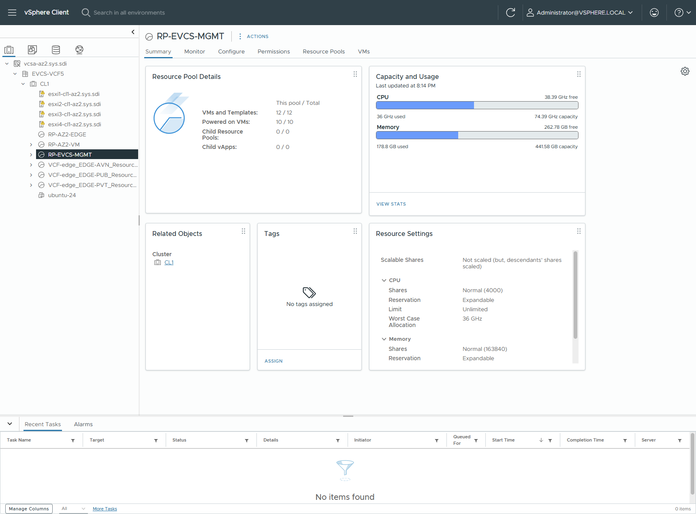 < vCenter 화면 접속 >

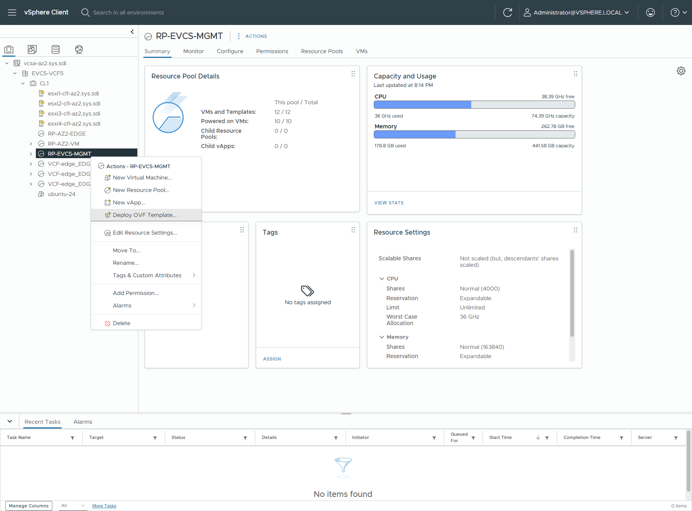 < 인벤토리에서 OVF 배포 실행 >

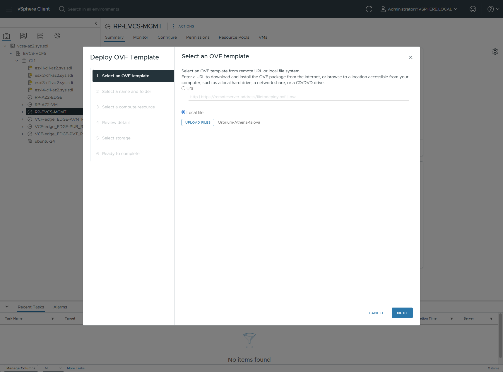 < 오브리움 OVA 파일 지정 >

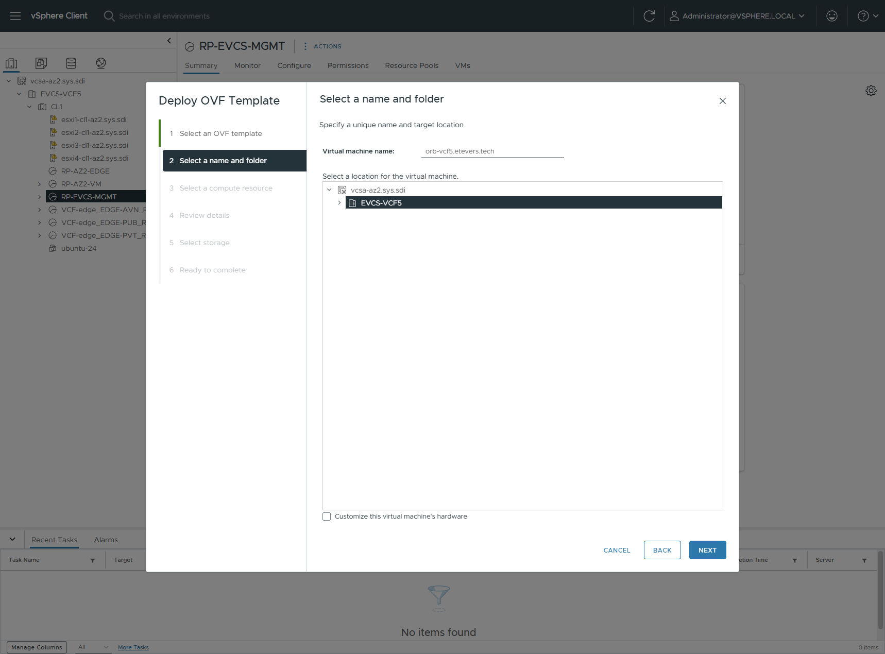 < VM 이름 및 폴더 결정 >

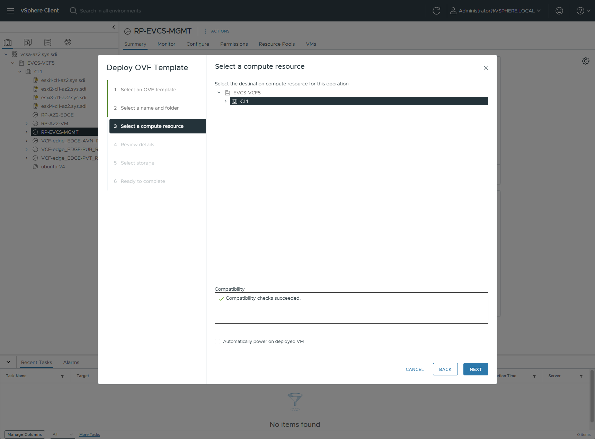 < 자원 위치 결정 >

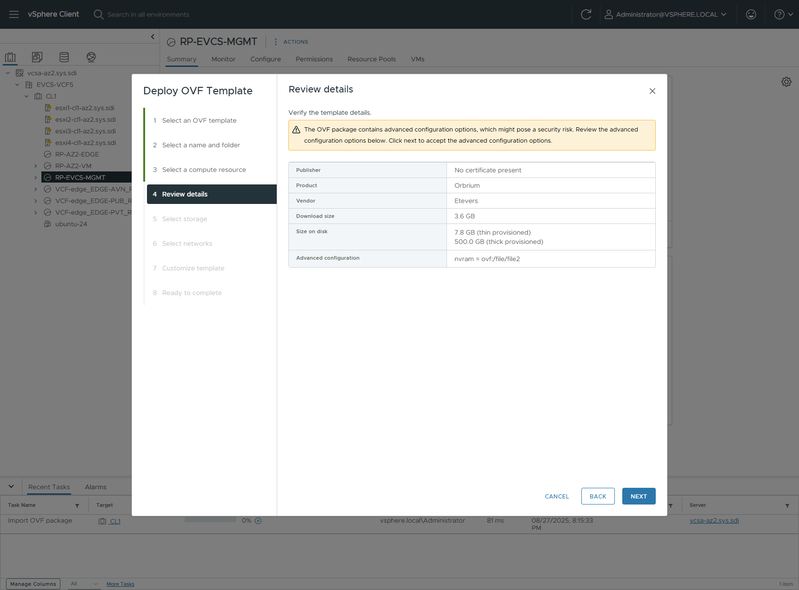 < 자원 디테일 확인 >

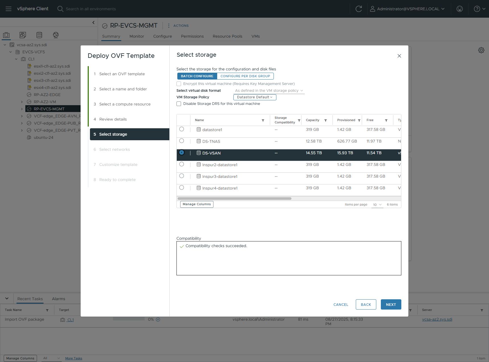 < 데이터스토어 결정 >

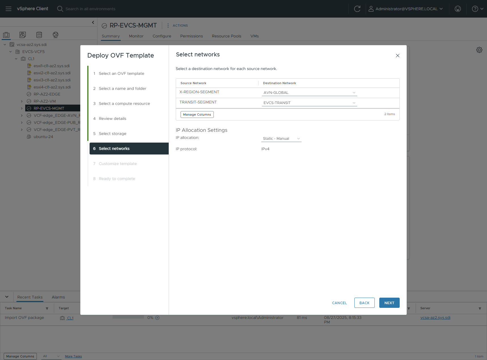 < 네트워크 연결 >

오브리움 네트워크는 2가지 네트워크 연결이 필요합니다.

- X-REGION-SEGMENT
  - VCF5 환경: AVN 글로벌 세그먼트에 연결합니다. 일반적으로 VCF5의 AVN 글로벌 네트워크는 VIDM, Aria Automation 및 Aria Operations 가 배포되는 네트워크 입니다.
  - VCF9 환경: 준비중...
- TRANSIT-SEGMENT
  - VCF5 환경: EVCS에서 설정한 트랜짓 세그먼트에 연결합니다. 트랜짓 세그먼트를 통해 VM 콘솔 연결및 VM에 대한 DNS 서비스, 프리셋 서비스를 제공합니다.
  - VCF9 환경: 준비중...

`IP allocation` 은  반드시 `Static - Manual` 로 설정합니다.

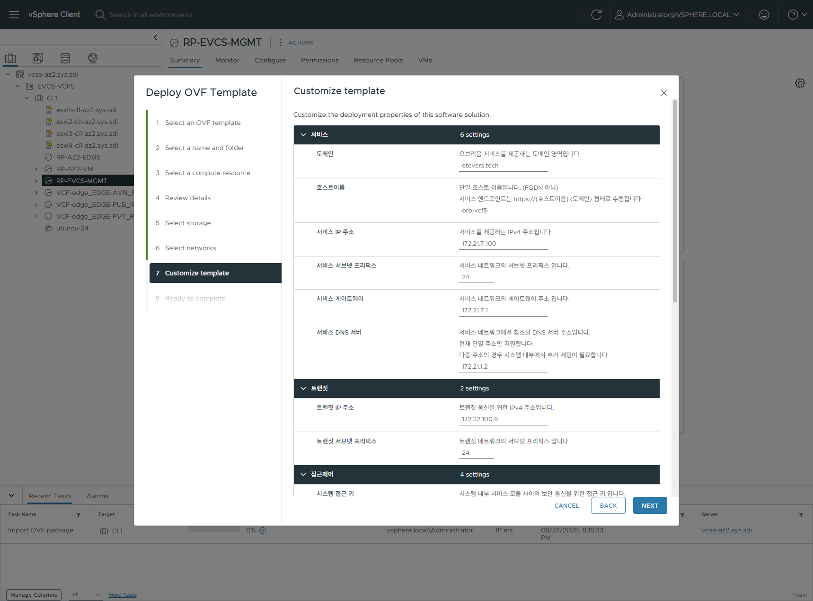 < 오브리움 네트워크 설정 >

기본적인 네트워크 설정을 합니다. 서비스 네트워크 설정과 트랜짓 네트워크 설정이 있습니다.

- 서비스: 도메인 이름 기반의 오브리움 서비스를 제공하기 위한 필수 요소를 설정합니다.
  - 도메인: 오브리움이 서비스 되는 도메인 영역을 설정합니다.
  - 호스트이름: 도메인 영역 내 오브리움의 호스트 이름을 설정합니다. FQDN이 아닌 단일 호스트이름으로 설정해야 하며, 최종적으로 `https://{호스트이름}.{도메인}` 형식으로 접속 URL이 결정됩니다.
  - 서비스 IP 주소: 서비스를 제공하는 IP 주소 입니다.
  - 서비스 서브넷 프리픽스: 서비스 IP 주소가 동작하는 서브넷 프리픽스 입니다. 최종 서브넷 IP는 `{서비스 IP 주소}/{서비스 서브넷 프리픽스}` 형태가 됩니다.
  - 서비스 게이트웨이: 서비스 네트워크의 게이트웨이 IP 주소 입니다.
  - 서비스 DNS 서버: 도메인내 DNS 쿼리 서비스를 제공하는 DNS 서버 IP 주소 입니다.
- 트랜짓: 오브리움이 클라우드 내부에서 다양한 서비스를 제공하기위한 인터페이스 입니다.
  - 트랜짓 IP 주소: 트랜짓 망에서 오브리움의 IP 주소 입니다.
  - 트랜짓 서브넷 프리픽스: 트랜짓 IP 주소가 동작하는 서브넷 프리픽스 입니다. 최종 서브넷 IP는 `{트랜짓 IP 주소}/{트랜짓 서브넷 프리픽스}` 형태가 됩니다.

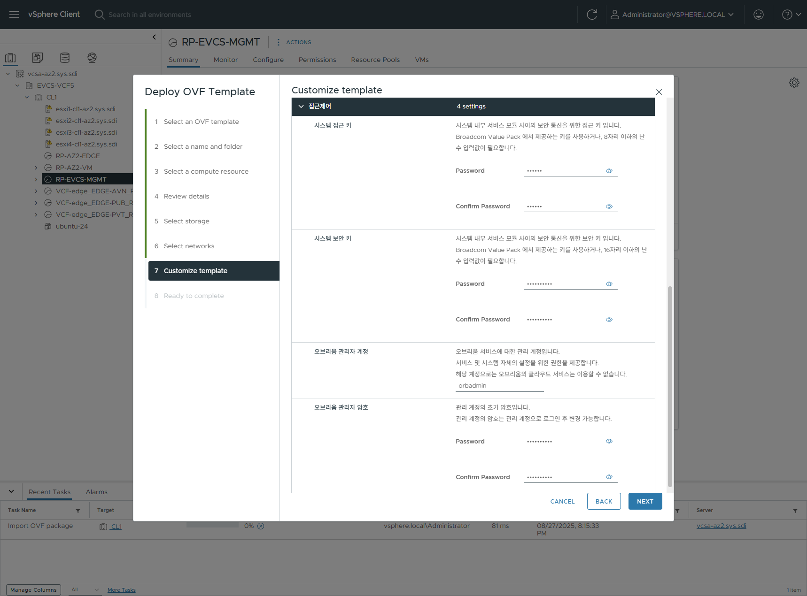 < 오브리움 접근제어 설정 >

- 시스템 접근 키: BVP의 `Get Package Keys` 워크플로우 실행의 결과로 나온 `accessKey` 항목입니다.
- 시스템 보안 키: BVP의 `Get Package Keys` 워크플로우 실행의 결과로 나온 `secretKey` 항목입니다.
- 오브리움 관리자 계정: 오브리움의 서비스 관리자 계정입니다. 클라우드 서비스가 제공되지는 않으며 VMware SSO 연동 및 서비스 엔드포인트 연결 작업을 수행하는 계정입니다. 계정 시스템(AD/LDAP)과 연결할 경우 계정 시스템이 보유한 계정과 겹치지 않는 ID를 제공해야 합니다.
- 오브리움 관리자 암호: 오브리움 관리자의 암호 입니다.

 < 오브리움 설정 확인 및 배포 >

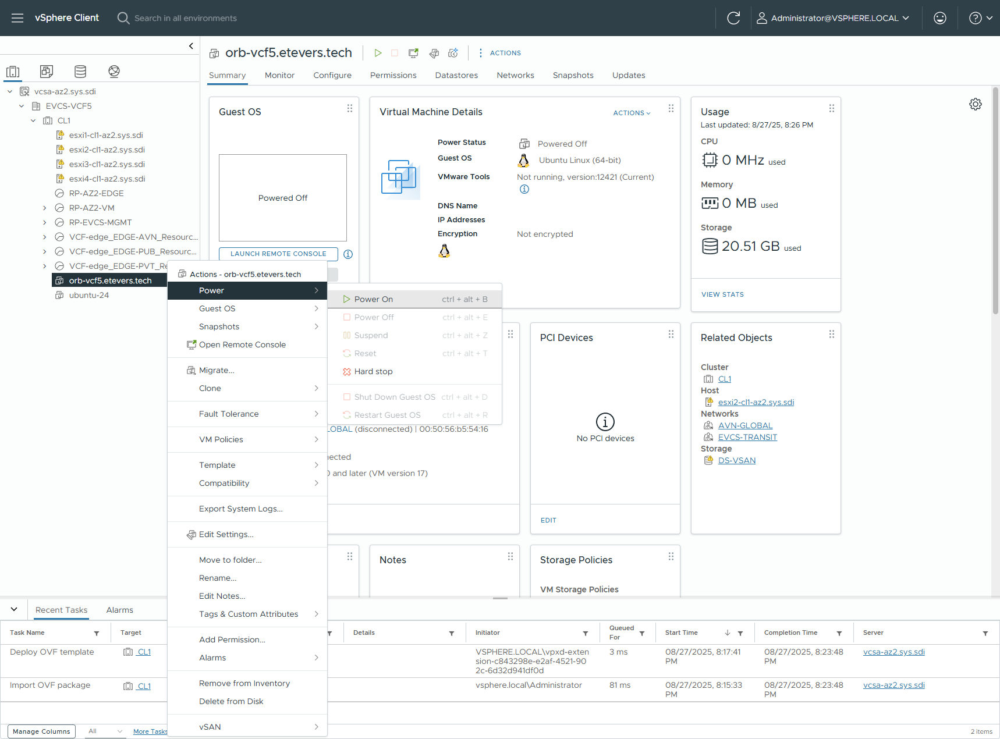 < 배포 완료 후 전원 켬 >

전원이 켜지고 최초 부팅시점에서, 입력한 값을 토대로 오브리움은 네트워크 및 오브리움 서비스가 자동 설정 됩니다.
최초 부팅시에는 설정에 따른 컨테이너 빌드 과정을 수행하므로 부팅 후 오브리움 서비스가 실행되기까지 시간이 조금 걸릴 수 있습니다.
오브리움에 콘솔에 로그인 후 `docker ps -a` 명령을 통해 컨테이너의 상태를 확인 할 수 있습니다.

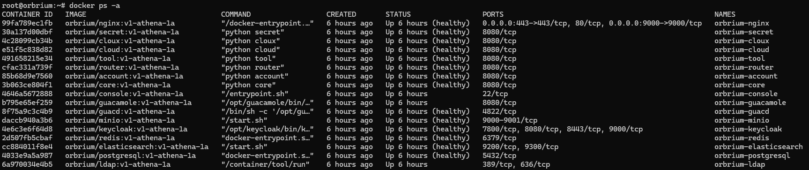 < 도커 컨테이너 상태 확인 >

`orbrium-nginx` 컨테이너가 `Healthy` 상태로 실행되고 있다면 정상 상태입니다.

> [!TIP]
> 오브리움 OVA의 `root` 계정 암호는 배포시 입력한 `오브리움 관리자 암호` 와 동일합니다.
> 오브리움 OVA의 경우 `root` 암호는 상시 변경 가능하고 서비스에 대한 영향도는 없습니다.

## 3. 오브리움 계정 정보 연동

> [!NOTE]
> 오브리움 키클록 서비스에서 `accessKey` 및 `secretKey` 를 통한 로그인 후 수행

오브리움은 키클록(Keycloak) 서비스를 통해 표준 OAuth2의 OpenID 인증시스템을 제공합니다.
OpenID가 제공하기 위한 계정정보를 외부의 계정 시스템과 연동할 필요가 있습니다. 이 작업은 표준 키클록 서비스의 기능을 사용하여 수행합니다.

> [!NOTE]
> 고객사 환경 계정 정보 연동은 에티버스에서 공식 지원합니다.
> 다만 무상 지원의 경우 표준 AD/LDAP 환경 또는 표준 OAuth2, SAML2.0 환경으로 제한하며, 그 이외의 고객사 고유의 계정시스템이나 SaaS형 솔루션에 대한 연동은 --상황에 따라-- 비용이 발생하는 프로젝트로 수행하여야 합니다.
> 전체적인 클라우드 계정 및 도메인 영역 설계에 대한 사전 아키텍처 지원은 EVCS 가이드를 참조하면 됩니다.
> EVCS에 따른 고객사 환경 사전설계에 대한 감수 작업을 에티버스에서 수행합니다.

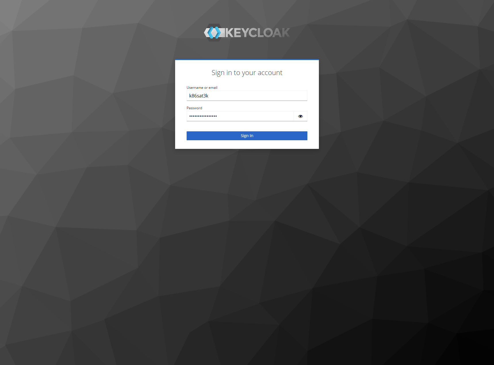 < 오브리움 키클록 로그인 화면 >

오브리움에 키클록에 접속합니다. 접속 URL은 `https://{호스트이름}.{도메인}/auth` 입니다. 사용자 이름과 암호는 BVP의 `Get Package Keys` 워크플로우 결과로 확인한 `accessKey` 와 `secretKey` 입니다.

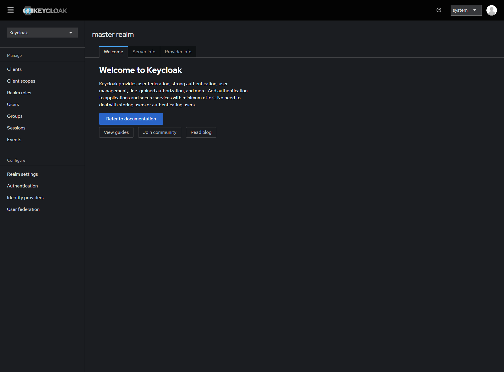 < 키클록 초기 화면 >

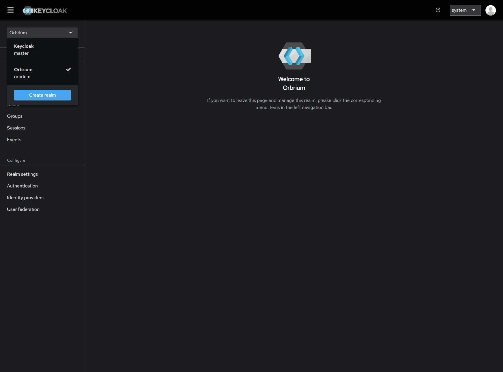 < 키클록 테넌트 변경 >

좌상단 테넌트 선택에서 Orbrium 테넌트를 선택합니다.

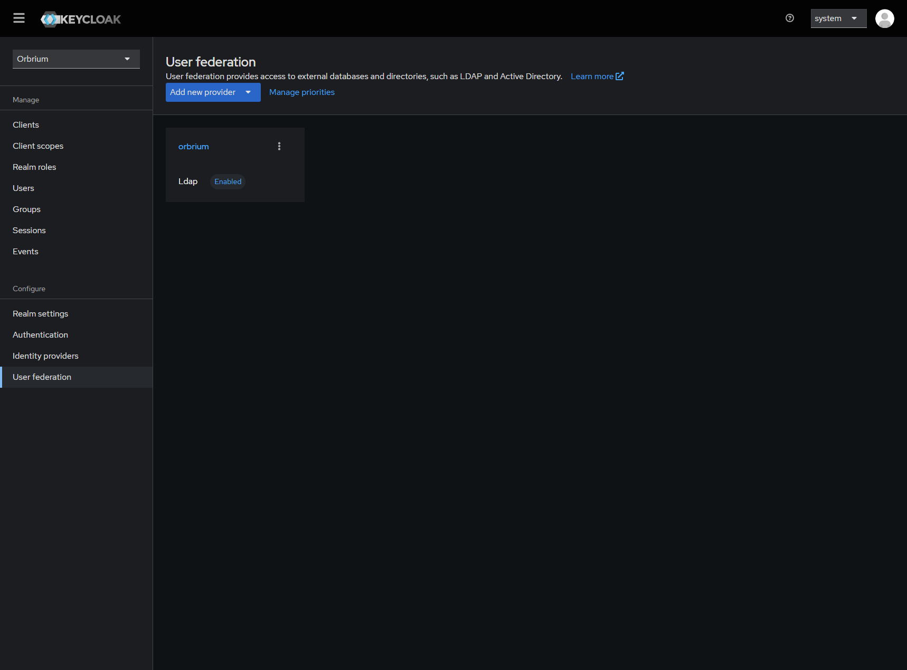 < 계정 시스템 연동 화면 >

좌하단 `User federation` 메뉴로 이동합니다.

> [!NOTE]
> 예제의 경우는 에티버스 내부의 테스트용 Microsoft Active Directory (AD) 를 연동하는 경우에 대한 샘플 예제 입니다.

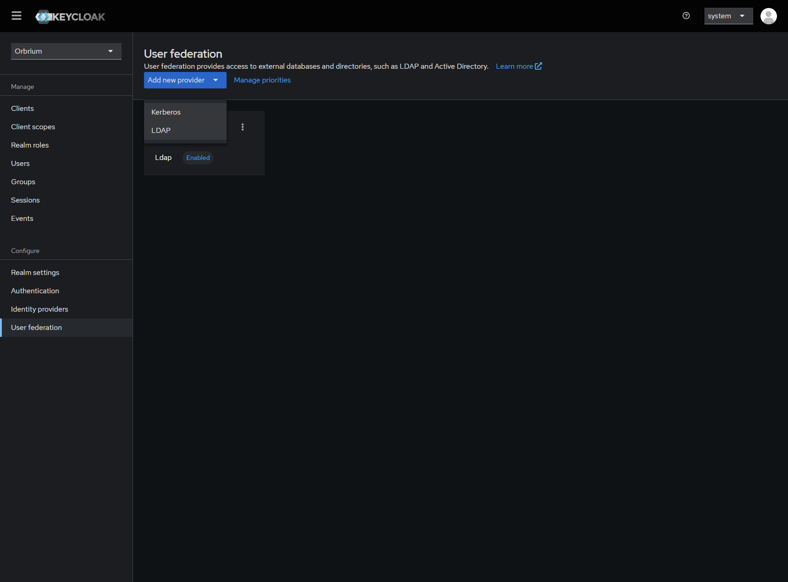 < 계정 시스템 종류 결정 >

`LDAP` 형식을 선택합니다.

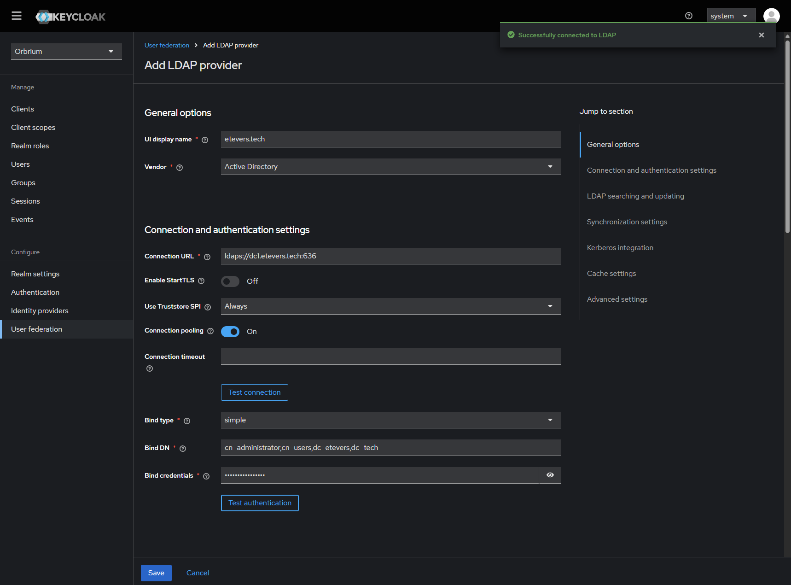 < 계정 시스템 연결 설정 >

계정 시스템 연결 정보를 입력합니다.

- UI display name: 계정시스템에서 제공하는 도메인을 입력합니다.
- Vendor: `Active Directory` 를 선택합니다.
- Connection URL: AD 접속 URL을 입력합니다.
- Connection pooling: 일반적으로 성능을 위해 `On` 상태로 둡니다.
- Bind 설정: AD 연동을 위한 바인드 계정 정보를 입력합니다.

입력후 `Test connection` 및 `Test authentication` 버튼을 통해 연결이 정상인지 확인합니다.

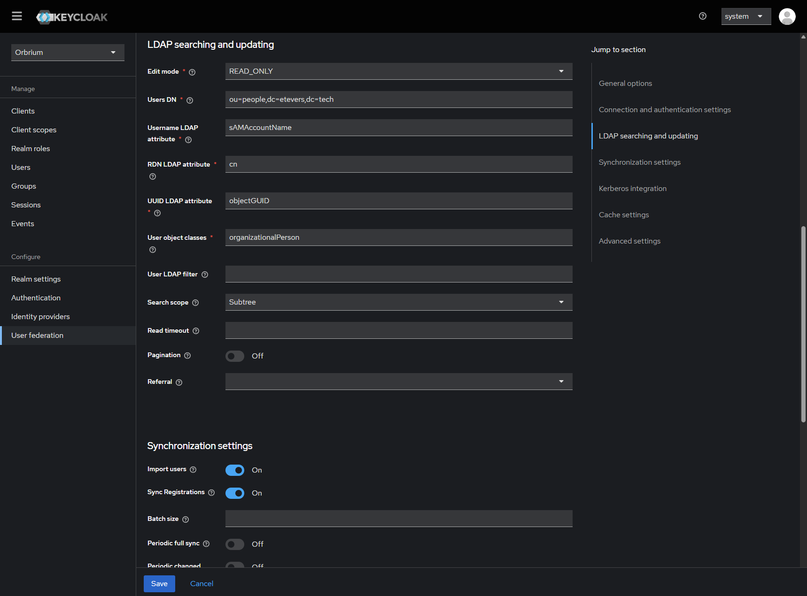 < 계정 시스템 쿼리 설정 >

계정 시스템 쿼리 정보를 입력합니다.

- Edit mode: 오브리움이 계정시스템에 영향을 주지 않으려면 `READ_ONLY`를 선택하고, 오브리움을 통해 신규 계정생성 작업을 수행하려면 `WRITABLE`, 신규 계정생성은 가능하지만 계정시스템에 영향을 주지 않으려면 `UNSYNCED`를 선택합니다. 일반적으로 `READ_ONLY`로 선택합니다.
- User DN: 사용자를 검색하는 기본 DN(Base DN)을 입력합니다.
- Username LDAP attribute: 기본 고유 ID 값 필드를 지정합니다. 일반적인 AD의 경우 `sAMAccountName` 입니다.
- RDN LDAP attribute: 사용자 DN에서 최종 고유 값을 판단하는 Attribute를 지정합니다. 일반적인 AD의 경우 `cn` 입니다.
- UUID LDAP attribute: 계정시스템의 정보의 고유값을 지정하는 Attribute를 지정합니다. 일반적인 AD의 경우 `objectGUID` 입니다.
- User object classes: 계정 정보 스키마 형식을 지정합니다. 일반적인 AD의 경우 `organizationalPerson` 입니다.
- Search scope: 계층적 OU 및 Group 구조라면 `Subtree`를 선택합니다.

동기화 설정은 상황에 따라 설정합니다. 일반적으로 `Sync Registrations`를 활성화 합니다. 최종 검토후 저장합니다.

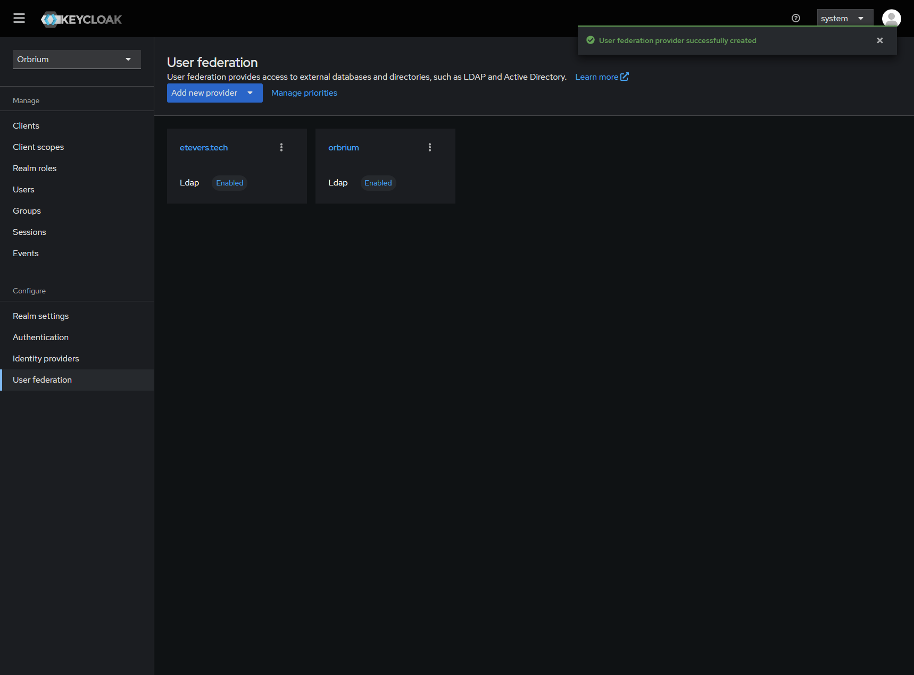 < 계정 시스템 연동 확인 >

정상적인 연동 정보 등록 후 도메인을 눌러 다시한번 계정 연동설정으로 들어갑니다.

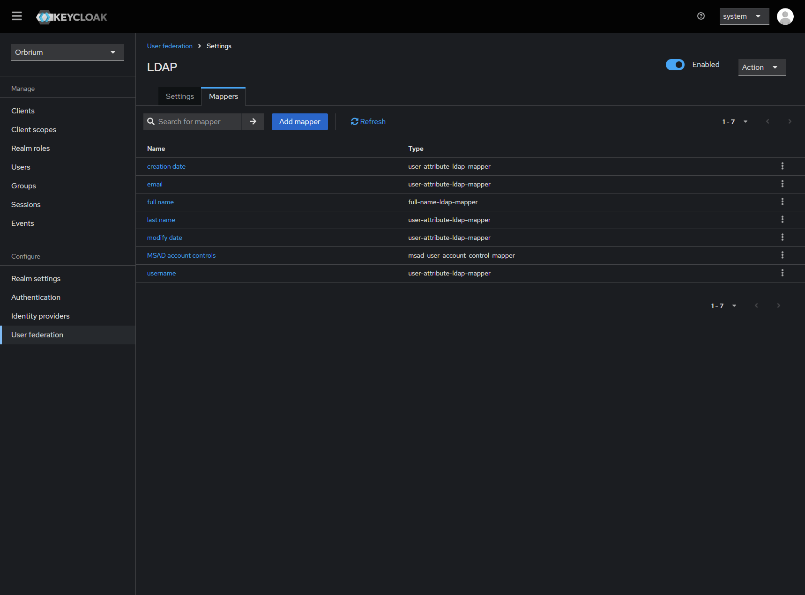 < 계정 필드 매핑 >

상황에 따라 표준 OAuth2 에서 제공하는 필드에 계정시스템에서 제공하는 Attribute를 연결하여 정상적인 계정 정보를 SSO로 제공 할 수 있도록 설정합니다.
예제에서는 `full name` 필드는 필요 없고 AD 에서 제공하는 `firstName` 필드를 OpenID `givenName` 으로 제공하기 위한 추가적인 매핑을 수행하였습니다.

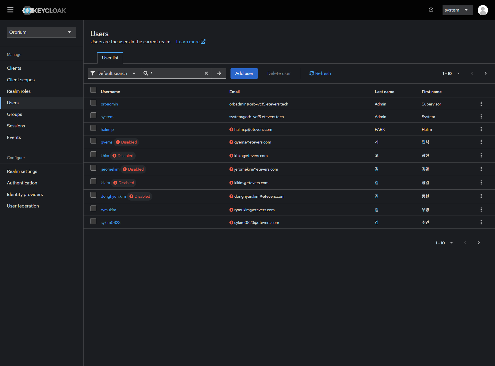 < 계정 정보 확인 >

`Users` 메뉴로 이동하여 검색 화면에 `*` 를 입력하고 검색을 실행합니다. 계정시스템에서 제공하는 사용자 정보가 정상적으로 테이블에 표시되는지 확인합니다.

## 4. 오브리움 프로바이더 & 엔드포인트 연동

> [!NOTE]
> 오브리움에서 오브리움 관리자 계정으로 수행

오브리움에 VMware SSO 환경을 연동하고 클라우드 자원 관리 서비스를 연동하는 작업을 수행합니다.

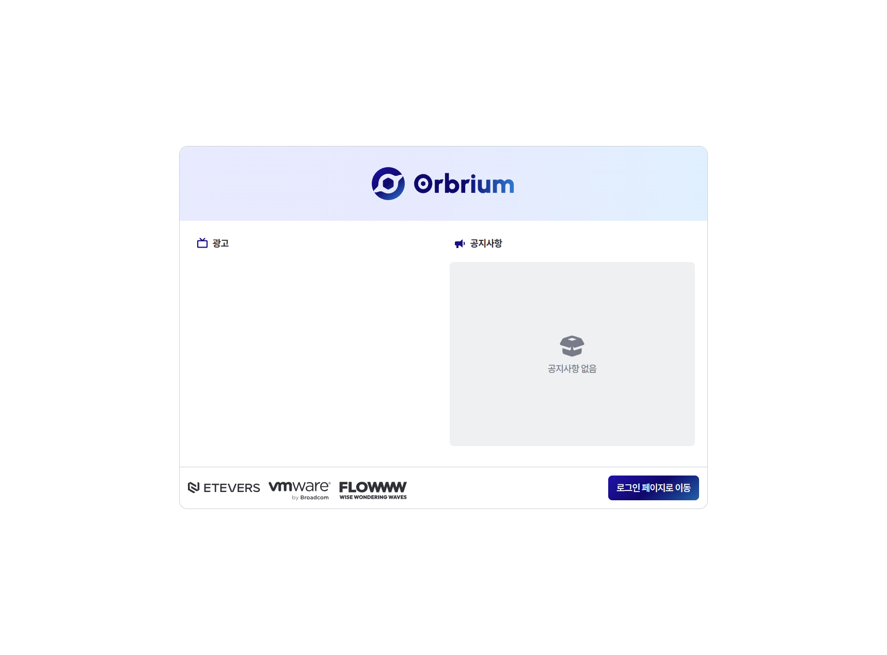 < 오브리움 초기 화면 >

오브리움에 접속합니다. 접속 URL은 `https://{호스트이름}.{도메인}` 입니다. `로그인 페이지로 이동` 버튼을 눌러 로그인창으로 이동합니다.

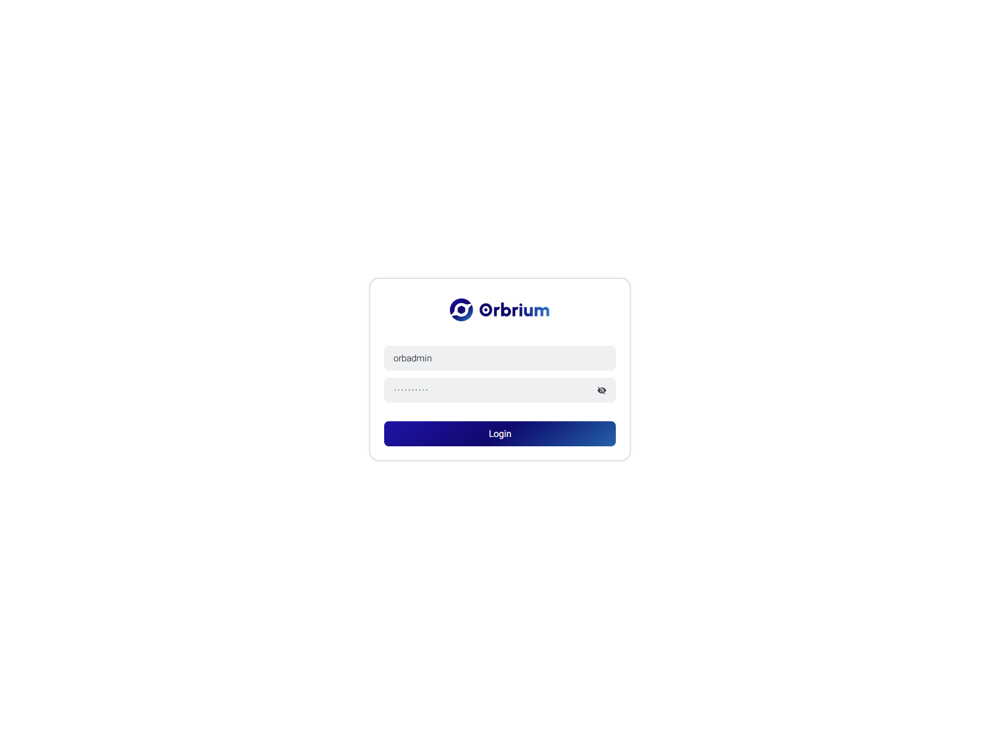 < 오브리움 로그인 창 >

> [!NOTE]
> OVA 배포시 설정한 오브리움 관리자 계정 및 암호를 이용하여 로그인을 합니다.

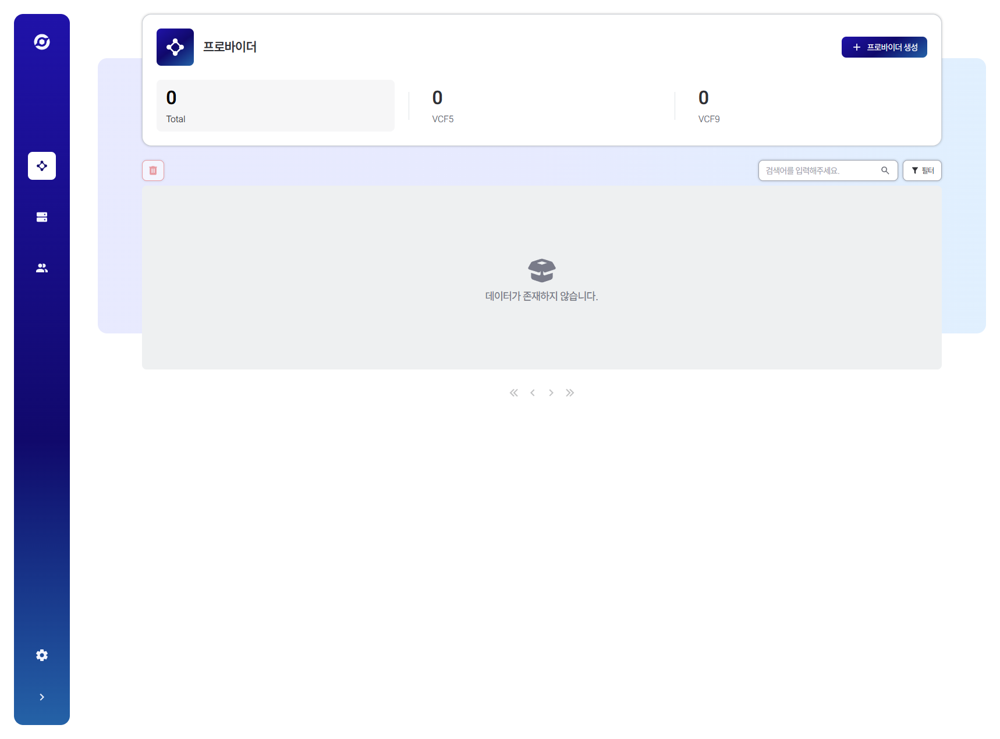 < 관리자 프로바이더 화면 >

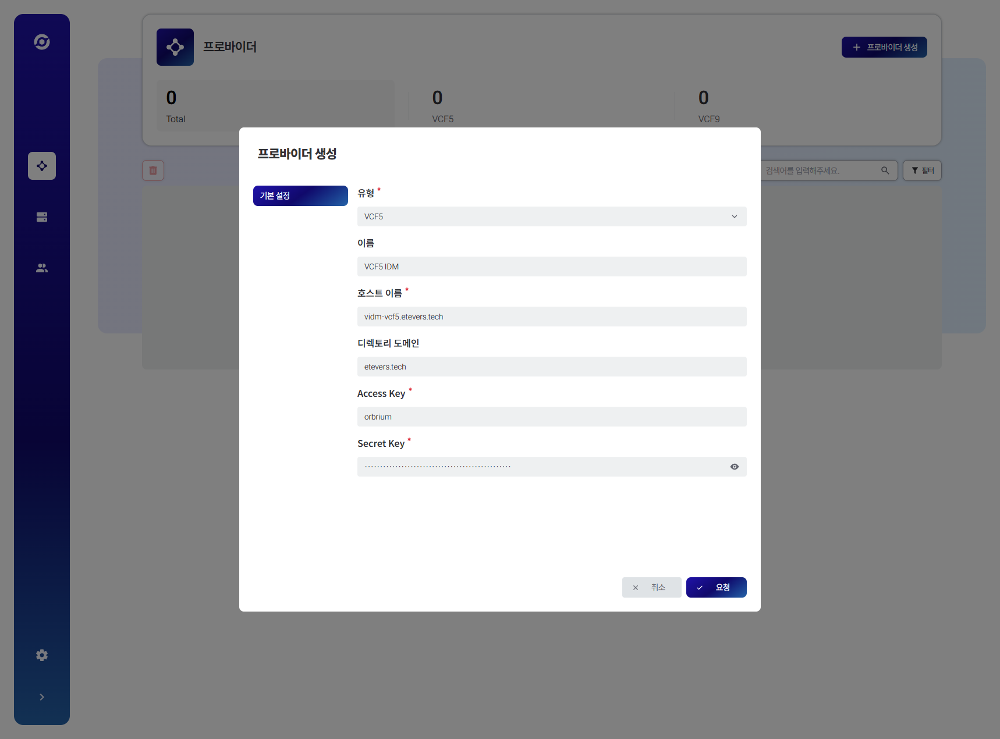 < 프로바이더 등록 >

VMware SSO 프로바이더를 연동합니다. 플랫폼 유형에 따라 정해진 값을 입력합니다.

- VCF5 유형
  - 이름: 자유롭게 구분 가능한 이름을 사용합니다.
  - 호스트 이름: VIDM의 FQDN을 입력합니다. VIDM 서비스가 외부 노출용 FQDN과 시스템용 FQDN이 분리되어 구성되어 있다면, 외부 노출용 FQDN을 입력합니다.
  - 디렉토리 도메인: VIDM에 설정한 디렉토리 도메인을 입력합니다. VIDM에 디렉토리를 설정하지 않았다면, 입력한 디렉토리 도메인으로 JIT(Just In Time) 디렉토리가 VIDM에 생성됩니다.
  - Access Key: VIDM에서 생성한 오브리움 SSO 클라이언트 ID를 입력합니다.
  - Secret Key: VIDM에서 생성한 오브리움 SSO 클라이언트의 공유 압호를 입력합니다.
- VCF9 유형: 준비중...

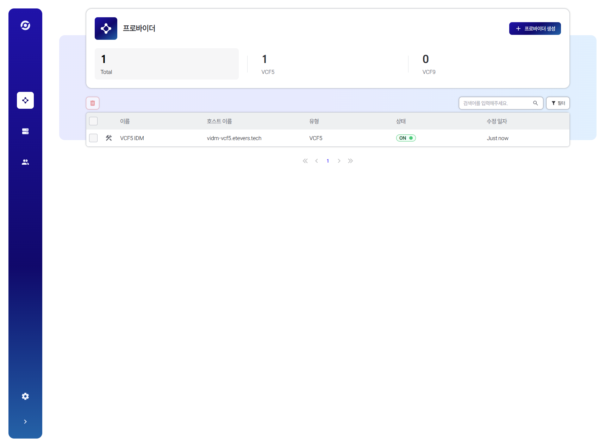 < 프로바이더 확인 >

정상적으로 등록이 완료되면 상태가 `ON` 으로 표시됩니다.

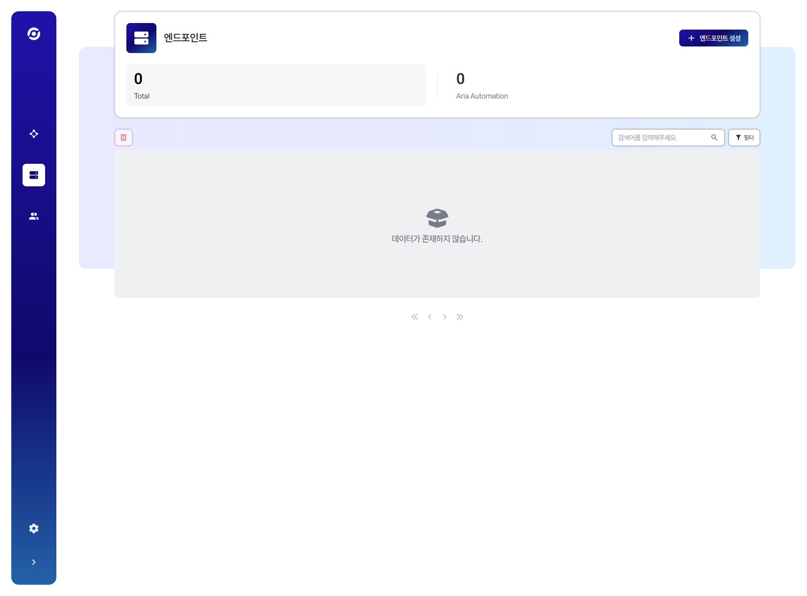 < 관리자 엔드포인트 화면 >

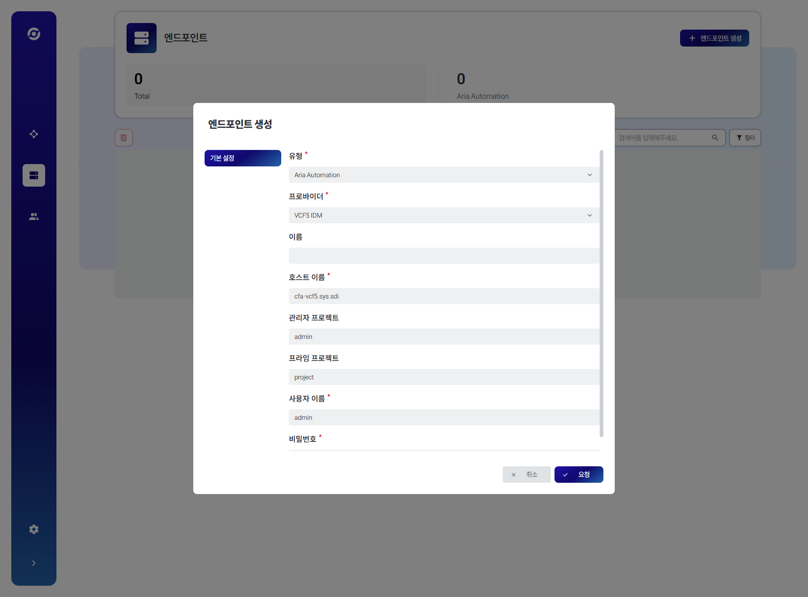 < 엔드포인트 등록 >

- VCF5
  - Aria Automation 유형
    - 프로바이더: SSO로 연결된 프로바이더를 선택합니다.
    - 이름: 입력한 이름으로 리전 이름이 결정됩니다. 입력하지 않는다면 Aria Automation의 브랜딩 이름이 자동으로 설정됩니다.
    - 호스트이름: Aria Automation의 FQDN을 입력합니다.
    - 관리자 프로젝트: BVP 설치시 생성한 관리자 프로젝트 이름을 입력합니다. 기본 설정은 `admin` 입니다.
    - 프라임 프로젝트: BVP 설치시 생성한 프라임 프로젝트 이름을 입력합니다. 기본 설정은 `project` 입니다.
    - 사용자 이름: Aria Automation의 Organization Owner 및 모든 서비스의 관리자 권한을 가진 계정을 입력합니다. 일반적으로 `admin` 입니다.
    - 비밀번호: 사용자의 암호를 입력합니다.
- VCF9: 준비중...

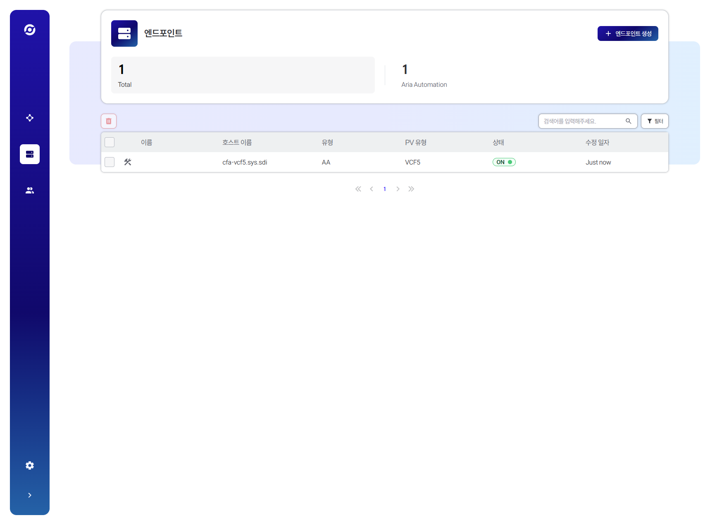 < 엔드포인트 확인 >

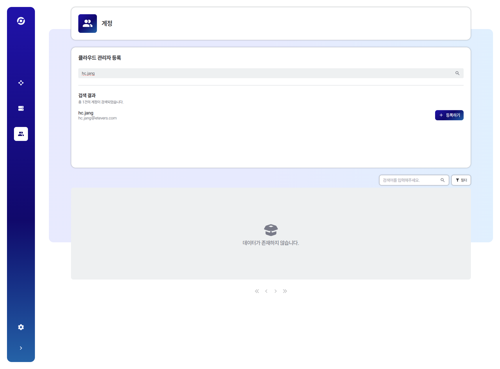 < 계정 연동 확인 >

계정 시스템에 등록된 사용자를 검색하여 정상적으로 조회 되는지 확인합니다. 만약 모든 프로젝트에 대한 접근 권한을 주고 싶다면 `+등록하기` 버튼을 눌러 해당 계정을 클라우드 관리자로 등록 할 수 있습니다.

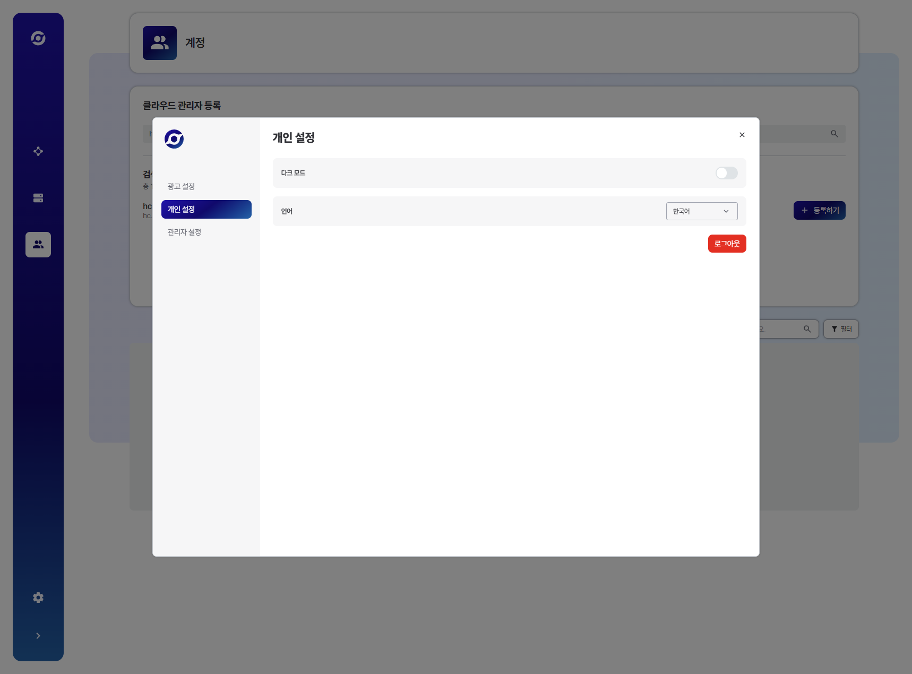 < 로그 아웃 >

> [!TIP]
> 오브리움 관리자의 로그아웃은 좌하단 `설정 버튼(Cog)` > `개인 설정` > `로그아웃` 으로 합니다.

## 5. 오브리움 시작
