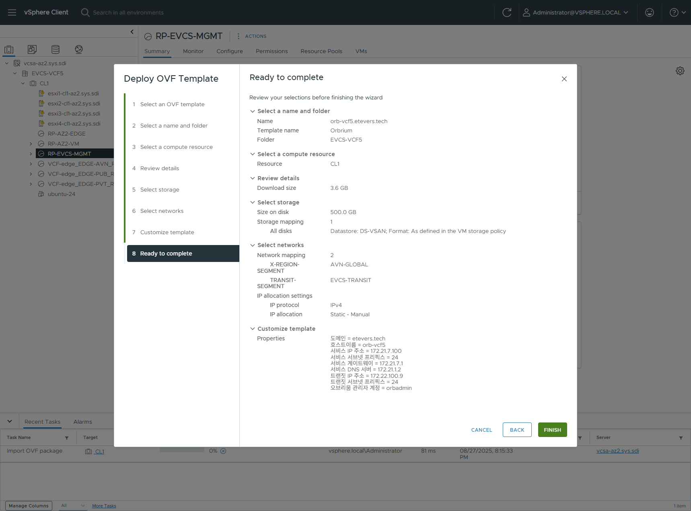

# 설치방법

## 1. VCF 환경 설정

- [VCF5 환경 설정](vcf5.md)
- VCF9 환경 설정: 준비중...

## 2. 오브리움 설치

> [!NOTE]
> `vCenter` 에서 관리자 계정으로 수행

### 2.1. 사전 요구사항

- CPU: 8코어 이상
- MEM: 32GByte 이상
- Disk: 500GByte 이상
- Network: 2 NIC
  - Primary NIC: 서비스용 인터페이스
  - Secondary NIC: 트랜짓 네트워크 연동용 인터페이스

### 2.2. OVA 배포

다운로드한 최신 오브리움 OVA 파일을 vCenter를 통해 배포합니다.

> [!NOTE]
> 설치 가이드는 vCenter 8.0.3.00500 버전에서 Athena-1a 버전의 배포 화면입니다. 버전에 따라 화면 구성이 다를 수 있습니다.

 < vCenter 화면 접속 >

 < 인벤토리에서 OVF 배포 실행 >

 < 오브리움 OVA 파일 지정 >

 < VM 이름 및 폴더 결정 >

 < 자원 위치 결정 >

 < 자원 디테일 확인 >

 < 데이터스토어 결정 >

 < 네트워크 연결 >

오브리움 네트워크는 2가지 네트워크 연결이 필요합니다.

- X-REGION-SEGMENT
  - VCF5 환경: AVN 글로벌 세그먼트에 연결합니다. 일반적으로 VCF5의 AVN 글로벌 네트워크는 VIDM, Aria Automation 및 Aria Operations 가 배포되는 네트워크 입니다.
  - VCF9 환경: 준비중...
- TRANSIT-SEGMENT
  - VCF5 환경: EVCS에서 설정한 트랜짓 세그먼트에 연결합니다. 트랜짓 세그먼트를 통해 VM 콘솔 연결및 VM에 대한 DNS 서비스, 프리셋 서비스를 제공합니다.
  - VCF9 환경: 준비중...

`IP allocation` 은  반드시 `Static - Manual` 로 설정합니다.

 < 오브리움 네트워크 설정 >

기본적인 네트워크 설정을 합니다. 서비스 네트워크 설정과 트랜짓 네트워크 설정이 있습니다.

- 서비스: 도메인 이름 기반의 오브리움 서비스를 제공하기 위한 필수 요소를 설정합니다.
  - 도메인: 오브리움이 서비스 되는 도메인 영역을 설정합니다.
  - 호스트이름: 도메인 영역 내 오브리움의 호스트 이름을 설정합니다. FQDN이 아닌 단일 호스트이름으로 설정해야 하며, 최종적으로 `https://{호스트이름}.{도메인}` 형식으로 접속 URL이 결정됩니다.
  - 서비스 IP 주소: 서비스를 제공하는 IP 주소 입니다.
  - 서비스 서브넷 프리픽스: 서비스 IP 주소가 동작하는 서브넷 프리픽스 입니다. 최종 서브넷 IP는 `{서비스 IP 주소}/{서비스 서브넷 프리픽스}` 형태가 됩니다.
  - 서비스 게이트웨이: 서비스 네트워크의 게이트웨이 IP 주소 입니다.
  - 서비스 DNS 서버: 도메인내 DNS 쿼리 서비스를 제공하는 DNS 서버 IP 주소 입니다.
- 트랜짓: 오브리움이 클라우드 내부에서 다양한 서비스를 제공하기위한 인터페이스 입니다.
  - 트랜짓 IP 주소: 트랜짓 망에서 오브리움의 IP 주소 입니다.
  - 트랜짓 서브넷 프리픽스: 트랜짓 IP 주소가 동작하는 서브넷 프리픽스 입니다. 최종 서브넷 IP는 `{트랜짓 IP 주소}/{트랜짓 서브넷 프리픽스}` 형태가 됩니다.

 < 오브리움 접근제어 설정 >

- 시스템 접근 키: BVP의 `Get Package Keys` 워크플로우 실행의 결과로 나온 `accessKey` 항목입니다.
- 시스템 보안 키: BVP의 `Get Package Keys` 워크플로우 실행의 결과로 나온 `secretKey` 항목입니다.
- 오브리움 관리자 계정: 오브리움의 서비스 관리자 계정입니다. 클라우드 서비스가 제공되지는 않으며 VMware SSO 연동 및 서비스 엔드포인트 연결 작업을 수행하는 계정입니다. 계정 시스템(AD/LDAP)과 연결할 경우 계정 시스템이 보유한 계정과 겹치지 않는 ID를 제공해야 합니다.
- 오브리움 관리자 암호: 오브리움 관리자의 암호 입니다.

 < 오브리움 설정 확인 및 배포 >

 < 배포 완료 후 전원 켬 >

전원이 켜지고 최초 부팅시점에서, 입력한 값을 토대로 오브리움은 네트워크 및 오브리움 서비스가 자동 설정 됩니다.
최초 부팅시에는 설정에 따른 컨테이너 빌드 과정을 수행하므로 부팅 후 오브리움 서비스가 실행되기까지 시간이 조금 걸릴 수 있습니다.
오브리움에 콘솔에 로그인 후 `docker ps -a` 명령을 통해 컨테이너의 상태를 확인 할 수 있습니다.

 < 도커 컨테이너 상태 확인 >

> [!TIP]
> 오브리움 `root` 계정의 암호는 배포시 입력한 `오브리움 관리자 암호` 와 동일합니다.
> 오브리움 OVA의 경우 `root` 암호는 상시 변경 가능하고 서비스에 대한 영향도는 없습니다.

## 3. 오브리움 계정 정보 연동

## 4. 오브리움 BVP 연동

## 5. 오브리움 시작
