# VCF5 환경 설정

## 1. 오브리움 설치 전 설정

### 1.1. 고유 키 확인

> [!NOTE]
> `Aria Automation` 에서 `admin/System Domain` 계정으로 수행

오브리움 OVA 이미지 배포시 필요한 고유 키 값들을 Broadcom Value-Pack 으로부터 가져오는 작업을 수행합니다.

 < Orchestrator 서비스 모듈 선택 >

 < Get Package Keys 워크플로우 실행 >

`Orchestrator` > `Workflows` > `BVP` > `Package` >`Get Package Keys` 워크플로우를 실행 (`RUN`) 합니다. 만약 화면 구성이 위 그림과 같이 Tree View 형태가 아니라면, 우상단에 있는 화면 표시 설정을 조정하여 Tree View 형태로 바꿀 수 있습니다. 실행 결과는 다음과 같이 나타납니다.

 < 워크플로우 결과 화면 >

워크플로우가 정상으로 수행되었다면 `Completed` 상태가 되며, 실행 결과 하단의 `Variables` 탭으로 이동하면 `accessKey` 와 `secretKey` 를 확인 할 수 있습니다.
이 키는 오브리움 한 사이트(=회사, =Org) 단위로 고유한 값이어야 합니다.
만약 오브리움에 여러 Aria Automation(=Multi Region)을 연결해야 한다면, 각 Aria Automation의 `accessKey` 와 `secretKey` 를 동일하게 수정해 주어야 합니다.
`accessKey` 와 `secretKey` 는 오브리움 배포 전 언제든지 `Orchestrator` > `Configuration` > `BVP` > `Endpoint` > `Orbrium` > `data` 항목에서 수정 가능합니다.

확인한 `accessKey` 와 `secretKey` 를 오브리움 설치를 위해 문서 편집기에 임시로 복사해 놓습니다.
`accessKey`와 `secretKey`는 영속적으로 유지되어야 하며 변경 불가능 하기 때문에, 반드시 보안을 지켜 사용해야 합니다.

> [!CAUTION]
> `accessKey` 와 `secretKey` 를 절대 유출하지 마세요.

> [!WARNING]
> `accessKey` 와 `secretKey` 변경이 필요할 경우에는 에티버스와 함께 사전 설계작업을 통해 결정합니다. key를 구성하는 요건에 대한 사전 검증이 필요합니다.

### 1.2. 계정 정보 연동

> [!NOTE]
> `VMware Identity Manager` 에서 `admin/System Domain` 계정으로 수행

클라우드 사용자를 위한 계정 정보를 Aria Suite의 통합 SSO 서비스인 VIDM(VMware Identity Manager)에 연결하는 작업을 수행합니다.
이 작업은 Aria Automation에서 사용자를 인식하기 위해 필요하지만, 오브리움이 있다면 필수 작업은 아닙니다.
오브리움과 연동할 경우 오브리움을 통해 로그인 하는 사용자를 JIT(Just In Time) 디렉토리에 저장하여 사용자를 동기화 할 수 있습니다.
다만 이렇게 사용할 경우 오브리움에 한번도 로그인하지 않은 사용자의 경우 Aria Suite 환경에서 인식 할 수 없는 사용자가 됩니다.
그러므로 권장하는 환경은 **오브리움과 VIDM 모두에 같은 계정 정보 시스템을 연동**하는 것입니다.

> [!NOTE]
> 고객사 환경 계정 정보 연동은 에티버스에서 공식 지원합니다.
> 다만 무상 지원의 경우 표준 AD/LDAP 환경 또는 표준 OAuth2, SAML2.0 환경으로 제한하며, 그 이외의 고객사 고유의 계정시스템이나 SaaS형 솔루션에 대한 연동은 상황에 따라 비용이 발생하는 프로젝트로 수행하여야 합니다.
> 전체적인 클라우드 계정 및 도메인 영역 설계에 대한 사전 아키텍처 지원은 EVCS 가이드를 참조하면 됩니다.
> EVCS에 따른 고객사 환경 사전설계에 대한 감수 작업을 에티버스에서 수행합니다.

 < 관리 콘솔로 이동 >

 < 디렉토리 추가 >

> [!NOTE]
> 디렉토리는 회사 환경 및 아키텍처 구성에 따라 다양한 방법 또는 제품이 사용 될 수 있습니다.\
> 예제의 경우는 에티버스 내부의 테스트용 Microsoft Active Directory (AD) 를 연동하는 경우에 대한 샘플 예제 입니다.

 < Active Directory 추가 >

 < 디렉토리 연동 정보 입력 >

 < 도메인 확인 >

 < 사용자 특성 정보 매핑 설정 >

 < 그룹 동기화 설정 >

 < 사용자 동기화 설정 >

 < 계정 동기화 검토 및 동기화 수행 >

 < 계정 연동 확인 >

`사용자 및 그룹` 으로 이동하여 Active Directory에 있는 정보가 정상적으로 동기화 되었는지 확인합니다.

> [!NOTE]
> 계정 정보 연동 후 특정 사용자 또는 그룹에게 권한 할당 작업 등을 수행 할 수도 있습니다.
> Aria 환경에 대한 권환관리를 위해 `admin` 계정을 직접 사용하여 조정 하는 것보다 특정 사용자 또는 그룹을 관리자 권한으로 만든 후, 작업에 대한 감사를 수행 할 수 있게 만드는 것이 안정적이고 보안적으로 우수한 권한 관리 방법입니다.

> [!NOTE]
> 기타 계정 정보 연동과 관련된 자세한 사용법은 브로드컴에서 제공하는 VMware Identity Manager의 사용 설명서를 참고하세요.

### 1.3. 오브리움 OAuth2 Client 생성

> [!NOTE]
> `VMware Identity Manager` 에서 `admin/System Domain` 계정으로 수행

오브리움과 Aria Suite의 SSO를 서로 연동하려면 SSO 프로트콜 인증을 위한 클라이언트 설정이 필요합니다. 이 클라이언트는 프로토콜 연결시 필요한 키를 제공합니다.

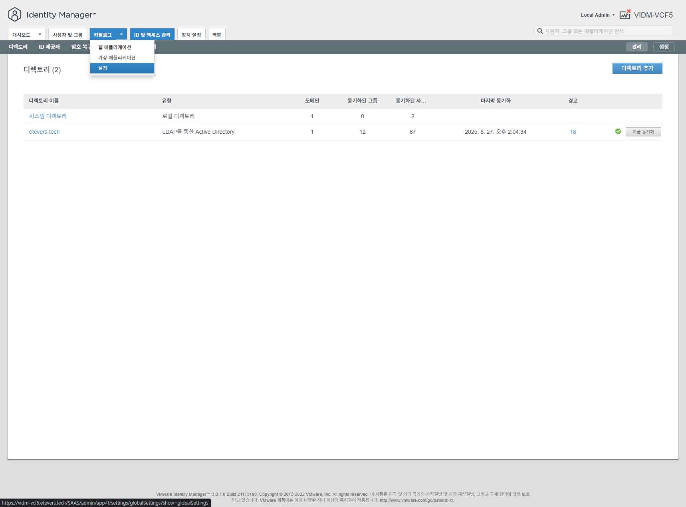 < SSO 설정 페이지로 이동 >

`카탈로그` 메뉴 우측의 화살표를 누르면 위 그림과 같은 하위 메뉴가 나타납니다. 여기서 `설정` 을 눌러 설정 화면으로 이동합니다.

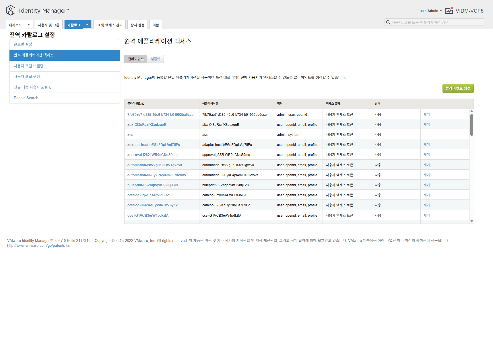 < 원격 애플리케이션 액세스 메뉴 선택 >

`원격 애플리케이션 액세스` 메뉴는 VIDM과 SSO로 연결하는 외부 서비스에 대한 정의와 연결 방법을 설정하는 화면 입니다. 여기서 우측의 `클라이언트 생성` 버튼을 눌러 오브리움을 위한 연동 클라이언트 생성 준비를 합니다.

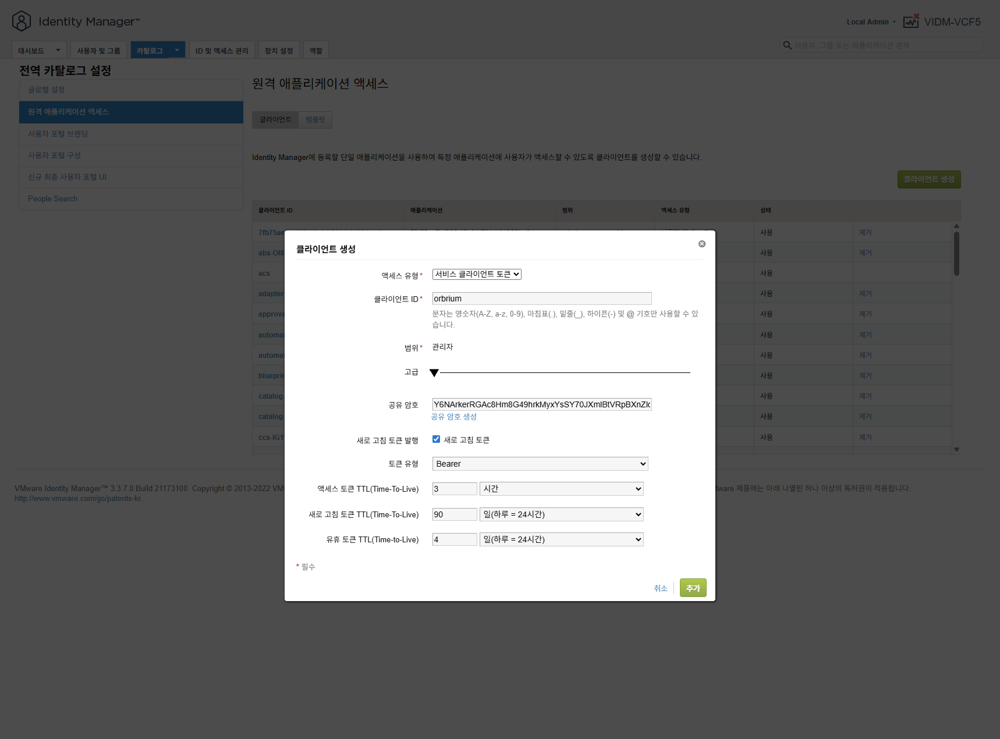 < 오브리움 클라이언트 >

다음과 같이 설정합니다.

- 액세스 유형: `서비스 클라이언트 토큰`
- 클라이언트 ID: 고유한 값이면 가능합니다. 일반적으로 모두 소문자로 `orbrium` 으로 하면 됩니다.
- 공유 암호: `고급` 화살표를 열어 고급기능을 활성화 한 후 `공유 암호 생성` 버튼을 눌러 공유 암호를 생성합니다.
- 새로 고침 토큰 발행: 체크박스를 활성화 합니다.

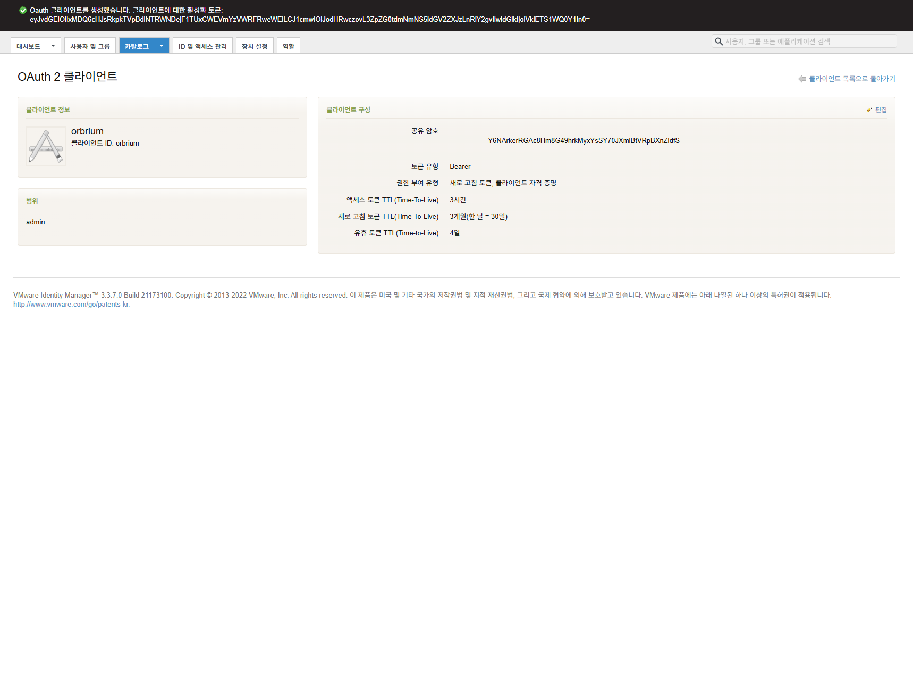 < 오브리움 클라이언트 확인 >

결과 화면에서 `클라이언트 ID` 와 `공유 암호` 를 오브리움 설치 후 연동을 위해 문서 편집기에 임시로 복사해 놓습니다.
`클라이언트 ID`와 `공유 암호`는 영속적으로 유지되어야 하며 변경 불가능 하기 때문에, 반드시 보안을 지켜 사용해야 합니다.

> [!CAUTION]
> `클라이언트 ID` 와 `공유 암호` 를 절대 유출하지 마세요.

### 1.4. Aria Automation 프라임 프로젝트 사용자 등록

> [!NOTE]
> `Aria Automation` 에서 `admin/System Domain` 계정으로 수행

BVP 설치시 입력한 프라임 프로젝트에 대한 사용자 등록을 수행합니다.
프라임 프로젝트는 프로젝트를 만들수 있는 사용자를 등록하는 프로젝트 입니다.
예를 들어 사업을 관리하는 PM 또는 부서장, 클라우드 테넌트 관리자 등이 프라임 프로젝트 멤버로 등록 될 수 있습니다.
프라임 프로젝트에 등록된 사용자만 오브리움에서 프로젝트를 만들 수 있습니다.

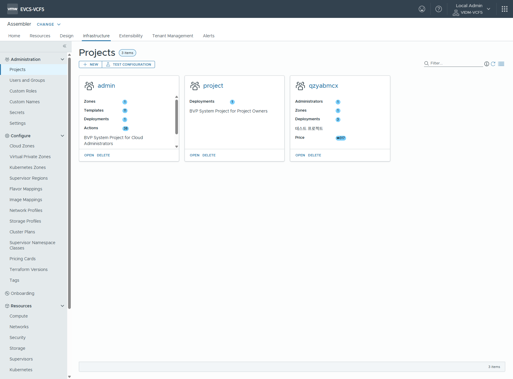 < 프라임 프로젝트 확인 >

> [!NOTE]
> BVP 설치시 기본 값으로 `project` 이름으로 프라임 프로젝트가 생성됩니다.

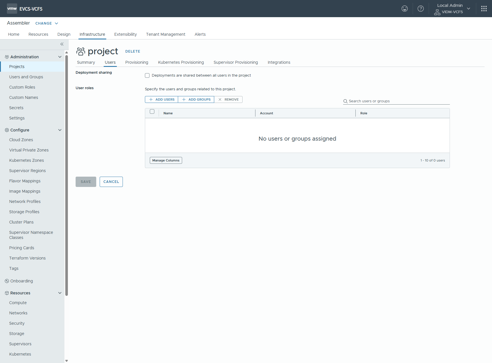 < 프로젝트 사용자 확인 >

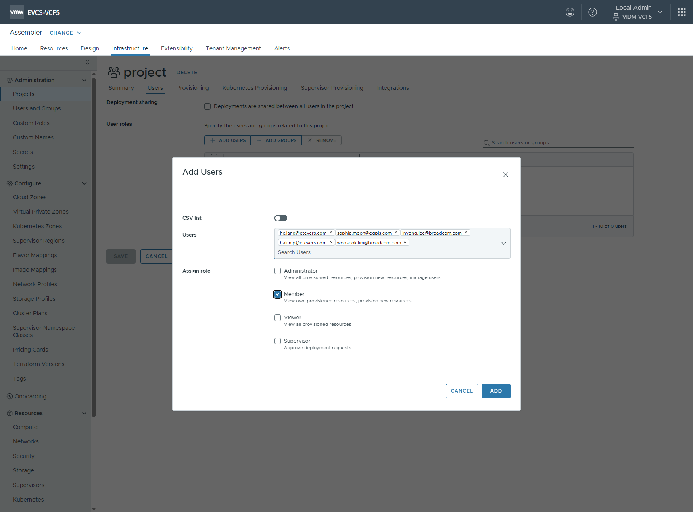 < 프로젝트 사용자 등록 >

> [!NOTE]
> 권한은 일반적으로 `Member` 권한으로 합니다. `Administrator` 권한은 다른 프로젝트를 침해할 여지가 있으며, 그 외의 권한은 프로젝트를 관측할 수 있는 권한만 제공하므로 사용 의도에 맞지 않습니다.

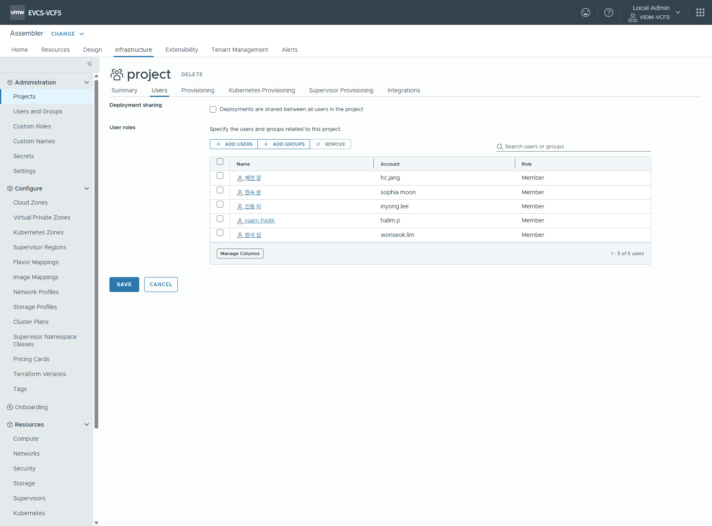 < 프로젝트 사용자 확인 >

## 2. 오브리움 설치 및 VCF5 프로바이더 설정 후 추가 작업

> [!NOTE]
> `VMware Identity Manager` 에서 `admin/System Domain` 계정으로 수행

VIDM에서 SSO 로그인 작업을 수행할 경우, 순서대로 처리할 ID 제공자의 순서를 결정합니다.
이 부분을 잘못 설정하면, System Domain 으로 로그인이 불가하거나 원하는 SSO 로그인 방법을 제공하지 못하므로 이상 동작을 하게 됩니다.

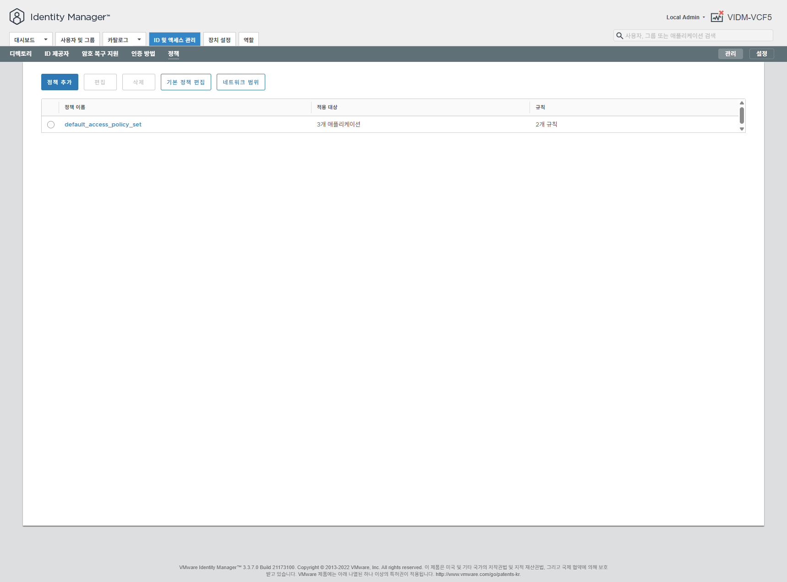 < 정책 메뉴 선택 >

`ID 및 액세스 관리` > `정책` > `default_access_policy_set` 을 선택합니다

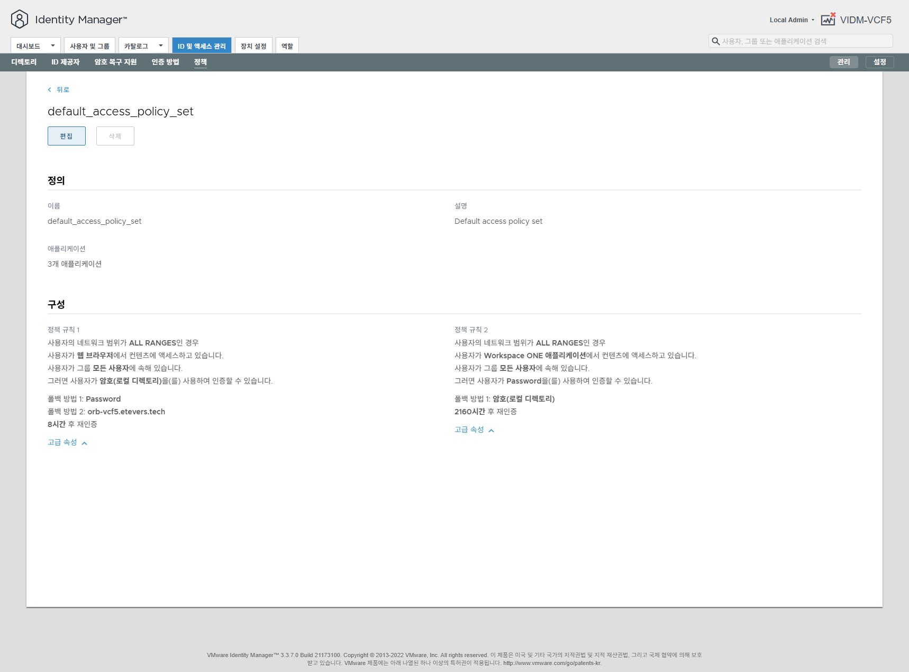 < 편집 선택 >

 < 편집 선택 >

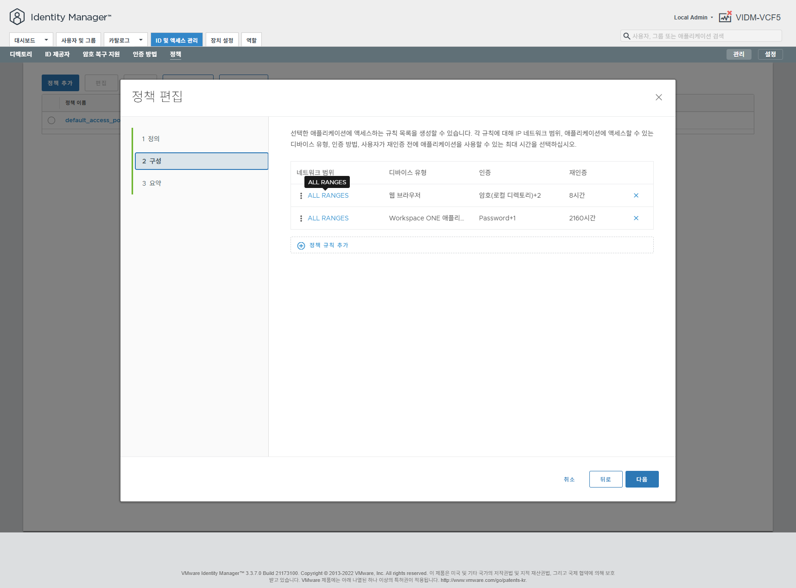 < ALL RANGES 웹 브라우저 선택 >

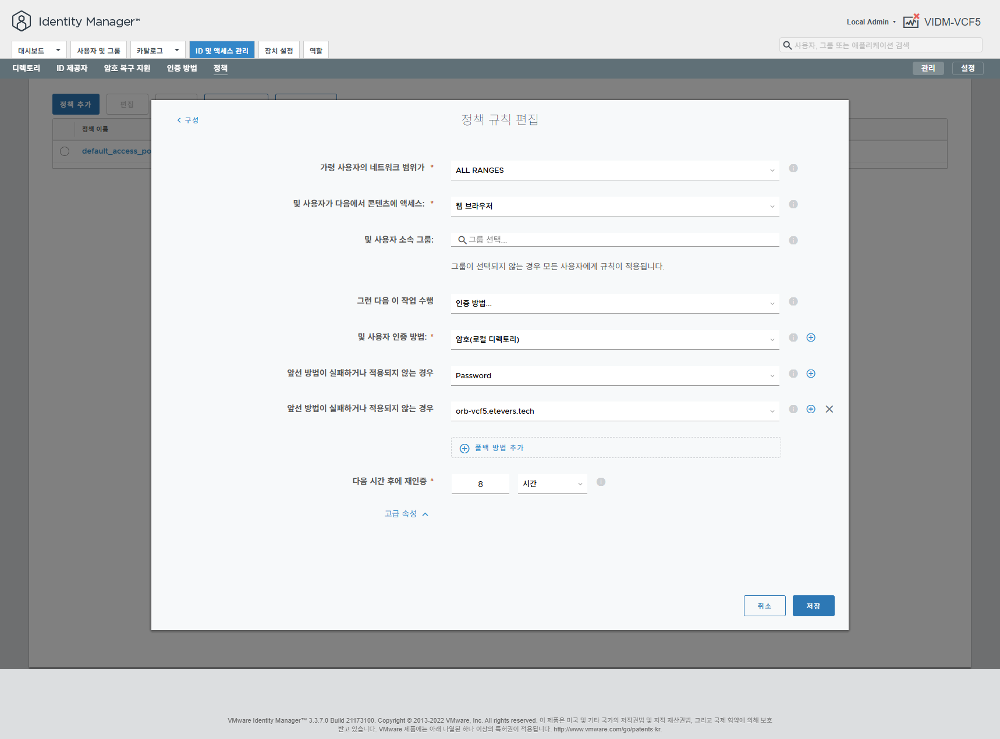 < 규칙 순서 확인 >

> [!NOTE]
> 정책 규칙은 상황에 따라 다양하게 설정 되어 있을 수 있습니다.

 < 규칙 순서 설정 >

정책 규칙은 특별한 경우를 제외하고 다음과 같은 순서로 설정되어야 합니다.

- 작업 수행: `인증 방법...`
- 사용자 인증 방법: `암호(로컬 디렉토리)`
- **앞선 방법이 실패하거나 적용되지 않는 경우**: `오브리움 FQDN`

이 외의 로그인 순서는 모두 삭제 합니다.

> [!CAUTION]
> 첫 번째 사용자 인증 방법 `암호(로컬 디렉토리)`를 반드시 포함해야 합니다.
> 순서가 달라지더라도 반드시 포함해야 합니다.
> `암호(로컬 디렉토리)` 가 없다면 `admin` 계정으로 로그인 할 수 있는 방법이 없으며, 시스템 전반에 대한 설정 권한을 누락하게 됩니다.

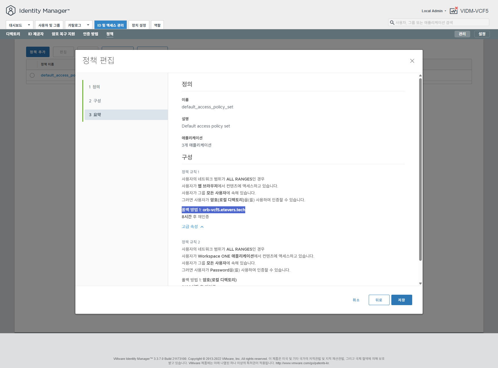 < 규칙 순서 검증 및 저장 >

