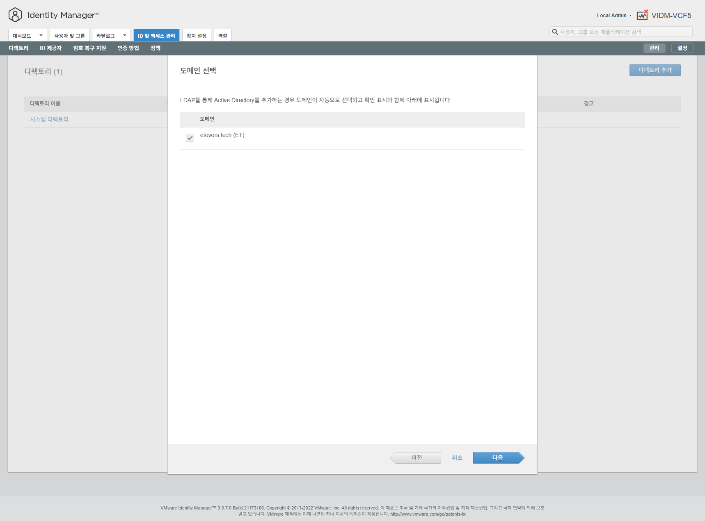

# VCF5 환경 사전 준비

## 1. 고유 키 확인

> [!NOTE]
> `Aria Automation` 에서 `admin/System Domain` 계정으로 수행

 < Orchestrator 서비스 모듈 선택 >

 < Get Package Keys 워크플로우 실행 >

`Get Package Keys` 워크플로우를 실행 (`RUN`) 합니다. 실행 결과는 다음과 같이 나타납니다.

 < 워크플로우 결과 화면 >

워크플로우가 정상으로 수행되었다면 `Completed` 상태가 되며, 실행 결과 하단의 `Variables` 탭으로 이동하면 `accessKey` 와 `secretKey` 를 확인 할 수 있습니다.
이 키는 오브리움 한 사이트(=회사, =Org) 단위로 고유한 값이어야 합니다.
만약 오브리움에 여러 Aria Automation(=Multi Region)을 연결해야 한다면, 각 Aria Automation의 `accessKey` 와 `secretKey` 를 동일하게 수정해 주어야 합니다.
`accessKey` 와 `secretKey` 는 오브리움 배포 전 언제든지 `Orchestrator` > `Configuration` > `BVP` > `Endpoint` > `Orbrium` > `data` 항목에서 수정 가능합니다.

확인한 `accessKey` 와 `secretKey` 를 오브리움 설치를 위해 임시로 복사해 놓습니다.
`accessKey`와 `secretKey`는 영속적으로 유지되어야 하며 변경 불가능 하기 때문에, 반드시 보안을 지켜 사용해야 합니다.

> [!CAUTION]
> `accessKey` 와 `secretKey` 를 절대 유출하지 마세요.

## 2. 계정 정보 연동

> [!NOTE]
> `VMware Identity Manager` `VIDM` 에서 `admin/System Domain` 계정으로 수행

 < 관리 콘솔로 이동 >

 < 디렉토리 추가 >

> [!NOTE]
> 디렉토리는 회사 환경 및 아키텍처 구성에 따라 다양한 방법 또는 제품이 사용 될 수 있습니다.\
> 예제의 경우는 에티버스 내부의 테스트용 Microsoft Active Directory (AD) 를 연동하는 경우에 대한 샘플 예제 입니다.

 < Active Directory 추가 >

 < 디렉토리 연동 정보 입력 >

 < 도메인 확인 >

 < 사용자 특성 정보 매핑 설정 >

 < 그룹 동기화 설정 >

 < 사용자 동기화 설정 >

 < 계정 동기화 검토 및 동기화 수행 >

 < 계정 연동 확인 >

> [!NOTE]
> 계정 정보 연동 후 특정 사용자 또는 그룹에게 권한 할당 작업 등을 수행 할 수도 있습니다.
> Aria 환경에 대한 권환관리를 위해 `admin` 계정을 직접 사용하여 조정 하는 것보다 특정 사용자 또는 그룹을 관리자 권한으로 만든 후, 작업에 대한 감사를 수행 할 수 있게 만드는 것이 안정적이고 보안적으로 우수한 권한 관리 방법입니다.
